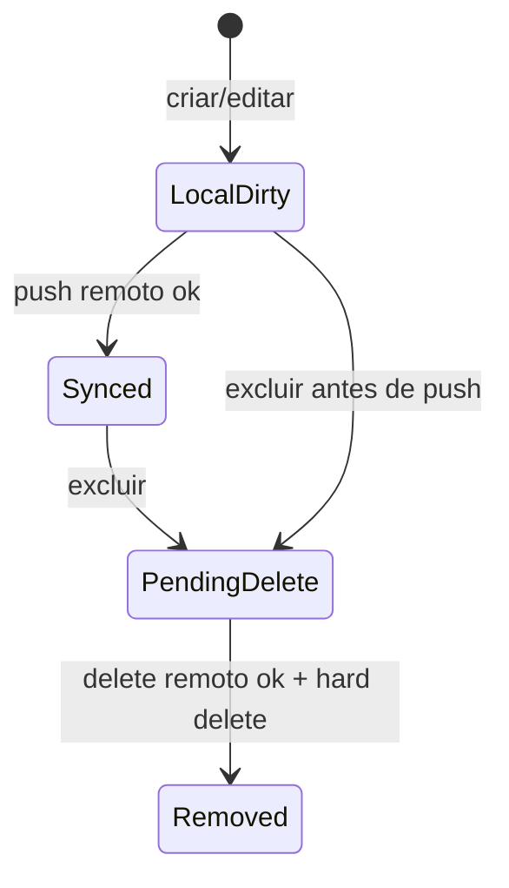

# Acervo e Categorias — Design Técnico

## Interface

🟢 **CONFIRMADO** — A unit é implementada como fluxo Flutter local/remoto, sem endpoint HTTP próprio exposto pelo app.

### Classes e funções

| Símbolo | Assinatura | Retorno | Observação |
|---------|-----------|---------|------------|
| `Category` | `Category({id, name, code, updatedAt, isSynced, isDeleted})` | Instância | 🟢 Modelo de categoria usado por SQLite e Supabase. |
| `Category.toMap` | `()` | `Map<String, dynamic>` | 🟢 Serializa campos locais, incluindo `is_synced` e `is_deleted`. |
| `Category.toSupabaseMap` | `()` | `Map<String, dynamic>` | 🟢 Serializa campos remotos: `id`, `name`, `code`, `updated_at`. |
| `Category.fromMap` | `(Map<String, dynamic> map)` | `Category` | 🟢 Converte dados SQLite/Supabase com defaults seguros. |
| `DatabaseHelper.readAllCategories` | `()` | `Future<List<Category>>` | 🟢 Lê categorias com `is_deleted = 0`, ordenadas por nome. |
| `DatabaseHelper.upsertCategory` | `(Category category)` | `Future<void>` | 🟢 Insere/substitui categoria local e força `is_deleted = 0`. |
| `DatabaseHelper.softDeleteCategory` | `(String id)` | `Future<void>` | 🟢 Marca categoria e letras associadas como excluídas/não sincronizadas. |
| `DatabaseHelper.hardDeleteCategory` | `(String id)` | `Future<int>` | 🟢 Remove fisicamente letras da categoria e categoria. |
| `SupabaseService.fetchCategories` | `({DateTime? since})` | `Future<List<Category>>` | 🟢 Busca categorias remotas, opcionalmente por `updated_at > since`. |
| `SupabaseService.upsertCategory` | `(Category category)` | `Future<void>` | 🟢 Upsert remoto em `categories`. |
| `SupabaseService.deleteCategory` | `(String id)` | `Future<void>` | 🟢 Soft delete remoto via `is_deleted = true` e `updated_at = now`. |
| `SyncRepository.addCategory` | `(Category category)` | `Future<void>` | 🟢 Grava local, notifica UI e tenta push remoto se online. |
| `SyncRepository.updateCategory` | `(Category category)` | `Future<void>` | 🟢 Reusa `addCategory`. |
| `SyncRepository.deleteCategory` | `(String id)` | `Future<void>` | 🟢 Soft delete local, notifica UI e tenta delete remoto/hard delete se online. |
| `SyncRepository.getCategories` | `()` | `Future<List<Category>>` | 🟢 Proxy para leitura local. |
| `SyncRepository.getLyricsCount` | `(String categoryId)` | `Future<int>` | 🟢 Conta letras locais da categoria. |
| `HomeScreen._showAddCategoryDialog` | `()` | `void` | 🟢 UI de criação com auto-sugestão de código. |
| `CategoryScreen._editCategory` | `()` | `void` | 🟢 UI de edição. |
| `CategoryScreen._deleteCategory` | `()` | `void` | 🟢 Confirma e chama exclusão. |

### Dados

| Campo | Tipo | Local | Observação |
|---|---|---|---|
| `id` | `String` | SQLite/Supabase | 🟢 UUID no app; text PK no SQL atual. |
| `name` | `String` | SQLite/Supabase | 🟢 Nome exibido na Home e CategoryScreen. |
| `code` | `String` | SQLite/Supabase | 🟢 Prefixo usado em códigos visuais de letras. |
| `updated_at` | `String/timestamptz` | SQLite/Supabase | 🟢 Base para sync incremental. |
| `is_synced` | `int/bool` | SQLite | 🟢 Flag local de pendência. |
| `is_deleted` | `int/bool` | SQLite/Supabase | 🟢 Soft delete. |

## Fluxo Principal

### Listar categorias

1. 🟢 `HomeScreen.build` obtém `SyncRepository` via `Provider`.
2. 🟢 `FutureBuilder<List<Category>>` chama `syncRepo.getCategories()`.
3. 🟢 `SyncRepository.getCategories()` chama `DatabaseHelper.readAllCategories()`.
4. 🟢 `DatabaseHelper.readAllCategories()` executa query em `categories` com `where: 'is_deleted = 0'` e `orderBy: 'name ASC'`.
5. 🟢 A Home renderiza um card/list item por categoria.
6. 🟢 Para cada categoria, a UI chama `syncRepo.getLyricsCount(category.id)` e exibe `ponto` ou `pontos`.
7. 🟢 Toque no item navega para `CategoryScreen(category: category)`.

### Criar categoria

1. 🟢 Usuário toca na aba/ação "Categoria" na Home.
2. 🟢 `HomeScreen._onTabTapped(4)` consulta `AuthService.canAddCategories`.
3. 🟢 Se permitido, `_showAddCategoryDialog()` abre diálogo com `nameController` e `codeController`.
4. 🟢 Listener do nome preenche `codeController` se ele estiver vazio.
5. 🟢 Ao salvar, se nome e código estão preenchidos, a UI cria `Category(id: Uuid().v4(), name, code.toUpperCase(), updatedAt: DateTime.now())`.
6. 🟢 `SyncRepository.addCategory()` faz `DatabaseHelper.upsertCategory()`, notifica listeners e, se online, chama `SupabaseService.upsertCategory()`.
7. 🟢 Push remoto bem-sucedido chama `DatabaseHelper.markCategorySynced(category.id)`.

### Editar categoria

1. 🟢 `CategoryScreen` exibe botão editar se `AuthService.canEditCategories`.
2. 🟢 `_editCategory()` abre diálogo preenchido com nome e código atuais.
3. 🟢 Salvar cria nova instância `Category` com mesmo `id`, nome/código atualizados e `updatedAt = DateTime.now()`.
4. 🟢 `SyncRepository.updateCategory()` delega para `addCategory()`.
5. 🟢 A tela retorna para forçar recarregamento simples.

### Excluir categoria

1. 🟢 `CategoryScreen` exibe botão excluir se `AuthService.canDeleteCategories`.
2. 🟢 `_deleteCategory()` exibe confirmação.
3. 🟢 Confirmado, chama `SyncRepository.deleteCategory(widget.category.id)`.
4. 🟢 `DatabaseHelper.softDeleteCategory()` marca categoria e letras da categoria com `is_deleted = 1`, `is_synced = 0`, `updated_at = now`.
5. 🟢 Se online, `SupabaseService.deleteCategory(id)` atualiza `is_deleted = true` remotamente.
6. 🟢 Após sucesso remoto, `DatabaseHelper.hardDeleteCategory(id)` remove letras e categoria locais.

## Fluxos Alternativos

- **Sem permissão para criar categoria:** 🟢 `HomeScreen._onTabTapped(4)` mostra snackbar com mensagem para login Google ou role moderador.
- **Nome/código vazios:** 🟢 o diálogo não cria categoria e mostra snackbar `Preencha nome e código`.
- **Offline:** 🟢 alterações ficam no SQLite com `is_synced = 0`; push remoto é postergado até sync.
- **Falha no push remoto:** 🟢 erro é logado em `debugPrint("Failed to push category: $e")`; categoria permanece local pendente.
- **Falha no delete remoto:** 🟢 erro é capturado/logado e o registro local permanece como pendente de sync.
- **Código duplicado remoto:** 🟡 a constraint remota deve falhar, mas a UI atual não intercepta esse caso explicitamente.

## Dependências

- 🟢 `Provider`: injeta `SyncRepository` e `AuthService` nas telas.
- 🟢 `uuid`: gera `id` de novas categorias.
- 🟢 `sqflite`: persiste categorias localmente.
- 🟢 `supabase_flutter`: executa upsert/update/select remoto.
- 🟢 `SnackbarUtils`: mostra erros de permissão/validação.
- 🟢 `StringExtension.capitalize`: ajusta exibição do nome.

## Decisões de Design Identificadas

| Decisão | Evidência no código | Confiança |
|---------|---------------------|-----------|
| Offline-first: a categoria é gravada localmente antes do push remoto. | `lib/services/sync_repository.dart` | 🟢 |
| Soft delete local com cascade lógico para letras. | `lib/services/db_helper.dart` | 🟢 |
| Reuso de `addCategory` para atualização. | `lib/services/sync_repository.dart` | 🟢 |
| RBAC aplicado na UI antes de mostrar comandos. | `lib/screens/home_screen.dart`, `lib/screens/category_screen.dart` | 🟢 |
| RBAC também aplicado no Supabase via RLS. | `supabase/supabase_schema.sql` | 🟢 |
| Código de categoria tem unicidade remota. | `supabase/migrations/20260114120000_add_prefix_and_sequence.sql` | 🟢 |
| Recarregamento simples via `Navigator.pop` após editar. | `lib/screens/category_screen.dart` | 🟢 |

## Estado Interno

### SQLite

🟢 **CONFIRMADO** — Tabela `categories` mantém:

- `id`
- `name`
- `code`
- `updated_at`
- `is_synced`
- `is_deleted`

### UI

🟢 **CONFIRMADO** — `HomeScreen` mantém `_currentIndex`, `_lastPressedAt` e `_version`; o estado de categorias vem de `FutureBuilder` sobre repository.  
🟢 **CONFIRMADO** — O diálogo de criação mantém `TextEditingController` para nome/código e listener para auto-sugestão.  
🟢 **CONFIRMADO** — `CategoryScreen` recebe uma `Category` por construtor e usa getters de permissão baseados em `AuthService`.

### Sync

🟢 **CONFIRMADO** — Categoria passa por estados:

## Observabilidade

- 🟢 **CONFIRMADO** — Falhas de push de categoria são registradas com `debugPrint("Failed to push category: $e")`.
- 🟢 **CONFIRMADO** — Falhas de delete remoto em categoria são registradas com `debugPrint(e.toString())`.
- 🟢 **CONFIRMADO** — Validações de UI usam snackbar para feedback ao usuário.
- 🟡 **INFERIDO** — Não há métrica estruturada ou telemetria dedicada para CRUD de categorias.

## Riscos e Lacunas

- 🔴 **LACUNA** — Não há tratamento explícito de conflito quando categoria é editada localmente e remotamente antes do sync.
- 🟡 **INFERIDO** — Código duplicado ou inválido pode ser rejeitado apenas pelo Supabase, sem mensagem amigável específica na UI.
- 🟡 **INFERIDO** — `updateCategory` reutiliza `addCategory`, então a distinção semântica entre criação e edição não existe no repository.
- 🟡 **INFERIDO** — Excluir categoria online chama delete remoto e hard delete local imediatamente; se políticas remotas não estiverem alinhadas, a categoria permanece pendente localmente.

