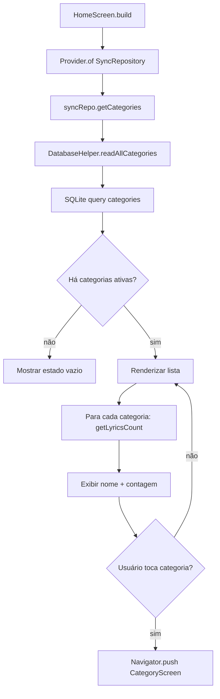
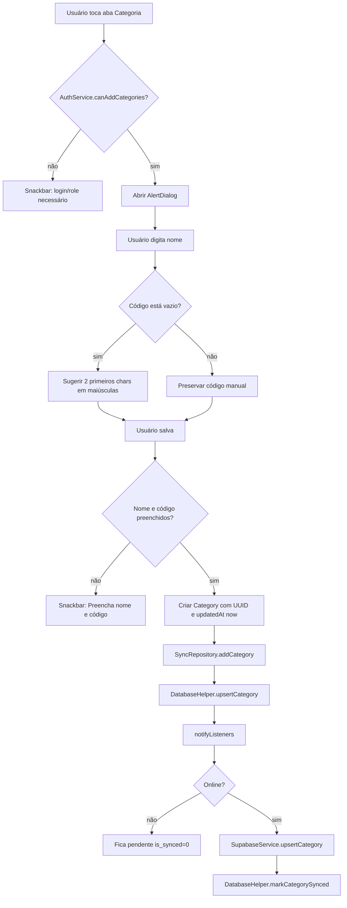
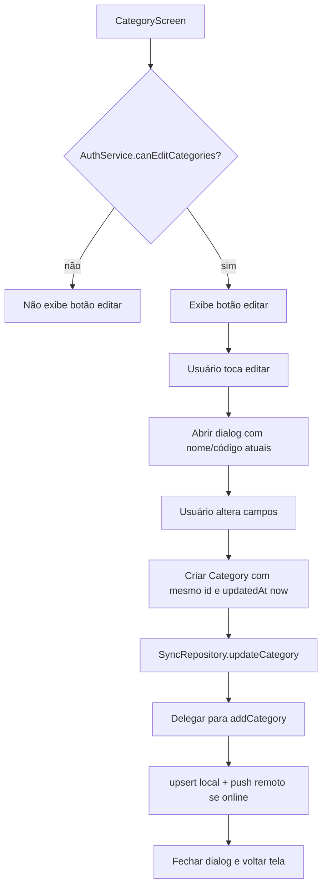
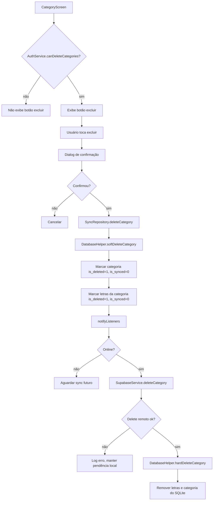
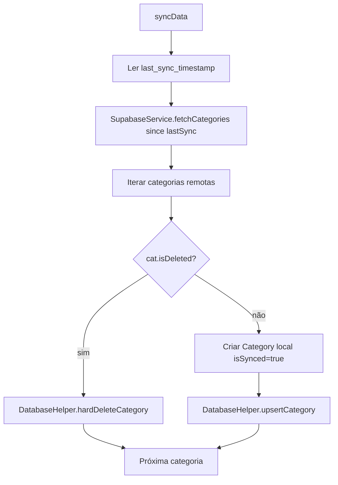
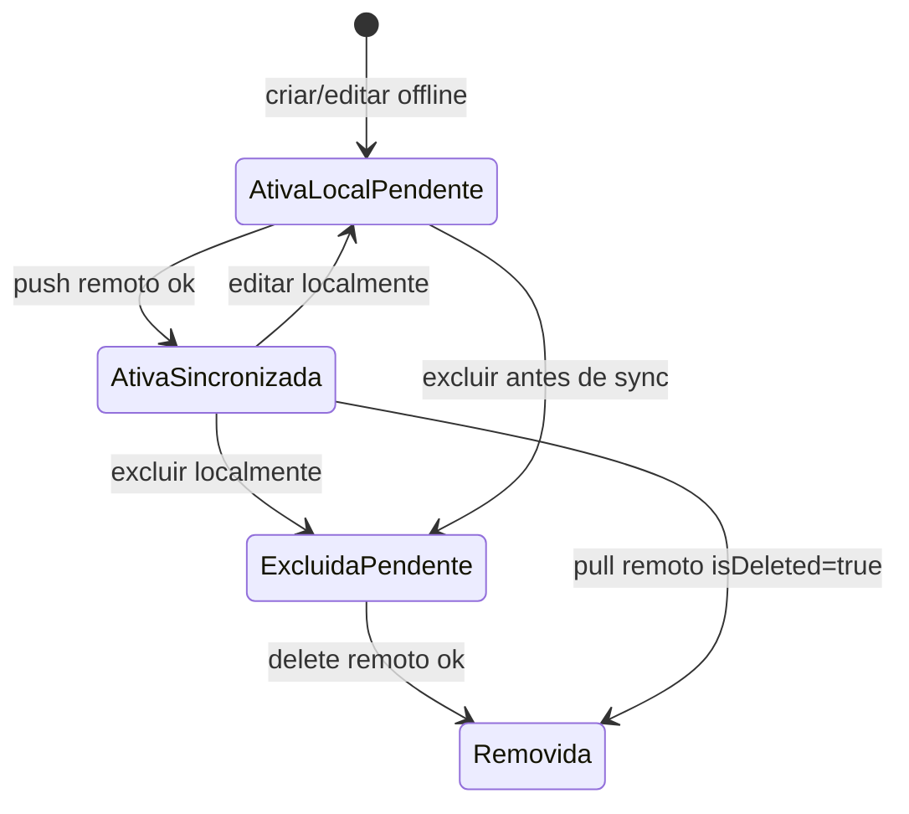

# Acervo e Categorias — Fluxos Operacionais

## Fluxo 1 — Listar e navegar por categorias

### Contrato do fluxo

- 🟢 **CONFIRMADO** — A query deve filtrar `is_deleted = 0`.
- 🟢 **CONFIRMADO** — A query deve ordenar por `name ASC`.
- 🟢 **CONFIRMADO** — A contagem de pontos é derivada de letras locais da categoria.
- 🟢 **CONFIRMADO** — A navegação passa o objeto `Category` para `CategoryScreen`.

## Fluxo 2 — Criar categoria

### Contrato do fluxo

- 🟢 **CONFIRMADO** — Categoria não deve ser criada sem nome e código.
- 🟢 **CONFIRMADO** — O código salvo pela UI deve ser maiúsculo.
- 🟢 **CONFIRMADO** — O ID é gerado no cliente com UUID.
- 🟢 **CONFIRMADO** — A persistência local ocorre antes do push remoto.
- 🟡 **INFERIDO** — Falha remota por código duplicado deve manter a categoria pendente ou exigir correção posterior; o legado não trata com mensagem específica.

## Fluxo 3 — Editar categoria

### Contrato do fluxo

- 🟢 **CONFIRMADO** — Edição exige `moderator` ou `admin`.
- 🟢 **CONFIRMADO** — O ID da categoria deve ser preservado.
- 🟢 **CONFIRMADO** — `updatedAt` deve ser atualizado.
- 🟢 **CONFIRMADO** — A implementação legada volta uma tela após salvar para recarregar dados.

## Fluxo 4 — Excluir categoria

### Contrato do fluxo

- 🟢 **CONFIRMADO** — Exclusão exige `admin`.
- 🟢 **CONFIRMADO** — Exclusão local é lógica antes de ser física.
- 🟢 **CONFIRMADO** — Letras associadas devem acompanhar o estado de exclusão.
- 🟢 **CONFIRMADO** — Exclusão remota atualiza `is_deleted = true` em Supabase.

## Fluxo 5 — Pull incremental de categorias

### Contrato do fluxo

- 🟢 **CONFIRMADO** — Pull incremental depende de `updated_at > lastSync`.
- 🟢 **CONFIRMADO** — Categoria remota excluída remove fisicamente a categoria local.
- 🟢 **CONFIRMADO** — Categoria remota ativa é salva localmente como sincronizada.

## Estados relevantes

## Pontos de falha

| Falha | Comportamento legado | Confiança |
|---|---|---|
| Usuário sem permissão tenta criar categoria | Snackbar de erro/login | 🟢 |
| Nome/código vazio | Snackbar `Preencha nome e código` | 🟢 |
| Push remoto falha | `debugPrint`, categoria fica local | 🟢 |
| Delete remoto falha | `debugPrint`, categoria fica pendente local | 🟢 |
| Código duplicado no Supabase | Não há tratamento específico documentado | 🟡 |
| Conflito de edição offline/remota | Não há resolução explícita | 🔴 |

