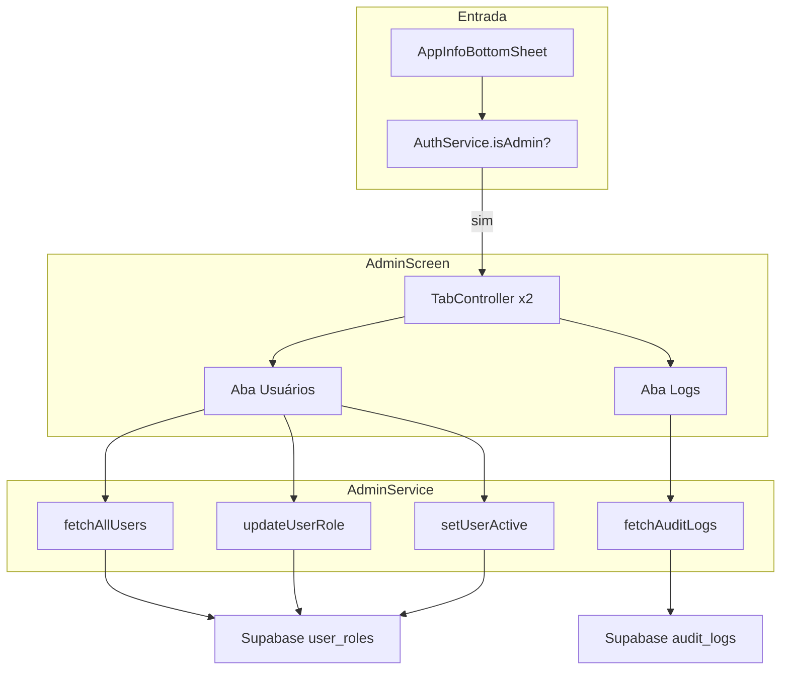
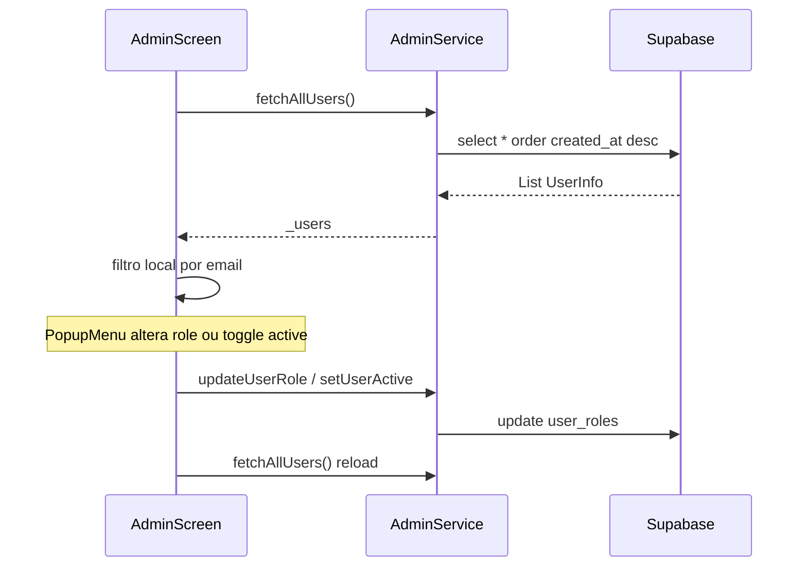
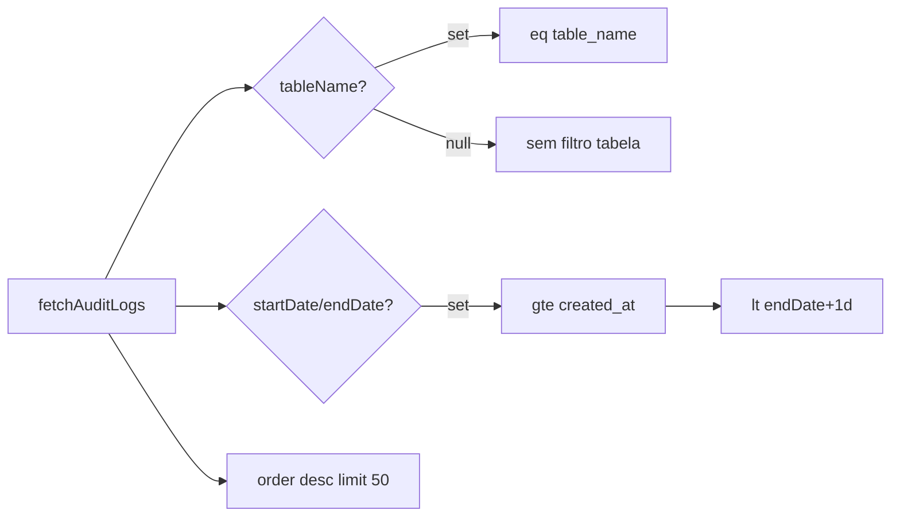
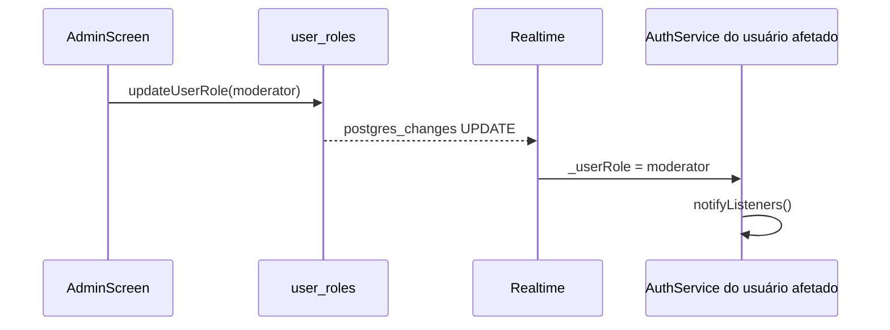

# Administração — Design

> **Contrato arquitetural:** [`../architecture-contract.md`](../architecture-contract.md) — **R-03**, **P-04**; dados admin só Supabase (§4).

## Decisão Arquitetural

🟢 **CONFIRMADO** — Painel admin **mobile-first** embutido no app Flutter, sem backoffice web separado.  
🟢 **CONFIRMADO** — `AdminService` é classe stateless instanciada pela tela (não é `ChangeNotifier` global).  
🟢 **CONFIRMADO** — Dados administrativos vêm **somente do Supabase**; sem cache SQLite para usuários/logs.  
🟢 **CONFIRMADO** — Autorização de entrada na UI via `AuthService.isAdmin`; enforcement de escrita via RLS `has_role('admin')`.  
🟢 **CONFIRMADO** — Auditoria em produção: `audit_logs` + `audit_trigger_func` + triggers `audit_categories`/`audit_lyrics` (backup 2026-01-21).  
🟡 **INFERIDO** — Versionar DDL em `supabase/migrations/` a partir de `_reversa_sdd/supabase-extracted/audit_logs.sql`.

## Componentes

| Componente | Tipo | Responsabilidade | Dependências |
|------------|------|------------------|--------------|
| `AdminScreen` | `StatefulWidget` + `TabController` | UI duas abas, filtros, dialogs | `AdminService`, `UserInfo`, `AuditLog` |
| `AdminService` | Service | PostgREST queries/updates | `SupabaseClient` |
| `UserInfo` | Model | Usuário administrável | map `user_roles` |
| `AuditLog` | Model | Evento CRUD auditado | map `audit_logs` |
| `showAppInfoBottomSheet` | Navegação | Gate + `Navigator.push(AdminScreen)` | `AuthService.isAdmin` |
| `AuthService` | Consumidor indireto | Realtime de role após promoção | — |

## Modelo de Dados

### `user_roles` (campos usados pelo admin)

| Coluna | Tipo | Uso na UI | Confiança |
|--------|------|-----------|-----------|
| `id` | UUID | Chave para update | 🟢 |
| `email` | TEXT | Título do ListTile, busca | 🟢 |
| `role` | TEXT | Chip + PopupMenu | 🟢 |
| `is_active` | BOOLEAN | Status visual, toggle | 🟡 (app sim; schema base não) |
| `avatar_url` | TEXT nullable | Avatar na lista | 🟢 |
| `created_at` | TIMESTAMPTZ | Ordenação fetch | 🟢 |
| `updated_at` | TIMESTAMPTZ | Atualizado em mutações | 🟢 |

### `audit_logs` (inferido do model Dart + queries)

| Coluna | Tipo | Uso | Confiança |
|--------|------|-----|-----------|
| `id` | TEXT/UUID | PK, detalhe | 🟢 |
| `table_name` | TEXT | Filtro + label | 🟢 |
| `record_id` | TEXT | ID do registro afetado | 🟢 |
| `action` | TEXT | INSERT/UPDATE/DELETE | 🟢 |
| `old_data` | JSONB nullable | Dialog detalhe | 🟢 |
| `new_data` | JSONB nullable | Dialog detalhe | 🟢 |
| `user_id` | UUID nullable | Executor | 🟢 |
| `user_email` | TEXT nullable | Subtítulo lista | 🟢 |
| `created_at` | TIMESTAMPTZ | Ordenação, filtro data | 🟢 |

🟢 **CONFIRMADO** — Estrutura presente no backup de produção; ver `supabase-extracted/audit_logs.sql`.

## Arquitetura da Tela

## Aba Usuários — Comportamento

### Elementos visuais por usuário

| Estado | Representação |
|--------|----------------|
| Ativo | Avatar colorido, email normal |
| Inativo | Avatar cinza, email `lineThrough`, chip "Inativo" |
| Role user | Chip azul "Usuário" |
| Role moderator | Chip tertiary "Moderador" |
| Role admin | `RoleBadge` verde (`AppColors.roleAdmin` / `#1DB954`) |

## Aba Logs — Filtros e Query

### Mapeamento de ícones por ação

| `action` | Ícone | Cor semântica |
|----------|-------|---------------|
| INSERT | `add_circle` | primary |
| UPDATE | `edit` | tertiary |
| DELETE | `delete` | error |

## Dialog de Detalhe do Log

🟢 **CONFIRMADO** — Campos fixos: ID registro, nome (`recordName`), email executor, data formatada `dd/MM/yyyy HH:mm`.  
🟢 **CONFIRMADO** — `old_data` em container vermelho claro; `new_data` em verde claro.  
🟢 **CONFIRMADO** — `_formatJson` omite chaves `is_synced` e `is_deleted` na exibição.

## API `AdminService`

| Método | Operação | Retorno |
|--------|----------|---------|
| `fetchAllUsers()` | SELECT `user_roles` ORDER desc | `List<UserInfo>` |
| `updateUserRole(userId, role)` | UPDATE role + updated_at | void / throw |
| `setUserActive(userId, isActive)` | UPDATE is_active + updated_at | void / throw |
| `fetchAuditLogs({table, dates, limit})` | SELECT filtrado | `List<AuditLog>` |
| `fetchAuditLogById(id)` | SELECT maybeSingle | `AuditLog?` |
| `getAuditStats()` | COUNT por table_name | `Map<String,int>` |

🟡 **INFERIDO** — `fetchAuditLogById` e `getAuditStats` não são chamados por `AdminScreen` hoje.

## Segurança

| Camada | Mecanismo | Gap |
|--------|-----------|-----|
| UI entrada | `if (authService.isAdmin)` no bottom sheet | 🟢 |
| Rota | Sem `RouteGuard` | 🟡 qualquer admin hardcoded na navegação |
| API write | RLS `has_role('admin')` em `user_roles` | 🟢 |
| API read logs | 🔴 policy SELECT admin não no schema repo | 🔴 |
| Sessão inativa | Sem invalidação | 🔴 |

## Integração com Autenticação

🟢 **CONFIRMADO** — Promoção/rebaixamento reflete na sessão ativa do usuário sem relogin.

## Lacunas e Débitos Técnicos

| Item | Impacto |
|------|---------|
| Schema `audit_logs` ausente no repo | Impossível reproduzir ambiente só com migrations locais |
| `is_active` sem migration versionada | Deploy fresh pode falhar em `setUserActive` |
| Sem route guard | AdminScreen acessível se navegação for exposta |
| `getAuditStats` órfão | Código morto ou feature dashboard futura |
| Desativação não bloqueia auth | Usuário inativo continua operando até policy adicionada |
