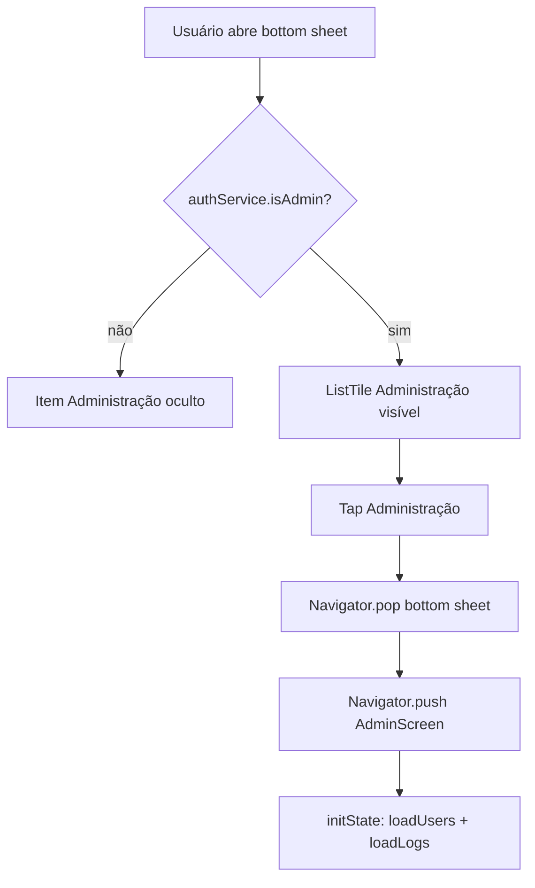
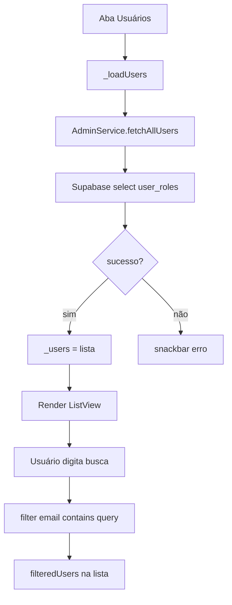
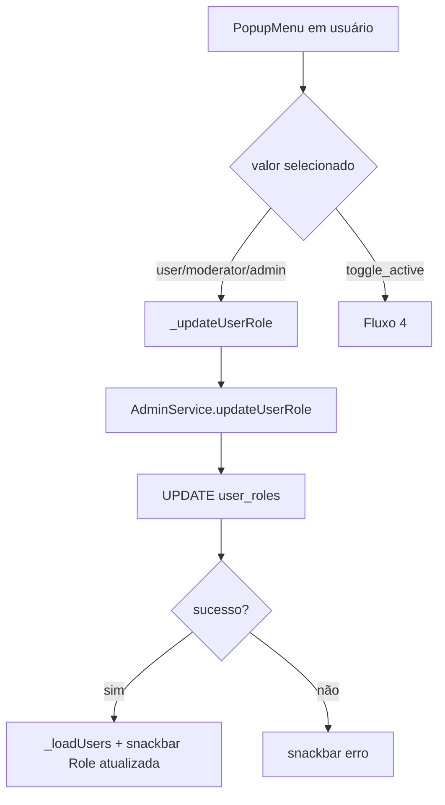
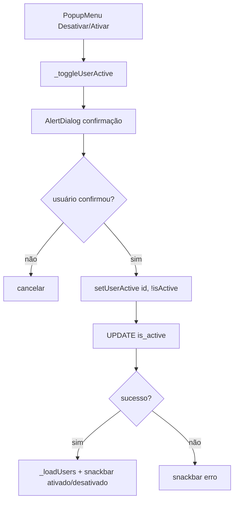
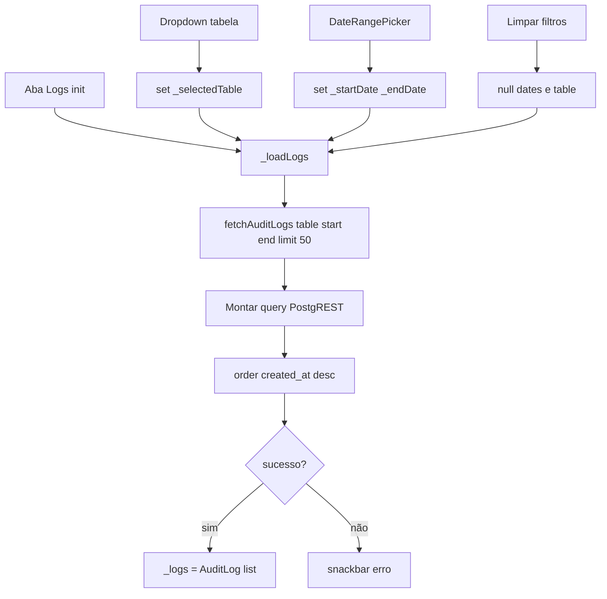
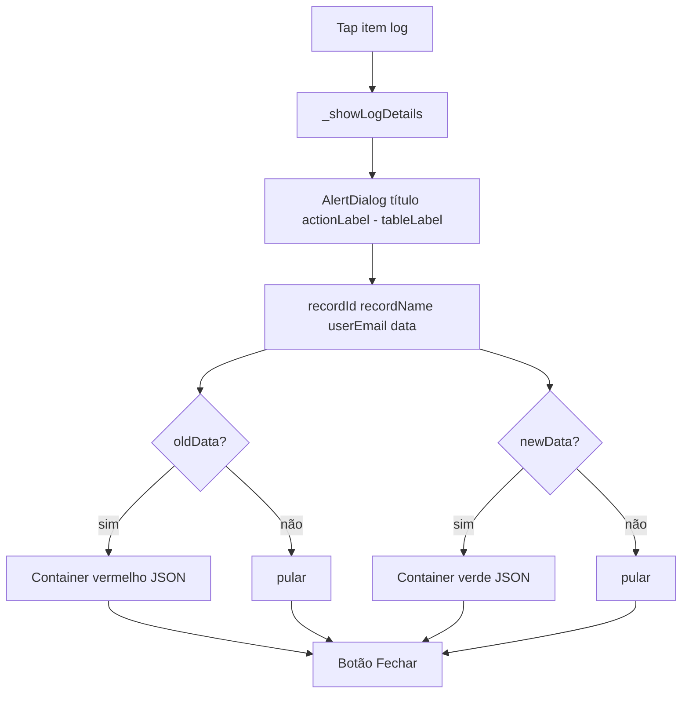
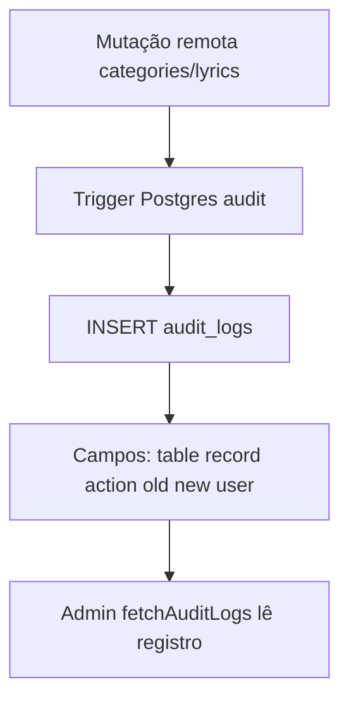
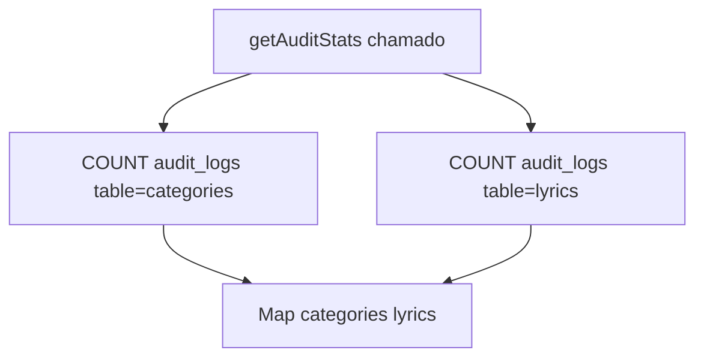

# Administração — Fluxos Operacionais

## Fluxo 1 — Acesso à área administrativa

### Contrato do fluxo

- 🟢 **CONFIRMADO** — Único gate documentado é `isAdmin` no bottom sheet.
- 🟡 **INFERIDO** — `AdminScreen` não revalida admin ao montar.
- 🟢 **CONFIRMADO** — Usuário precisa estar logado com Google (não anônimo) e ter role `admin` em `user_roles`.

## Fluxo 2 — Listar e buscar usuários

### Contrato do fluxo

- 🟢 **CONFIRMADO** — Busca é **client-side**; não dispara nova query Supabase.
- 🟢 **CONFIRMADO** — Lista vazia após filtro mostra "Nenhum usuário encontrado".
- 🟢 **CONFIRMADO** — Pull-to-refresh reexecuta fetch completo.

## Fluxo 3 — Alterar role de usuário

### Contrato do fluxo

- 🟢 **CONFIRMADO** — Não há confirmação extra para mudança de role (apenas para ativo/inativo).
- 🟢 **CONFIRMADO** — Usuário afetado com app aberto recebe nova role via Realtime (`AuthService`).
- 🟢 **CONFIRMADO** — `updated_at` é gravado em ISO8601 no update.

## Fluxo 4 — Ativar ou desativar usuário

### Contrato do fluxo

- 🟢 **CONFIRMADO** — Texto do dialog usa email do usuário.
- 🟢 **CONFIRMADO** — Visual inativo: `lineThrough`, chip cinza, ícone `person_off`.
- 🟢 **CONFIRMADO** — Usuário desativado não deve conseguir login (`is_active=false` bloqueia autenticação).  
- 🟡 **INFERIDO** — Legado ainda permite uso até policy/`AuthService` implementarem bloqueio.

## Fluxo 5 — Listar logs com filtros

### Contrato do fluxo

- 🟢 **CONFIRMADO** — Filtro de data exibe faixa formatada `dd/MM/yyyy` abaixo dos filtros.
- 🟢 **CONFIRMADO** — Ícone calendário fica destacado (primary) quando há range ativo.
- 🟢 **CONFIRMADO** — Botão clear só aparece se há filtro ativo.
- 🟢 **CONFIRMADO** — Limite fixo 50 registros por página (sem paginação "carregar mais").

## Fluxo 6 — Detalhar log de auditoria

### Contrato do fluxo

- 🟢 **CONFIRMADO** — `_formatJson` exclui `is_synced` e `is_deleted` da exibição.
- 🟢 **CONFIRMADO** — `recordName` para DELETE usa `old_data`; para INSERT/UPDATE usa `new_data`.
- 🟢 **CONFIRMADO** — Email ausente exibe "Desconhecido" / "Anônimo" na lista.

## Fluxo 7 — Geração de log (servidor — lacuna)

### Contrato do fluxo

- 🟢 **CONFIRMADO** — Triggers `audit_categories` e `audit_lyrics` existem em produção (backup 2026-01-21).
- 🟢 **CONFIRMADO** — App espera ações `INSERT`, `UPDATE`, `DELETE` e tabelas `categories`, `lyrics`.

## Fluxo 8 — Estatísticas de logs (API não usada)

### Contrato do fluxo

- 🟡 **INFERIDO** — Método implementado para dashboard futuro; `AdminScreen` não invoca.
- 🟢 **CONFIRMADO** — Em erro retorna `{'categories': 0, 'lyrics': 0}`.

## Matriz fluxo × requisito

| Fluxo | RF relacionados |
|-------|-----------------|
| Acesso admin | RF-01 |
| Listar/buscar usuários | RF-02, RF-05, RF-10 |
| Alterar role | RF-03 |
| Ativar/desativar | RF-04 |
| Listar/filtrar logs | RF-06, RF-07, RF-08, RF-10 |
| Detalhe log | RF-09 |
| Geração servidor | RF-13 |
| Stats API | RF-12 |
