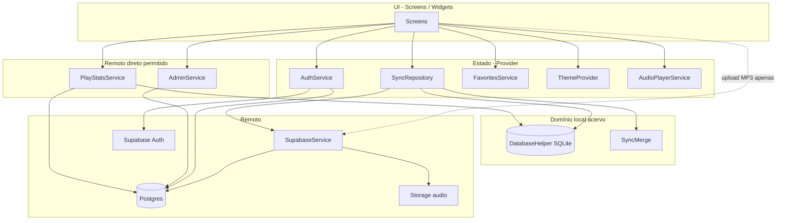

# Contrato Arquitetural — FMA Pontos

> Documento normativo para implementação e revisão de código.  
> Versão: **1.0** · Data: **2026-05-19** · Aprovado por: Roberto (direção offline-first)  
> Complementa: `_reversa_sdd/architecture.md` (visão C4 legada) · Não substitui specs por feature em `_reversa_sdd/*/`

---

## 1. Propósito

Este contrato define **onde cada dado vive**, **quem pode ler/escrever** e **como a sincronização deve se comportar**. Objetivo: manter o app **offline-first no acervo**, sem acoplar a UI ao Supabase, e deixar explícitas as exceções que já existem no legado.

**Princípio reitor:** a interface reage ao estado local; a nuvem é réplica compartilhada e fonte de verdade para dados globais/administrativos.

---

## 2. Escopo

| Incluído | Excluído |
|----------|----------|
| Acervo: categorias, letras, referências de áudio | Infra de CI/CD (detalhes em `release-update/`) |
| Sincronização push/pull | Texto legal completo da política (ver `onboarding-privacidade/`) |
| Auth, RBAC, storage de MP3 | Implementação pixel-perfect de UI |
| Favoritos, tema, consentimento local | Migração futura Drift/Riverpod (seção 8 — opcional) |
| Estatísticas remotas, admin, update | |

---

## 3. Stack (legado atual vs. alvo opcional)

### 3.1 Legado em produção (obrigatório respeitar até migração explícita)

| Camada | Tecnologia | Papel |
|--------|------------|-------|
| UI | Flutter / Material 3 | Telas e navegação |
| Estado | **Provider** + `ChangeNotifier` | `AuthService`, `SyncRepository`, etc. |
| Local (acervo) | **SQLite** via **sqflite** + `DatabaseHelper` | Fonte operacional da UI para categorias/letras |
| Remoto | **Supabase Postgres** + RLS | Réplica compartilhada |
| Auth | **Supabase Auth** + Google Sign-In | Sessão anônima e login |
| Arquivos | **Supabase Storage** (bucket `audio`) | MP3 públicos; paths `lyrics/{filename}` |
| Sync | **`SyncRepository`** + flag `is_synced` | Fila implícita; não há tabela `sync_queue` |
| Prefs locais | **SharedPreferences** | Favoritos, tema, onboarding, `last_sync_timestamp` |

### 3.2 Alvo opcional (melhoria — não é requisito de correção)

| Camada | Substituição possível | Quando adotar |
|--------|----------------------|---------------|
| ORM local | **Drift** no lugar de sqflite cru | Schema complexo, mais devs, testes de query |
| Estado | **Riverpod** no lugar de Provider | Estado mais granular, testes, múltiplos listeners |

**Regra:** nenhum PR é obrigado a introduzir Drift/Riverpod até decisão de migração registrada neste documento (nova versão do contrato).

---

## 4. Mapa de persistência (fonte de verdade por domínio)

| Domínio | Fonte de verdade (UI) | Persistência | Sync / remoto | Observação |
|---------|------------------------|--------------|---------------|------------|
| Categorias | SQLite | `categories` | Supabase `categories` | Offline-first |
| Letras | SQLite | `lyrics` | Supabase `lyrics` | Inclui `local_audio_path` **somente local** |
| Fila de sync (acervo) | SQLite | coluna `is_synced` | — | `0` = pendente de push |
| Fila de stats (acessos) | SQLite | `pending_access_events` | Flush → RPC `increment_play_count` | Só autenticado não anônimo |
| Exclusões | SQLite + remoto | `is_deleted` | Soft delete remoto (`is_deleted=true`) | Tombstones no PULL via views `sync_*` |
| Áudio (binário) | Supabase Storage | URL em `lyrics.audio_url` | Upload/delete via `SupabaseService` | Ver regra 5.3 |
| Favoritos | SharedPreferences | `favorite_lyrics` | **Não sincroniza** | Por dispositivo |
| Tema | SharedPreferences | theme key | **Não sincroniza** | |
| Onboarding / LGPD | SharedPreferences | `onboarding_completed`, `privacy_policy_version` | **Não sincroniza** | Nova política → novo aceite |
| Sessão / identidade | Supabase Auth | JWT / sessão SDK | — | Anônimo permitido para leitura |
| Role / `is_active` | Supabase | `user_roles` | Realtime opcional | `is_active=false` → bloqueia login |
| Estatísticas de acesso | Supabase + SQLite | `lyric_play_stats` + `pending_access_events` | RPC `increment_play_count`; fila offline com flush no sync | Sem INSERT client em `lyric_play_stats` |
| Auditoria (admin) | Supabase | `audit_logs` | Triggers em `categories`/`lyrics` | Sem cache local obrigatório |
| Update do app | GitHub Releases API | — | HTTPS | Fora do SQLite |

---

## 5. Regras obrigatórias

### 5.1 Leitura (Read)

| ID | Regra | Aplica a |
|----|-------|----------|
| **R-01** | Telas de acervo **devem** ler categorias e letras apenas via `SyncRepository` (ou camada que delega a `DatabaseHelper`). | Home, Category, Search, LyricView, LyricForm (listas), Favorites (resolução de IDs) |
| **R-02** | **Proibido** `client.from('categories'|'lyrics').select()` direto em telas de acervo. | Screens |
| **R-03** | Admin, estatísticas e auth **podem** ler Supabase diretamente via serviços dedicados. | `AdminService`, `PlayStatsService`, `AuthService` |
| **R-04** | Favoritos e tema leem **SharedPreferences** via seus serviços; não passam pelo SQLite. | `FavoritesService`, `ThemeProvider` |

### 5.2 Escrita (Write)

| ID | Regra | Aplica a |
|----|-------|----------|
| **W-01** | Criar/editar/excluir categoria ou letra **deve** gravar no SQLite **antes** de qualquer push remoto. | `SyncRepository.add*`, `update*`, `delete*` |
| **W-02** | Após escrita local, marcar `is_synced = 0` (implícito em upsert/soft delete). | `DatabaseHelper` |
| **W-03** | Exclusão de letra/categoria no remoto **deve** ser soft delete (`is_deleted = true`), alinhado ao ADR 001. | `SupabaseService.delete*` |
| **W-04** | Escritas em `categories`/`lyrics` no Postgres **somente** para usuários autenticados (não `anon`). | RLS / migrations |
| **W-05** | Usuário com `is_active = false` **não pode** permanecer autenticado; `AuthService` encerra sessão. | Auth |

### 5.3 Áudio e Storage (exceção controlada)

| ID | Regra | Detalhe |
|----|-------|---------|
| **A-01** | Upload de MP3 **pode** ir ao Supabase Storage **antes** de persistir a URL no SQLite, desde que o save da letra passe por `SyncRepository.addLyric` com `audioUrl` preenchido. | Fluxo `LyricFormScreen` |
| **A-02** | `local_audio_path` **nunca** é enviado ao Supabase (`toSupabaseMap` não inclui). | Model `Lyric` |
| **A-03** | Download de MP3 para uso offline é responsabilidade do `SyncRepository._downloadMissingAudios`, não da UI. | Pós-PULL |
| **A-04** | Remoção de áudio no Storage **pode** ser imediata na UI de edição; metadado da letra atualiza via `SyncRepository`. | |

### 5.4 Sincronização

| ID | Regra | Detalhe |
|----|-------|---------|
| **S-01** | Orquestração central em **`SyncRepository.syncData()`**: PUSH acervo → **flush stats** → PULL → segundo PUSH → download de áudios. | |
| **S-02** | PUSH processa registros com `is_synced = 0`; após sucesso, `mark*Synced`. Anônimo ou sem `can*` **não** enfileiram push. | `AuthService` + `SyncRepository` |
| **S-03** | PULL incremental usa `last_sync_timestamp` em SharedPreferences; fetch via views **`sync_categories` / `sync_lyrics`** (inclui tombstones). | `SupabaseService` |
| **S-04** | Conflito: **LWW record-level** — vence o snapshot com `updated_at` mais recente; dirty local com timestamp maior **não** é sobrescrito no PULL. | `SyncMerge` |
| **S-05** | Após PULL que gera merge local, executar **segundo PUSH** no mesmo ciclo. | |
| **S-06** | CRUD online dispara `syncData()`; falha deixa `is_synced = 0` e `lastSyncError` preenchido. | |
| **S-07** | `syncData()` não roda se `isOffline` ou `isSyncing`. | |
| **S-08** | Conectividade restaurada dispara sync automático (inclui flush de acessos pendentes). | `connectivity_plus` |
| **S-09** | Acessos offline: `pending_access_events` (SQLite v6); flush com N RPCs individuais após PUSH, só sessão autenticada não anônima. | `PlayStatsService` |

### 5.5 Segurança e permissões (cliente)

| ID | Regra | Papel mínimo |
|----|-------|--------------|
| **P-01** | Adicionar letra | `user` (não anônimo) |
| **P-02** | Editar letra / categorias | `moderator` |
| **P-03** | Excluir letra / categoria | `admin` |
| **P-04** | Tela Admin | `admin` + guard na rota (`AdminScreen`) |

---

## 6. Camadas e dependências permitidas

**Dependências proibidas:**

- Screen → `DatabaseHelper` (pular `SyncRepository`)
- Screen → `SupabaseClient` para acervo
- `DatabaseHelper` → Supabase

---

## 7. Contratos por serviço

| Serviço | Pode ler | Pode escrever | Não pode |
|---------|----------|---------------|----------|
| `SyncRepository` | SQLite (acervo) | SQLite + orquestrar `SupabaseService` | Lógica de UI |
| `DatabaseHelper` | SQLite | SQLite | Rede |
| `SupabaseService` | Postgres + Storage (acervo) | Postgres + Storage (acervo) | SharedPreferences |
| `AuthService` | Auth + `user_roles` | Auth + insert role inicial | Categorias/letras |
| `AdminService` | `user_roles`, `audit_logs` | `user_roles` (role, `is_active`) | SQLite acervo |
| `PlayStatsService` | `lyric_play_stats` + SQLite (join) | `lyric_play_stats` | Alterar letras |
| `FavoritesService` | SharedPreferences | SharedPreferences | Supabase |

---

## 8. Evolução planejada (opcional)

Se o projeto adotar Drift + Riverpod:

| Item | Ação |
|------|------|
| ORM | Migrar `DatabaseHelper` → Drift; manter schema equivalente (v5+) |
| Fila | Manter `is_synced` ou introduzir `sync_queue` com migração documentada |
| Estado | Providers atuais → `@riverpod` notifiers; `SyncRepository` permanece único orquestrador de sync |
| Contrato | Incrementar versão deste doc; **R-01 a S-08 permanecem válidas** |

---

## 9. Checklist de revisão de PR

Use antes de merge em código de app:

- [ ] Tela de acervo nova usa `SyncRepository` para leitura?
- [ ] Escrita de categoria/letra passa por SQLite primeiro?
- [ ] Nenhum `select()` direto em `categories`/`lyrics` na screen?
- [ ] Exclusão remota é soft delete?
- [ ] `local_audio_path` fora do payload Supabase?
- [ ] Conflito de sync considera `SyncMerge` se tocar PUSH/PULL?
- [ ] Feature admin/stats não força cache SQLite desnecessário?
- [ ] RBAC respeitado (`AuthService.hasRole`)?

---

## 10. Rastreabilidade

| Decisão | Origem |
|---------|--------|
| Offline-first SQLite | ADR implícito legado · `architecture.md` |
| Soft delete unificado | ADR 001 · Pergunta 6 Revisor |
| Merge por campo | Pergunta 1 Revisor · `SyncMerge` |
| `is_active` bloqueia login | Pergunta 4 |
| Sem INSERT anon | Pergunta 5 |
| `privacy_policy_version` | Pergunta 8 |
| Política enxuta | Pergunta 7 |

| Artefato legado | Seção |
|-----------------|-------|
| `lib/services/sync_repository.dart` | 5.4, 7 |
| `lib/services/db_helper.dart` | 4, 5.1–5.2 |
| `lib/services/supabase_service.dart` | 5.3, 7 |
| `lib/services/auth_service.dart` | 5.2 W-05, 7 |
| `lib/main.dart` | 3.1 |

---

## 11. Histórico de versões

| Versão | Data | Alteração |
|--------|------|-----------|
| 1.0 | 2026-05-19 | Contrato inicial (legado sqflite + Provider; alvo Drift/Riverpod opcional) |
