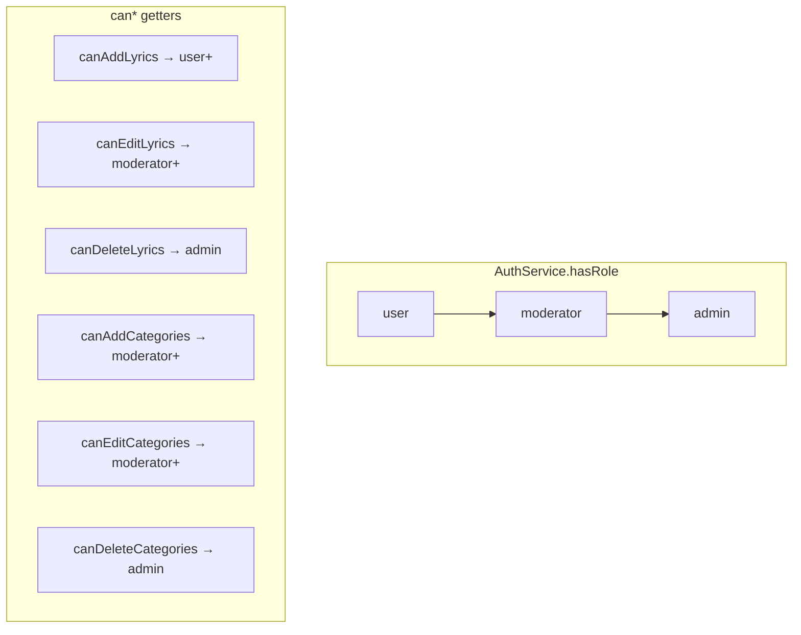
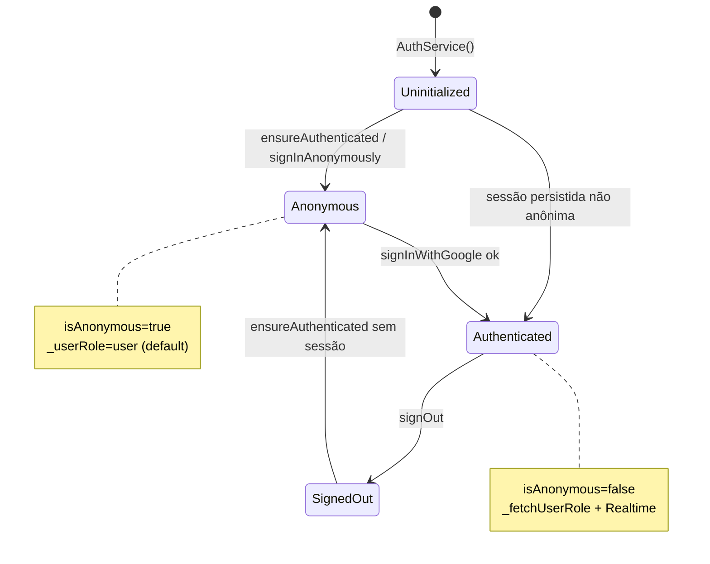
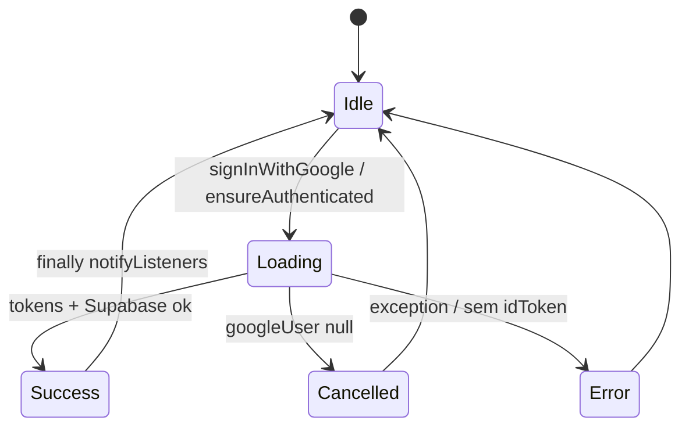
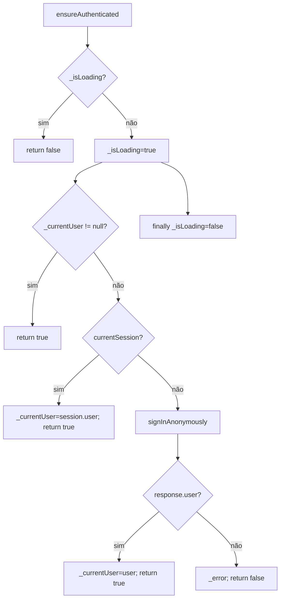
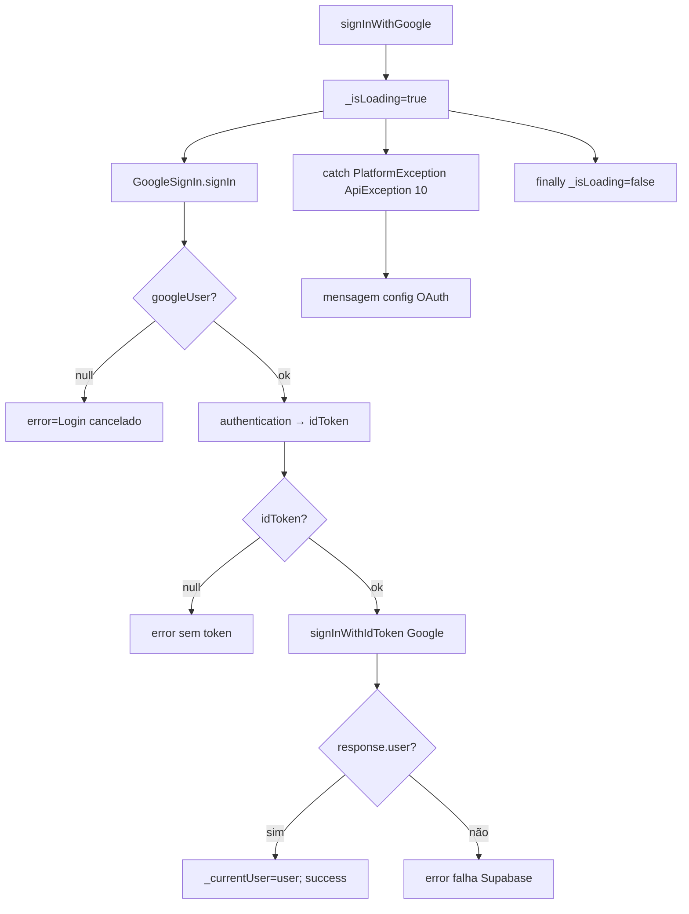
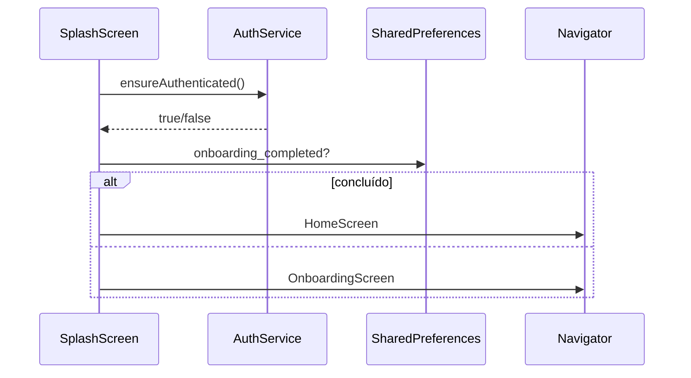

# Autenticação — Design

> **Contrato arquitetural:** [`../architecture-contract.md`](../architecture-contract.md) — **W-05** (`is_active`), mapa §4 (Auth / `user_roles`).

## Decisão Arquitetural

🟢 **CONFIRMADO** — **Supabase Auth** como provedor de identidade; **Google Sign-In** apenas como origem de `idToken`/`accessToken`.  
🟢 **CONFIRMADO** — **Sessão anônima por padrão** na primeira abertura — permite uso do app e vínculo de dispositivo sem cadastro.  
🟢 **CONFIRMADO** — **RBAC híbrido**: regras no cliente (`AuthService.hasRole`) + enforcement no Postgres (`has_role()`, RLS).  
🟢 **CONFIRMADO** — **Realtime** para propagar mudanças de role sem reinício do app.  
🟡 **INFERIDO** — Segurança efetiva de escrita depende das policies Supabase; UI é camada de conveniência, não única barreira.

## Componentes

| Componente | Tipo | Responsabilidade | Dependências |
|------------|------|------------------|--------------|
| `AuthService` | `ChangeNotifier` | Sessão, login Google, RBAC, Realtime role | `supabase_flutter`, `google_sign_in` |
| `SupabaseClient` | SDK | Auth, PostgREST, Realtime | Inicializado em `main()` |
| `GoogleSignIn` | SDK | OAuth UI nativo, tokens | `serverClientId` Web Client |
| `showAppInfoBottomSheet` | Widget | Login/logout, perfil, atalho admin | `AuthService`, `ThemeProvider` |
| `SplashScreen` | Tela | `ensureAuthenticated` antes de onboarding/home | `AuthService` |
| Telas de acervo | Consumidores | Checagem `can*` / `isAnonymous` | `Provider` |

## Modelo de Dados — `user_roles`

| Coluna | Tipo | Uso | Confiança |
|--------|------|-----|-----------|
| `id` | UUID PK → `auth.users` | Identificador do usuário | 🟢 |
| `email` | TEXT NOT NULL | Email exibido/admin | 🟢 |
| `role` | TEXT CHECK (`user`,`moderator`,`admin`) | Papel RBAC | 🟢 |
| `created_at` | TIMESTAMPTZ | Auditoria | 🟢 |
| `updated_at` | TIMESTAMPTZ | Auditoria | 🟢 |
| `avatar_url` | TEXT nullable | 🟡 Inserido pelo app no `_createUserRole` | 🟡 |
| `is_active` | BOOLEAN | 🟡 Usado em `UserInfo`/admin; ausente no schema base `supabase_schema.sql` | 🔴 |

🟢 **CONFIRMADO** — Funções SQL `get_user_role()` e `has_role(required_role)` espelham a hierarquia do Dart.

## Hierarquia de Roles (cliente e servidor)



| Getter | Expressão | Confiança |
|--------|-----------|-----------|
| `isAnonymous` | `user == null \|\| user.isAnonymous` | 🟢 |
| `canAddLyrics` | `!isAnonymous && hasRole('user')` | 🟢 |
| `canEditLyrics` | `!isAnonymous && hasRole('moderator')` | 🟢 |
| `canDeleteLyrics` | `!isAnonymous && hasRole('admin')` | 🟢 |
| `canAddCategories` | `!isAnonymous && hasRole('moderator')` | 🟢 |
| `canEditCategories` | `!isAnonymous && hasRole('moderator')` | 🟢 |
| `canDeleteCategories` | `!isAnonymous && hasRole('admin')` | 🟢 |
| `isAdmin` | `hasRole('admin')` | 🟢 |
| `isModerator` | `hasRole('moderator')` | 🟢 |

## Máquina de Estados — Sessão



## Máquina de Estados — Operação de Login



## Fluxo `ensureAuthenticated()`



## Fluxo `signInWithGoogle()`



🟢 **CONFIRMADO** — `onAuthStateChange` dispara `_fetchUserRole` e `_subscribeToRoleChanges` após login não anônimo.

## Realtime — Subscription de Role

| Parâmetro | Valor |
|-----------|-------|
| Canal | `public:user_roles:{userId}` |
| Evento | `UPDATE` |
| Schema | `public` |
| Tabela | `user_roles` |
| Filtro | `id = eq.{userId}` |
| Callback | Atualiza `_userRole` se `role` mudou → `notifyListeners()` |

🟢 **CONFIRMADO** — `_unsubscribeFromRoleChanges` em `signedOut` via `removeChannel`.

## Integração UI

### Splash → Auth → Navegação



### Bottom sheet — estados

| Estado | UI principal | Ações |
|--------|--------------|-------|
| Anônimo | Ícone visitante, texto "Entre para contribuir" | Botão "Entrar com Google" |
| Autenticado | Avatar, nome, email, badge role | Tema, privacidade, admin (se `isAdmin`), Sair |
| Loading | Botão Google com `CircularProgressIndicator` | Desabilitado |

🟢 **CONFIRMADO** — Snackbar de sucesso/erro após login via `showAppSnackBar`.

### Home — avatar e refresh

🟢 **CONFIRMADO** — Se `!isAnonymous && photoUrl != null`, AppBar mostra `CircleAvatar` clicável que abre o mesmo bottom sheet.  
🟢 **CONFIRMADO** — `RefreshIndicator` chama `Future.wait([syncData(), refreshUserRole()])`.

## Configuração Google OAuth

| Parâmetro | Valor / local | Confiança |
|-----------|---------------|-----------|
| Instância | `GoogleSignIn.instance` (singleton v7) | 🟢 |
| Inicialização | `initialize(serverClientId: ...)` em `_init` | 🟢 |
| Login interativo | `authenticate()` | 🟢 |
| `serverClientId` | Web Client ID em `auth_service.dart` | 🟢 |
| Token Supabase | `idToken` via `googleUser.authentication` (getter) | 🟢 |

## RLS e Policies (`user_roles`)

| Policy | Operação | Regra | Confiança |
|--------|----------|-------|-----------|
| Users can view own role | SELECT | `id = auth.uid()` | 🟢 |
| Admins can manage roles | ALL | `has_role('admin')` | 🟢 |
| Users can create own user role | INSERT | 🟡 presente em migrações posteriores | 🟡 |

🟢 **CONFIRMADO** — Trigger `handle_new_user` insere linha em `user_roles` no signup (schema SQL).

## Lacunas e Débitos

| Item | Severidade | Notas |
|------|------------|-------|
| `upgradeToEmail` sem UI | 🟡 | API pronta, fluxo morto |
| `serverClientId` hardcoded | 🟡 | Deveria vir de `--dart-define` em builds |
| Divergência UI vs RLS | 🟡 | Policies remotas podem mudar fora do repo |

## Contratos de Interface (`AuthService`)

```dart
// Estado exposto (🟢 CONFIRMADO)
User? currentUser;
bool isAuthenticated;
bool isAnonymous;
bool isInitialized;
bool isLoading;
String? error;
String? userId, userEmail, displayName, photoUrl;
String userRole;

// Operações (🟢 CONFIRMADO)
Future<bool> ensureAuthenticated();
Future<bool> signInWithGoogle();
Future<void> signOut();
Future<void> refreshUserRole();
Future<bool> upgradeToEmail(String email, String password); // 🟡 sem UI

// Permissões (🟢 CONFIRMADO)
bool hasRole(String requiredRole);
bool canAddLyrics, canEditLyrics, canDeleteLyrics;
bool canAddCategories, canEditCategories, canDeleteCategories;
bool isAdmin, isModerator;
```
