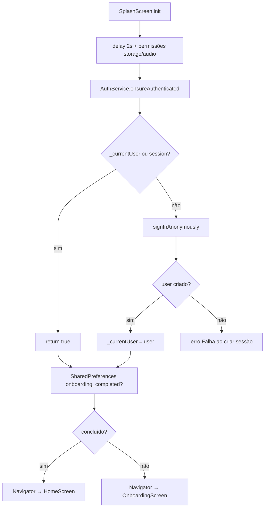
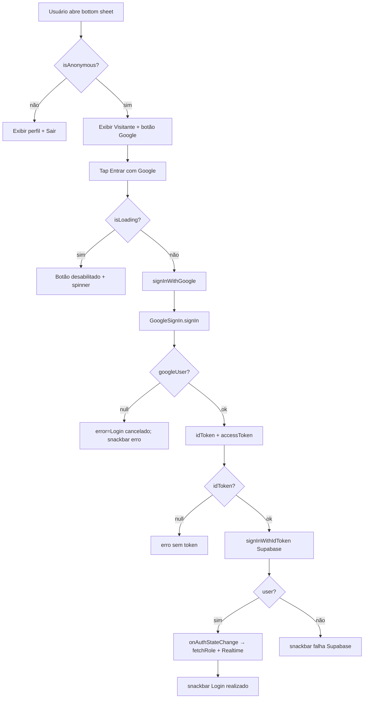
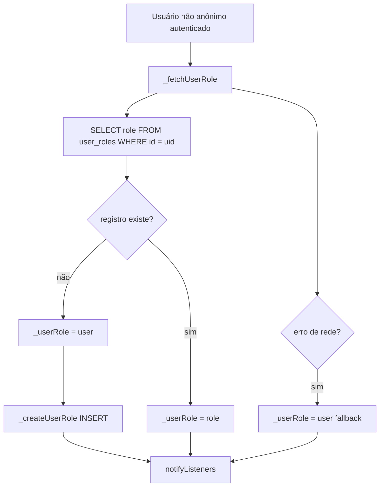
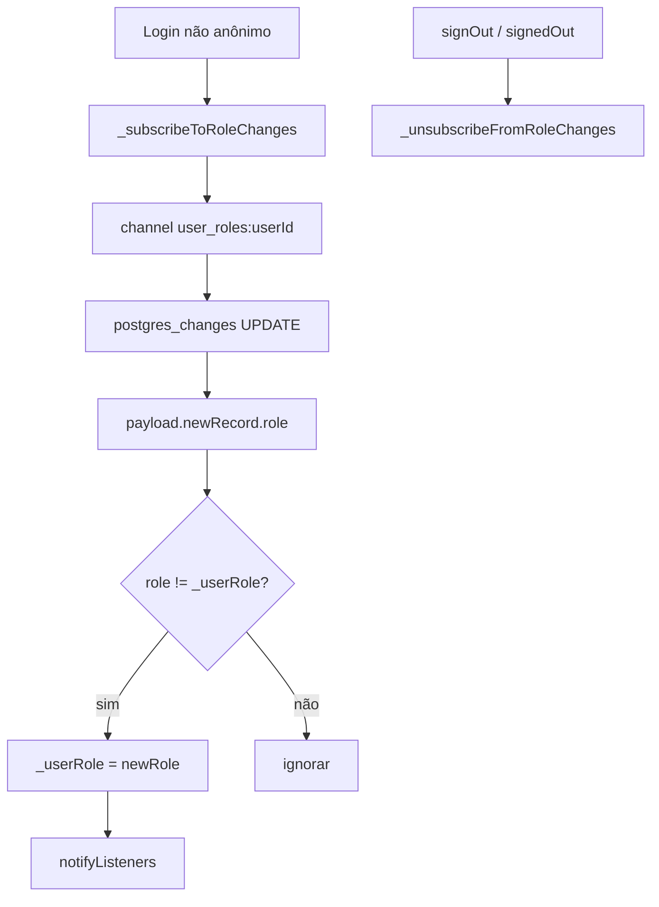
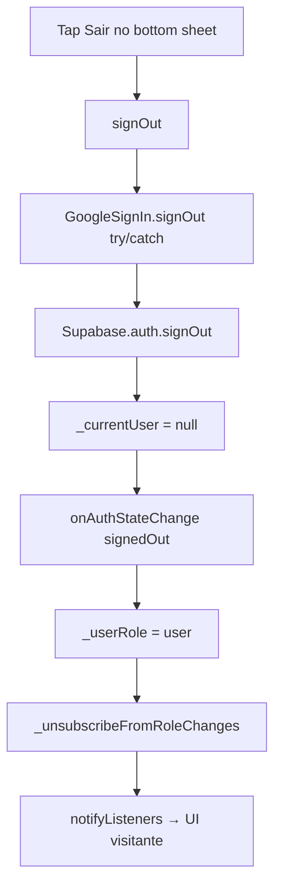
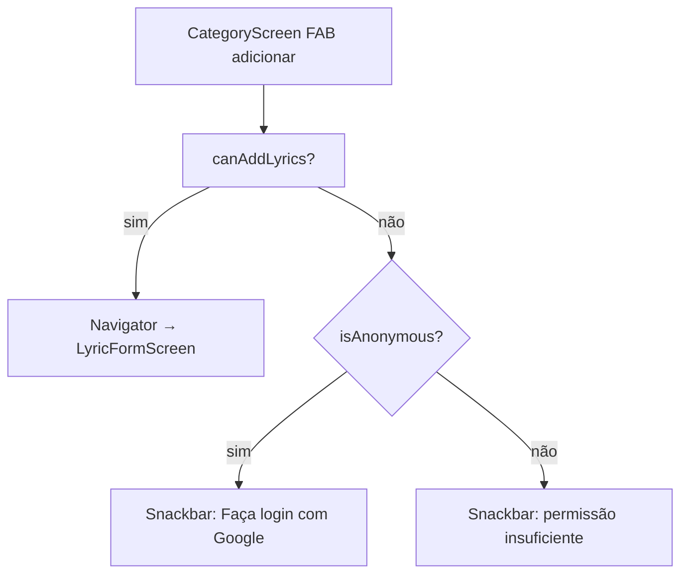
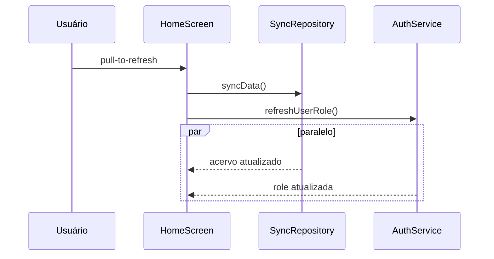
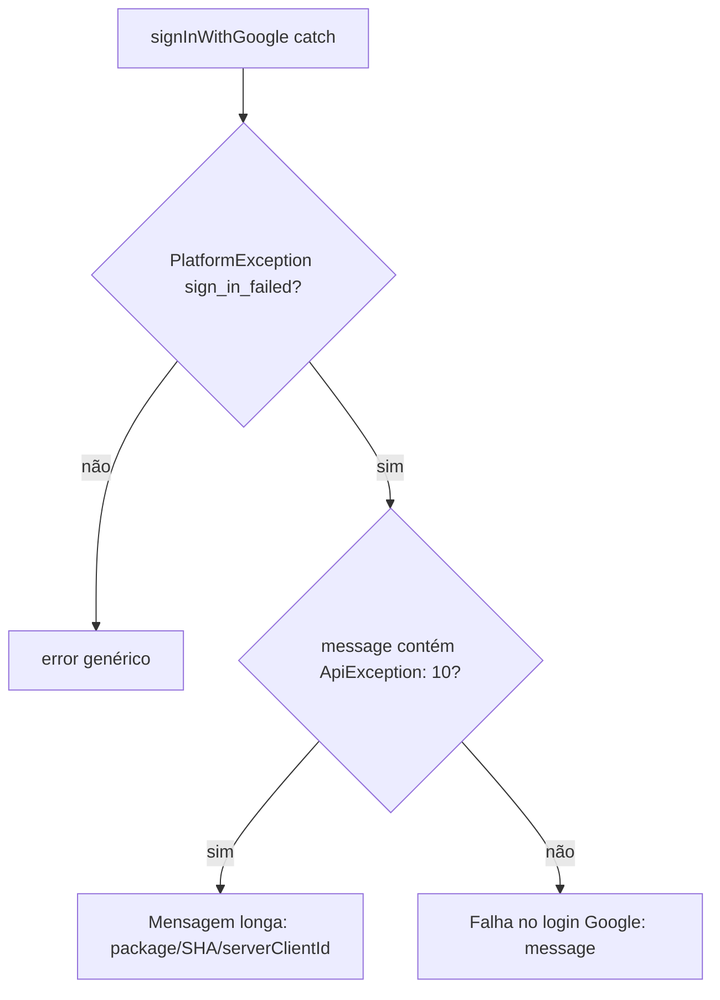

# Autenticação — Fluxos Operacionais

## Fluxo 1 — Bootstrap de sessão na splash

### Contrato do fluxo

- 🟢 **CONFIRMADO** — Auth roda **antes** da decisão onboarding/home.
- 🟢 **CONFIRMADO** — Falha em `ensureAuthenticated` não bloqueia navegação explícita no código atual (retorno ignorado).
- 🟢 **CONFIRMADO** — Sessão anônima satisfaz requisitos Supabase para operações que aceitam `anon`/`authenticated`.

## Fluxo 2 — Login com Google (bottom sheet)

### Contrato do fluxo

- 🟢 **CONFIRMADO** — UI usa `Consumer<AuthService>` para reagir a loading e perfil.
- 🟢 **CONFIRMADO** — Sucesso depende de `success == true` retornado por `signInWithGoogle`.
- 🟢 **CONFIRMADO** — `_error` é exibido via snackbar quando login falha.
- 🟢 **CONFIRMADO** — Após sucesso, bottom sheet re-renderiza seção autenticada (avatar, role badge).

## Fluxo 3 — Carregamento e criação de role

### Contrato do fluxo

- 🟢 **CONFIRMADO** — Fallback seguro para `user` em qualquer falha de fetch.
- 🟢 **CONFIRMADO** — Insert inclui `email`, `role`, `avatar_url` dos metadados Google.
- 🟡 **INFERIDO** — Trigger SQL no servidor pode criar linha em paralelo; insert app-side é idempotente apenas se não houver race.

## Fluxo 4 — Atualização de role em tempo real

### Contrato do fluxo

- 🟢 **CONFIRMADO** — Apenas eventos `UPDATE` na linha do próprio usuário.
- 🟢 **CONFIRMADO** — Telas com `Consumer<AuthService>` atualizam botões editar/excluir sem restart.
- 🟢 **CONFIRMADO** — Admin que promove usuário reflete na sessão ativa do promotee.

## Fluxo 5 — Logout

### Contrato do fluxo

- 🟢 **CONFIRMADO** — Erro no Google signOut é ignorado (usuário pode nunca ter usado Google).
- 🟢 **CONFIRMADO** — Próximo `ensureAuthenticated` pode criar nova sessão anônima.
- 🟡 **INFERIDO** — Dados locais (SQLite, favoritos) permanecem no dispositivo após logout.

## Fluxo 6 — Bloqueio de permissão na UI (exemplo: adicionar letra)

### Contrato do fluxo

- 🟢 **CONFIRMADO** — Padrão repetido em Home (categorias) e LyricView (editar/excluir).
- 🟢 **CONFIRMADO** — Anônimo é tratado com CTA de login, não mensagem genérica de role.
- 🟡 **INFERIDO** — Enforcement final ainda depende de RLS no Supabase se usuário contornar UI.

## Fluxo 7 — Refresh de role na Home

### Contrato do fluxo

- 🟢 **CONFIRMADO** — `Future.wait` aguarda ambos antes de encerrar refresh.
- 🟢 **CONFIRMADO** — Complementa Realtime quando subscription falhou ou app estava em background.

## Fluxo 8 — Tratamento de erro OAuth (ApiException 10)

### Contrato do fluxo

- 🟢 **CONFIRMADO** — Mensagem educativa para equipe de build Android.
- 🟢 **CONFIRMADO** — Erro exposto em `authService.error` para snackbar.

## Matriz fluxo × artefato

| Fluxo | Arquivo principal | Spec |
|-------|-------------------|------|
| Bootstrap splash | `splash_screen.dart` | RF-01, RF-02, RF-03 |
| Login Google | `auth_service.dart`, `app_info_bottom_sheet.dart` | RF-04, RF-14 |
| RBAC fetch/create | `auth_service.dart` | RF-05, RF-06 |
| Realtime role | `auth_service.dart` | RF-07 |
| Logout | `auth_service.dart`, bottom sheet | RF-10 |
| Bloqueio UI | `category_screen.dart`, etc. | RF-08 |
| Refresh Home | `home_screen.dart` | RF-11 |
