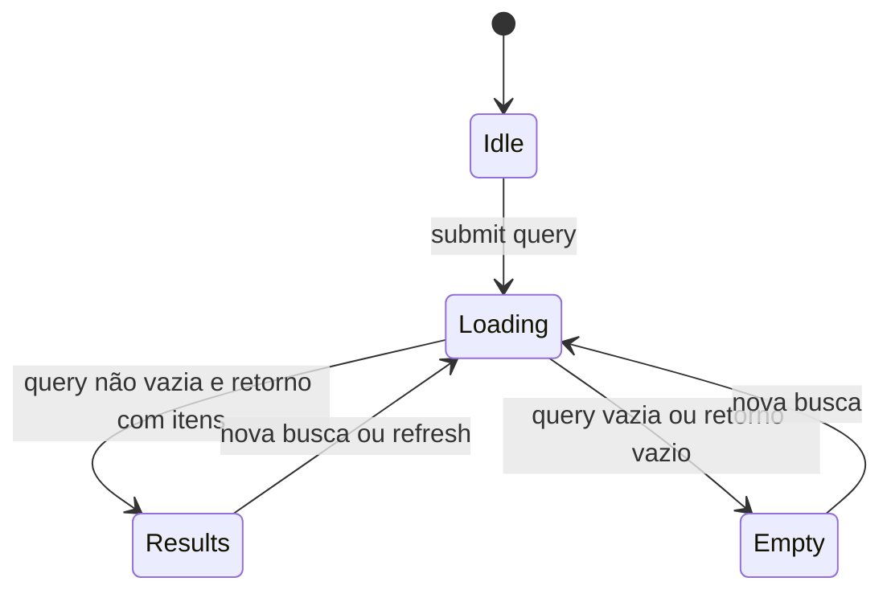

# Busca — Design Técnico

## Interface

🟢 **CONFIRMADO** — A busca é uma tela Flutter com campo de texto, lista local de resultados e navegação para visualização de letra.  
🟢 **CONFIRMADO** — Não há endpoint HTTP próprio nem busca remota direta para esta unit.

### Classes e funções

| Símbolo | Assinatura | Retorno | Observação |
|---------|-----------|---------|------------|
| `SearchScreen` | `const SearchScreen()` | `StatefulWidget` | 🟢 Tela de busca. |
| `_SearchScreenState._performSearch` | `()` | `void` async | 🟢 Executa busca local, atualizando `_isLoading` e `_results`. |
| `SyncRepository.searchLyrics` | `(String query)` | `Future<List<Lyric>>` | 🟢 Encaminha busca ao DAO local. |
| `DatabaseHelper.searchLyrics` | `(String query)` | `Future<List<Lyric>>` | 🟢 Executa query SQLite em `title` e `content`. |
| `LyricViewScreen` | `LyricViewScreen({required Lyric lyric})` | `Widget` | 🟢 Destino ao tocar em resultado. |

### Estado de UI

| Campo | Tipo | Função | Confiança |
|---|---|---|---|
| `_searchController` | `TextEditingController` | Texto digitado pelo usuário. | 🟢 |
| `_results` | `List<Lyric>` | Lista renderizada de resultados. | 🟢 |
| `_isLoading` | `bool` | Controla `LinearProgressIndicator`. | 🟢 |

## Fluxo Principal

1. 🟢 Usuário abre `SearchScreen`.
2. 🟢 A tela renderiza `TextField` com label `Pesquisar por nome ou trecho`.
3. 🟢 Usuário digita e submete o campo.
4. 🟢 `_performSearch()` define `_isLoading = true`.
5. 🟢 `_performSearch()` lê `query = _searchController.text`.
6. 🟢 Se `query.isNotEmpty`, chama `Provider.of<SyncRepository>(listen:false).searchLyrics(query)`.
7. 🟢 `SyncRepository.searchLyrics(query)` chama `_dbHelper.searchLyrics(query)`.
8. 🟢 `DatabaseHelper.searchLyrics()` executa query SQLite:
   - tabela: `lyrics`
   - where: `(title LIKE ? OR content LIKE ?) AND is_deleted = 0`
   - args: `'%$query%'`, `'%$query%'`
   - orderBy: `title ASC`
9. 🟢 O resultado é convertido com `Lyric.fromMap`.
10. 🟢 A tela salva `_results` e desativa loading.
11. 🟢 A lista renderiza `ListTile` por resultado.
12. 🟢 Toque em item navega para `LyricViewScreen(lyric: lyric)`.

## Fluxos Alternativos

- **Query vazia:** 🟢 `_results` é definido como lista vazia e `_isLoading` volta para `false`.
- **Refresh manual:** 🟢 `RefreshIndicator.onRefresh` executa `syncData()`; se o campo não está vazio, chama `_performSearch()` novamente.
- **Resultado atualmente tocando:** 🟢 se `AudioPlayerService.currentLyric?.id == lyric.id`, o item recebe cor/ícone de estado atual.
- **Nenhum resultado:** 🟢 `ListView.builder` renderiza zero itens; não há mensagem vazia específica no legado.
- **Erro de banco/local:** 🔴 não há tratamento explícito em `_performSearch`; exceções propagariam para o Future sem snackbar dedicado.

## Dependências

- 🟢 `Provider`: acesso a `SyncRepository` e consumo de `AudioPlayerService`.
- 🟢 `DatabaseHelper`: busca local SQLite.
- 🟢 `Lyric`: modelo retornado pela busca.
- 🟢 `LyricViewScreen`: detalhe aberto a partir de resultado.
- 🟢 `StringExtension.capitalize`: formata título exibido.
- 🟢 `AudioPlayerService`: fornece estado visual de reprodução.

## Decisões de Design Identificadas

| Decisão | Evidência no código | Confiança |
|---------|---------------------|-----------|
| Busca local, não remota. | `lib/services/sync_repository.dart`, `lib/services/db_helper.dart` | 🟢 |
| Busca por `LIKE` em título e conteúdo. | `lib/services/db_helper.dart` | 🟢 |
| Filtrar soft deletes na própria query. | `lib/services/db_helper.dart` | 🟢 |
| Resultado ordenado por título. | `lib/services/db_helper.dart` | 🟢 |
| Refresh sincroniza antes de repetir busca. | `lib/screens/search_screen.dart` | 🟢 |
| Tela de busca reaproveita estado do player para destacar item atual. | `lib/screens/search_screen.dart` | 🟢 |

## Estado Interno

## Observabilidade

- 🔴 **LACUNA** — Não há logging explícito para tempo de busca, quantidade de resultados ou falha de query.
- 🟢 **CONFIRMADO** — A UI mostra loading linear durante a busca.

## Riscos e Lacunas

- 🟡 **INFERIDO** — `LIKE '%query%'` pode ficar lento em acervos grandes por não usar índice de texto.
- 🟡 **INFERIDO** — Sensibilidade a acentos/maiúsculas depende do SQLite/configuração, não há normalização no código.
- 🔴 **LACUNA** — Não há estado vazio textual para "nenhum resultado encontrado".
- 🔴 **LACUNA** — Não há tratamento explícito de erro de busca.

