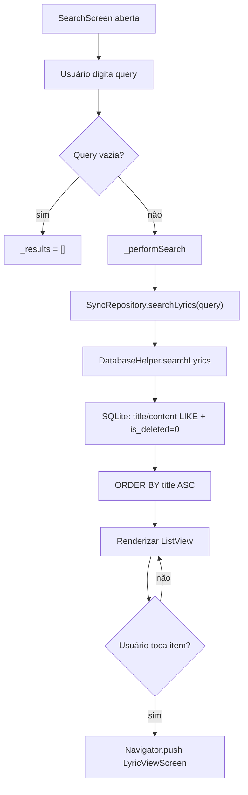
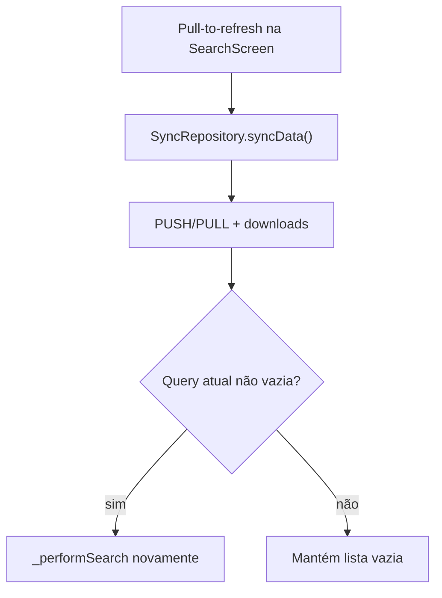

# Busca — Fluxos Operacionais

## Fluxo 1 — Busca local por título ou trecho

### Contrato do fluxo

- 🟢 **CONFIRMADO** — Busca apenas em dados SQLite locais (sem API remota direta).
- 🟢 **CONFIRMADO** — Letras com `is_deleted = 1` não entram nos resultados.
- 🟢 **CONFIRMADO** — Item em reprodução (`AudioPlayerService.currentLyric`) recebe destaque visual.
- 🟡 **INFERIDO** — Case-sensitivity do `LIKE` depende do collation SQLite do dispositivo.

## Fluxo 2 — Refresh com sincronização

### Contrato do fluxo

- 🟢 **CONFIRMADO** — Refresh dispara sync completo antes de repetir a busca ativa.
- 🟢 **CONFIRMADO** — Busca não exige login Google (leitura local).
