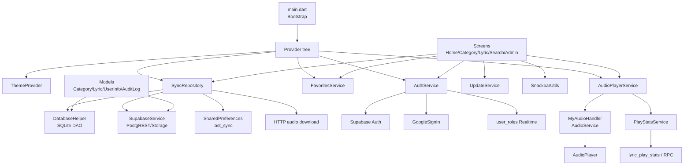

# C4 Componentes — App Flutter

## Componentes críticos

- `SyncRepository`: maior concentração de regras offline/online.
- `AuthService`: fonte de permissões da UI e assinaturas realtime.
- `AudioPlayerService`: mídia, playlist, notification audio e estatísticas.
- `DatabaseHelper`: schema local e migrações SQLite.
- `SupabaseService`: contrato remoto para dados e storage.

