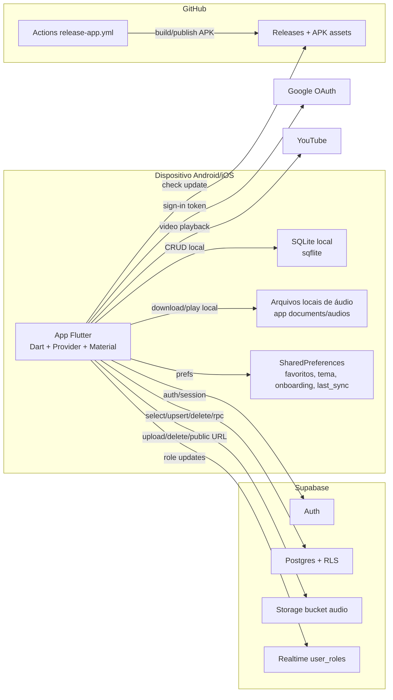

# C4 Containers — FMA_Pontos

## Observações

- 🟢 **CONFIRMADO** — Não há backend próprio além do Supabase.
- 🟢 **CONFIRMADO** — SQLite e SharedPreferences vivem no dispositivo.
- 🟢 **CONFIRMADO** — Build release consome secrets Supabase via `--dart-define`.

