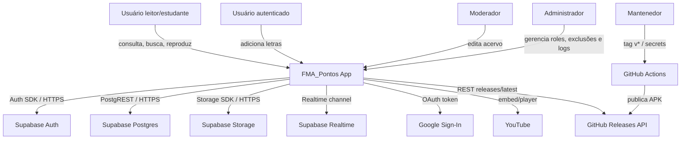

# C4 Contexto — FMA_Pontos

## Relações

- 🟢 **CONFIRMADO** — Leitores usam consulta pública/offline.
- 🟢 **CONFIRMADO** — Usuários logados via Google podem receber role e criar conteúdo conforme RBAC.
- 🟢 **CONFIRMADO** — Supabase concentra dados, auth, storage e realtime.
- 🟢 **CONFIRMADO** — GitHub Releases distribui APK e informa updates.

