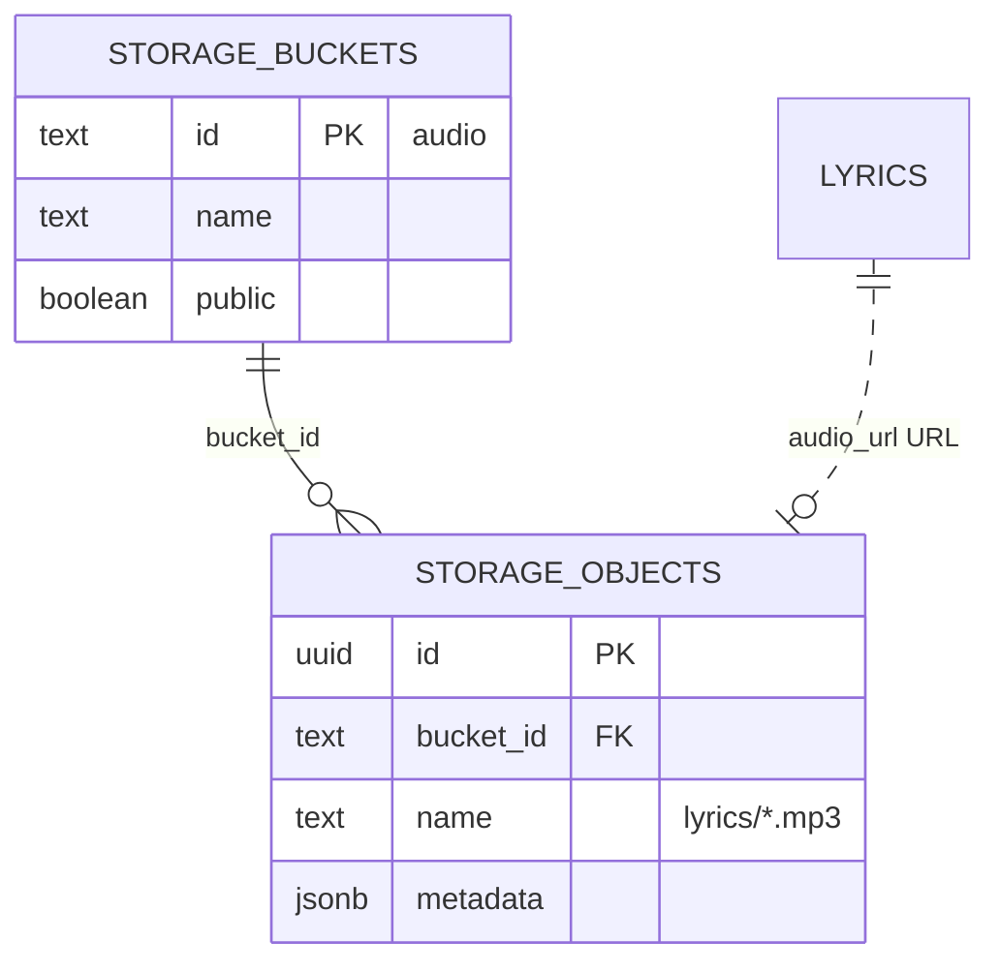
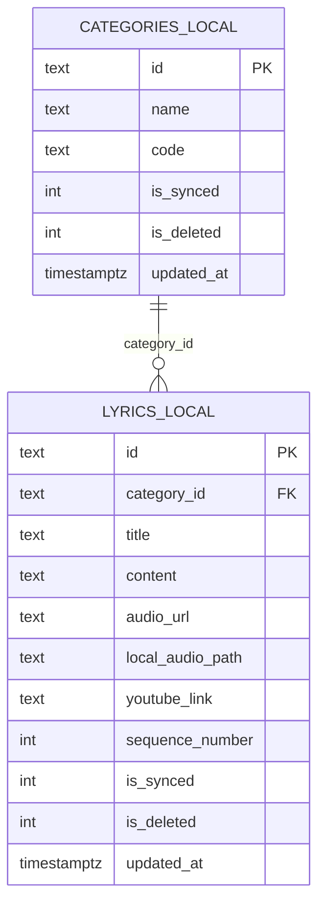

# ERD — FMA_Pontos (domínio aplicacional)

> Data Master · 2026-05-31 · Schema `public` + vínculos `auth` / `storage`

## ERD principal (`public` + `auth.users`)

```mermaid
erDiagram
    AUTH_USERS ||--o| USER_ROLES : "1:1 id"
    AUTH_USERS ||--o{ AUDIT_LOGS : "opcional user_id"

    CATEGORIES ||--o{ LYRICS : "category_id CASCADE"
    LYRICS ||--o| LYRIC_PLAY_STATS : "lyric_id PK CASCADE"

    AUTH_USERS {
        uuid id PK
        text email
        jsonb raw_user_meta_data
        boolean is_anonymous
    }

    USER_ROLES {
        uuid id PK_FK
        text email
        text role "user|moderator|admin"
        boolean is_active
        text avatar_url
        timestamptz created_at
        timestamptz updated_at
    }

    CATEGORIES {
        text id PK
        text name
        text code UK
        timestamptz updated_at
    }

    LYRICS {
        text id PK
        text category_id FK
        text title
        text content
        text audio_url "mp3 only"
        text youtube_url
        text youtube_link
        int sequence_number
        timestamptz updated_at
    }

    LYRIC_PLAY_STATS {
        text lyric_id PK_FK
        int play_count
        timestamptz last_played_at
        timestamptz updated_at
    }

    AUDIT_LOGS {
        uuid id PK
        text table_name
        text record_id
        text action "INSERT|UPDATE|DELETE"
        jsonb old_data
        jsonb new_data
        uuid user_id FK
        text user_email
        timestamptz created_at
    }
```

## ERD Storage (áudio)



## ERD SQLite local (espelho — 🟡 inferido do app)



## Legenda de confiança

- Entidades/colunas do backup: 🟢
- `LYRIC_PLAY_STATS` vazia no snapshot: 🟢 estrutura, 🟡 dados
- SQLite local: 🟢 confirmado no código Dart
- RPC `increment_play_count`: 🔴 ausente em produção (ver `procedures.md`)
