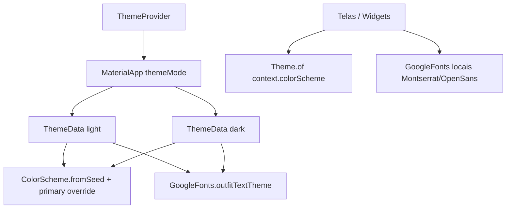

# Design System — FMA_Pontos

> Documento consolidado gerado pelo agente **Design System** (Reversa).  
> Stack UI: **Flutter Material 3** + **google_fonts**.  
> Data: 2026-05-20

## Visão geral

🟢 **CONFIRMADO** — O app não possui biblioteca de componentes isolada nem arquivo de design tokens. O design system é **implícito**, concentrado em:

- `lib/main.dart` — `ThemeData` light/dark
- `lib/providers/theme_provider.dart` — modo claro/escuro/sistema
- Padrões repetidos em telas (`ListTile` customizados, bottom nav, player compacto)
- Utilitário `lib/utils/snackbar_utils.dart`

Identidade visual: **roxo primário** (`#6200EE`, Material Purple 700), tipografia **Outfit** no shell e **Montserrat + Open Sans** no conteúdo de letras.

## Arquitetura do tema

| Aspecto | Decisão | Confiança |
|---------|---------|-----------|
| Design system base | Material 3 | 🟢 |
| Cor brand | `#6200EE` fixa | 🟢 |
| Paleta estendida | `fromSeed` (gerada) | 🟢 |
| Dark mode | Sim, + system | 🟢 |
| Locale | pt-BR | 🟢 |

## Paleta (resumo)

Ver detalhes em [`color-palette.md`](color-palette.md).

- **Primária:** `#6200EE`
- **Fundos:** cinza claro (light) / `surface` M3 (dark)
- **Feedback:** `error` para snackbars de erro; `primary` para sucesso
- **Decorativo:** amber / grey / brown para ranking Top 3

## Tipografia (resumo)

Ver [`typography.md`](typography.md).

| Camada | Fonte |
|--------|-------|
| App shell | Outfit (textTheme global) |
| Títulos de letra | Montserrat |
| Corpo de letra | Open Sans 18px / lh 1.75 |

## Espaçamento e forma (resumo)

Ver [`spacing.md`](spacing.md).

- **Raio dominante:** 12dp (cards, inputs, listas)
- **Padding de tela:** 24dp
- **Elevação:** cards 2; snackbar 6

## Tokens

Tabela completa em [`tokens.md`](tokens.md).

## Componentes identificados

Não há package `components/` — padrões reutilizáveis:

| Componente | Arquivo principal | Variantes / notas | Confiança |
|------------|-------------------|-------------------|-----------|
| App shell | `main.dart` | Light/dark M3 | 🟢 |
| Theme switcher | `theme_provider.dart`, `app_info_bottom_sheet.dart` | cycle system→light→dark | 🟢 |
| Bottom navigation | `home_screen.dart` | 5 destinos | 🟢 |
| Lista de categoria/letra | `category_screen.dart`, `favorites_screen.dart`, `search_screen.dart`, `top_played_screen.dart` | Tile com play, borda ativa quando tocando | 🟢 |
| Player compacto | `category_player_widget.dart` | Playlist ativa; letra expansível; favorito | 🟢 |
| Snackbar | `snackbar_utils.dart` | Sucesso (primary) / erro | 🟢 |
| Bottom sheet info | `app_info_bottom_sheet.dart` | Login, tema, versão | 🟢 |
| Onboarding | `onboarding_screen.dart`, `onboarding_widgets.dart` | Slides animados, checkbox privacidade | 🟢 |
| Input padrão | `main.dart` `inputDecorationTheme` | Filled, radius 12 | 🟢 |
| Splash | `splash_screen.dart` | Logo 300px, loader primary | 🟢 |

### Props / comportamento comum de lista

🟢 **CONFIRMADO** — Tiles usam `Card` ou container com `borderRadius: 12`, `margin` horizontal 16, destaque com `BorderSide(color: primary, width: 2)` quando faixa atual.

## Assets visuais

| Asset | Caminho | Uso | Confiança |
|-------|---------|-----|-----------|
| Splash | `assets/images/splash.png` | Tela inicial | 🟢 |
| Maria (onboarding) | `assets/images/maria.png` | Logo animado | 🟢 |
| Launcher | `mipmap/ic_launcher` | Notificação áudio | 🟢 |

## Rastreabilidade de código

| Área | Arquivos |
|------|----------|
| Tema global | `lib/main.dart` |
| Modo escuro | `lib/providers/theme_provider.dart` |
| Feedback | `lib/utils/snackbar_utils.dart` |
| Player UI | `lib/widgets/category_player_widget.dart` |
| Info / tema | `lib/widgets/app_info_bottom_sheet.dart` |
| Onboarding | `lib/screens/onboarding_widgets.dart` |

## Recomendações para migração / redesign

🟡 **INFERIDO** — Para sistema novo ou refactor:

1. Centralizar tokens em um único módulo (`theme/tokens.dart` ou Style Dictionary).
2. Unificar tipografia (Outfit vs Montserrat/Open Sans) ou documentar hierarquia oficial.
3. Versionar valores M3 `fromSeed` exportados (script de build) para paridade visual.
4. Extrair `LyricListTile`, `CategoryPlayer`, `AppSnackbar` como widgets nomeados.

## Documentos relacionados

- [`color-palette.md`](color-palette.md)
- [`typography.md`](typography.md)
- [`spacing.md`](spacing.md)
- [`tokens.md`](tokens.md)

## Estatísticas

| Categoria | Tokens documentados | 🟢 | 🟡 | 🔴 |
|-----------|---------------------|----|----|-----|
| Cores | 12+ explícitos + M3 gerado | 9 | 3 | 1 |
| Tipografia | 10+ | 10 | 1 | 1 |
| Espaçamento / radius | 15+ | 14 | 2 | 1 |
| Motion | 6 | 6 | 0 | 0 |
| Componentes | 10 padrões | 10 | 0 | 0 |
