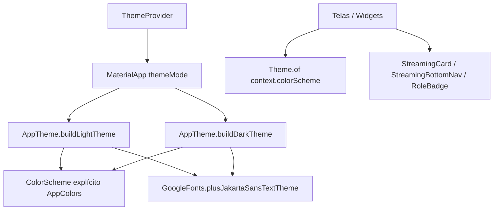

# Design System — FMA_Pontos

> Documento consolidado gerado pelo agente **Design System** (Reversa).  
> Stack UI: **Flutter Material 3** + **google_fonts**.  
> Data: 2026-05-20 · **Re-extração visual:** 2026-05-31 · **Rodada 2:** 2026-05-31 (Home grid, toasts, artes)

## Visão geral

🟢 **CONFIRMADO** — O design system passou a ser **explícito** em módulos de tema e widgets streaming (re-extração 2026-05-31):

- `lib/theme/app_colors.dart` — tokens de cor (brand, surfaces, badges de role)
- `lib/theme/app_theme.dart` — `ThemeData` light/dark Material 3
- `lib/theme/streaming_tokens.dart` — espaçamentos, raios e alturas de layout streaming
- `lib/providers/theme_provider.dart` — modo claro/escuro/sistema + persistência
- `lib/widgets/streaming/*` — scaffold, nav, cards, search, player mini, track tile, role badge
- `package:toastification` — toasts globais via `ToastificationWrapper` + `SnackbarUtils`
- Padrões de tela em `lib/screens/*.dart` e utilitário `lib/utils/snackbar_utils.dart`

Identidade visual: **verde streaming** (`#1DB954` / `#53E076`), fundo escuro `#131313`, tipografia **Plus Jakarta Sans** unificada (shell, letras, admin).

## Arquitetura do tema

| Aspecto | Decisão | Confiança |
|---------|---------|-----------|
| Design system base | Material 3 (`useMaterial3: true`) | 🟢 |
| Cor brand | `#1DB954` (primaryContainer) / `#53E076` (highlight) | 🟢 |
| Paleta estendida | `ColorScheme` explícito em `app_theme.dart` (não `fromSeed`) | 🟢 |
| Default tema (sem prefs) | `ThemeMode.dark` | 🟢 |
| AppBar | Transparente, título `onSurface` 20px bold | 🟢 |
| Dark mode | Sim + system + light | 🟢 |
| Locale | pt-BR | 🟢 |

## Paleta (resumo)

Ver detalhes em [`color-palette.md`](color-palette.md).

- **Primária:** `#1DB954` / `#53E076`
- **Fundos dark:** `#131313` (scaffold) e containers `#201F1F`–`#353534`
- **Feedback:** `error` para snackbars de erro; `primaryContainer` para sucesso
- **Badges de role:** admin verde, moderador `#BB86FC`, user cinza
- **Decorativo:** amber / grey / brown para ranking Top 3

## Tipografia (resumo)

Ver [`typography.md`](typography.md).

| Camada | Fonte |
|--------|-------|
| App shell, letras, admin | Plus Jakarta Sans (`GoogleFonts.plusJakartaSansTextTheme`) |
| Corpo de letra | 18px, line-height 1.75 (tema) |

## Espaçamento e forma (resumo)

Ver [`spacing.md`](spacing.md).

- **Raio dominante:** 12dp (inputs, botões); cards 16dp
- **Padding de tela:** 24dp
- **AppBar:** elevation 0 (transparente)

## Tokens

Tabela completa em [`tokens.md`](tokens.md).

## Componentes identificados

| Componente | Arquivo principal | Variantes / notas | Confiança |
|------------|-------------------|-------------------|-----------|
| App shell | `lib/main.dart`, `app_theme.dart` | Light/dark M3 | 🟢 |
| Theme switcher | `theme_provider.dart`, `app_info_bottom_sheet.dart` | cycle system→light→ dark | 🟢 |
| Bottom navigation | `streaming_bottom_nav.dart`, telas | 5 destinos Home; 3 em Category | 🟢 |
| Card streaming | `streaming_card.dart` | Lista genérica | 🟢 |
| Card categoria | `category_card.dart` | Grid Home/AllCategories; arte WebP ou gradiente | 🟢 |
| Scaffold streaming | `streaming_scaffold.dart` | AppBar + body + bottom nav + mini-player | 🟢 |
| Nav streaming | `streaming_navigation.dart` | Índices e `StreamingAppBar` | 🟢 |
| Tile faixa | `track_list_tile.dart` | Lista numerada em `CategoryScreen` | 🟢 |
| Campo busca | `streaming_search_field.dart` | Busca pill escuro | 🟢 |
| Badge de role | `role_badge.dart` | admin/moderator/user | 🟢 |
| Lista de categoria/letra | `category_screen.dart`, `favorites_screen.dart`, etc. | `TrackListTile`; borda ativa quando tocando | 🟢 |
| Player compacto | `category_player_widget.dart` | Playlist ativa; letra expansível; favorito | 🟢 |
| Toast feedback | `snackbar_utils.dart` + `toastification` | Sucesso verde container / erro `#E07A6B`; margem 110dp inferior | 🟢 |
| Bottom sheet info | `app_info_bottom_sheet.dart` | Login, tema, versão | 🟢 |
| Onboarding | `onboarding_screen.dart`, `onboarding_widgets.dart` | Slides animados, checkbox privacidade | 🟢 |
| Splash | `splash_screen.dart` | Fundo escuro, loader verde | 🟢 |

### Props / comportamento comum de lista

🟢 **CONFIRMADO** — Tiles usam `StreamingCard` ou container com `borderRadius: 12`, `margin` horizontal 16, destaque com `BorderSide(color: primary, width: 2)` quando faixa atual.

## Assets visuais

| Asset | Caminho | Uso | Confiança |
|-------|---------|-----|------------|
| Splash | `assets/images/splash.png` | Tela inicial | 🟢 |
| Artes de categoria | `assets/images/categories/*.webp` | `CategoryCard` via `category_artwork.dart` | 🟢 |
| Maria (onboarding) | `assets/images/maria.png` | Logo animado | 🟢 |
| Launcher | `mipmap/ic_launcher` | Notificação áudio | 🟢 |
| Splash nativa Android | `android/.../launch_background.xml` | Fundo `#131313` | 🟢 |

## Rastreabilidade de código

| Área | Arquivos |
|------|----------|
| Tokens de cor | `lib/theme/app_colors.dart` |
| Tokens de layout | `lib/theme/streaming_tokens.dart` |
| Tema global | `lib/theme/app_theme.dart` |
| Artes por categoria | `lib/utils/category_artwork.dart` |
| Modo escuro/claro | `lib/providers/theme_provider.dart` |
| Feedback | `lib/utils/snackbar_utils.dart` |
| Player UI | `lib/widgets/category_player_widget.dart` |
| Info / tema | `lib/widgets/app_info_bottom_sheet.dart` |
| Onboarding | `lib/screens/onboarding_widgets.dart` |
| Widgets streaming | `lib/widgets/streaming/*.dart` |

## Recomendações para migração / redesign

🟡 **INFERIDO** — Pós feature 001:

1. ~~Centralizar tokens~~ — feito em `app_colors.dart` / `app_theme.dart`.
2. ~~Unificar tipografia~~ — Plus Jakarta Sans única.
3. Versionar `ColorScheme` exportado (script de build) para paridade visual em CI.
4. Extrair `LyricListTile` como alias de `StreamingCard` se a lista crescer.

## Documentos relacionados

- [`color-palette.md`](color-palette.md)
- [`typography.md`](typography.md)
- [`spacing.md`](spacing.md)
- [`tokens.md`](tokens.md)
- [`../_reversa_forward/001-novo-visual-streaming/legacy-impact.md`](../_reversa_forward/001-novo-visual-streaming/legacy-impact.md)

## Estatísticas

| Categoria | Tokens documentados | 🟢 | 🟡 | 🔴 |
|-----------|---------------------|----|----|-----|
| Cores | 20+ explícitos em `AppColors` | 18 | 2 | 0 |
| Tipografia | 10+ | 10 | 0 | 0 |
| Espaçamento / radius | 15+ | 14 | 1 | 0 |
| Motion | 6 | 6 | 0 | 0 |
| Componentes | 12 padrões | 12 | 0 | 0 |
