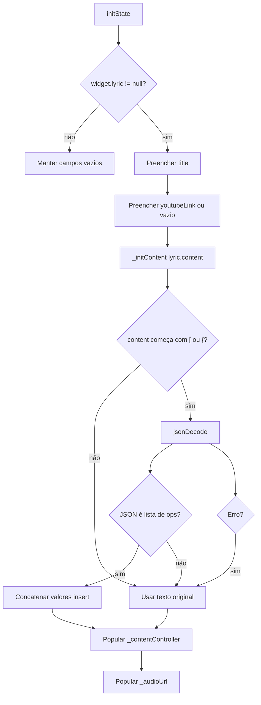
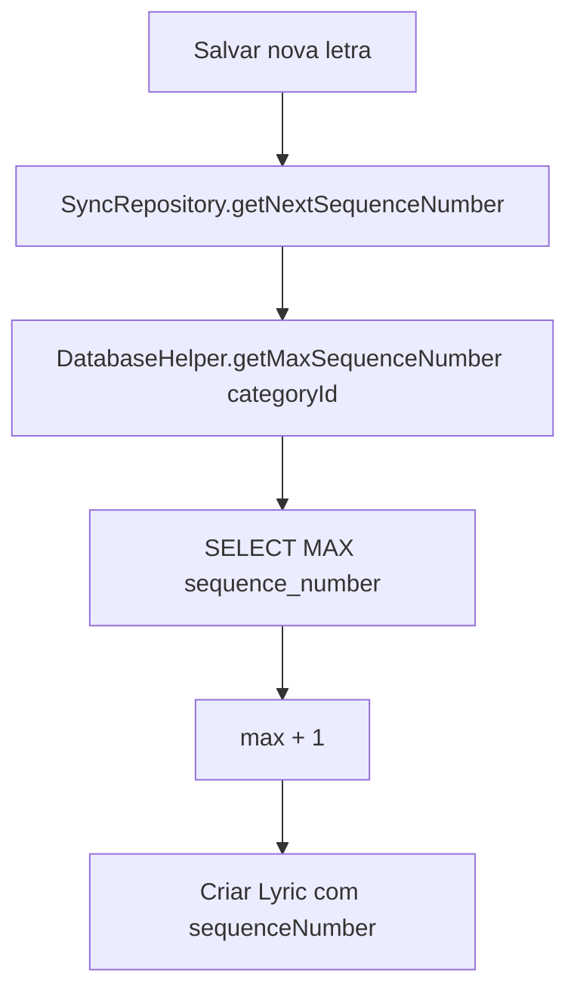
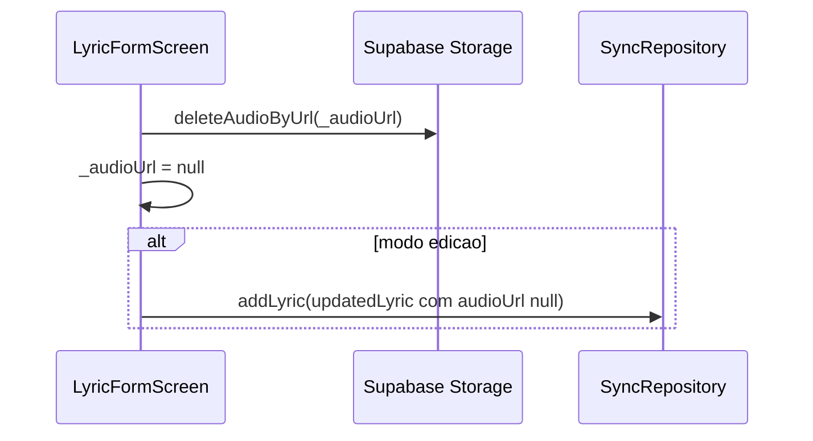
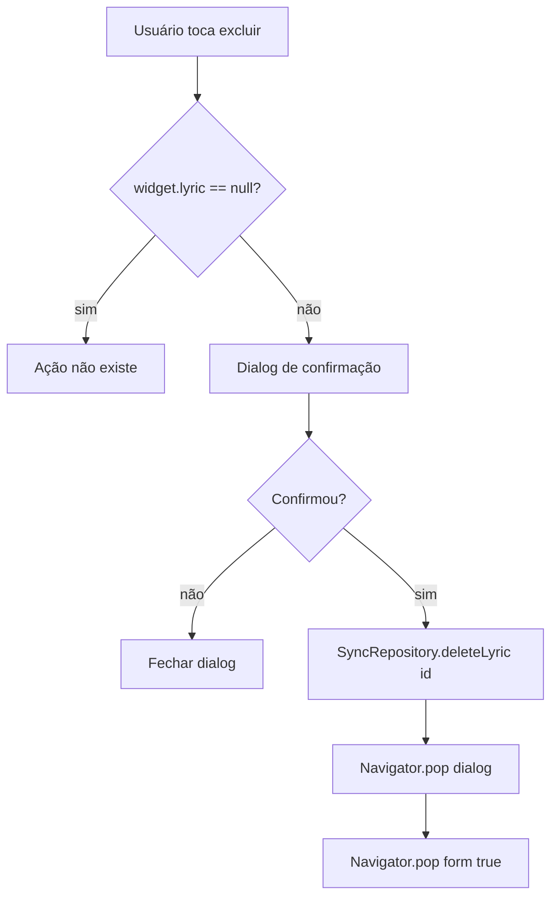

# Edição de Letra — Design

## Decisão Arquitetural

🟢 **CONFIRMADO** — `LyricFormScreen` é uma tela stateful usada tanto para criação quanto para edição de letras.  
🟢 **CONFIRMADO** — O formulário é fino: monta objetos `Lyric` e delega persistência para `SyncRepository`; upload/remoção de arquivo delega para `SupabaseService`.  
🟢 **CONFIRMADO** — A sincronização de dados textuais é offline-first, mas upload e remoção de áudio dependem diretamente do Supabase Storage.

## Componentes

| Componente | Tipo | Responsabilidade | Dependências |
|------------|------|------------------|--------------|
| `LyricFormScreen` | `StatefulWidget` | Receber `categoryId` e opcionalmente `Lyric` para editar | `Lyric` |
| `_LyricFormScreenState` | Estado da tela | Controlar campos, áudio atual e upload | Controllers, `SyncRepository`, `SupabaseService` |
| `SyncRepository` | Service | Criar/atualizar/excluir letra localmente e tentar push remoto | `DatabaseHelper`, `SupabaseService` |
| `DatabaseHelper` | DAO | Upsert, soft delete, hard delete e sequência máxima local | SQLite |
| `SupabaseService` | Service remoto | Upsert/delete remoto e storage de áudio | Supabase PostgREST/Storage |
| `YoutubePlayer` | Validador | Validar links YouTube via `convertUrlToId` | `youtube_player_flutter` |
| `FilePicker` | Integração nativa | Selecionar arquivo de áudio | `file_picker` |
| `SnackbarUtils` | UI util | Feedback de upload, erro e remoção | `toastification` (global wrapper em `main.dart`) |

## Modos do Formulário

| Modo | Critério | Título | Ações |
|------|----------|--------|-------|
| Criação | `widget.lyric == null` | `Nova Letra` | Salvar; anexar áudio; sem botão excluir |
| Edição | `widget.lyric != null` | `Editar Letra` | Salvar; anexar/remover áudio; excluir |

### Estado Local

```dart
final _titleController = TextEditingController();
final _youtubeController = TextEditingController();
final _contentController = TextEditingController();
String? _audioUrl;
bool _isUploadingAudio = false;
```

Regras:

- 🟢 **CONFIRMADO** — Em edição, `_audioUrl` recebe `widget.lyric!.audioUrl`.
- 🟢 **CONFIRMADO** — `localAudioPath` não é editado no formulário.
- 🟢 **CONFIRMADO** — Controllers são descartados em `dispose()`.

## Inicialização de Conteúdo



## Modelo de Persistência

### Criação

```dart
Lyric(
  id: const Uuid().v4(),
  categoryId: widget.categoryId,
  title: title,
  content: content,
  updatedAt: DateTime.now(),
  audioUrl: _audioUrl,
  youtubeLink: youtubeUrl.isEmpty ? null : youtubeUrl,
  sequenceNumber: seqNum,
)
```

### Edição

```dart
Lyric(
  id: widget.lyric!.id,
  categoryId: widget.categoryId,
  title: title,
  content: content,
  updatedAt: DateTime.now(),
  audioUrl: _audioUrl,
  isSynced: false,
  youtubeLink: youtubeUrl.isEmpty ? null : youtubeUrl,
  sequenceNumber: widget.lyric!.sequenceNumber,
)
```

### Contratos

- 🟢 **CONFIRMADO** — `SyncRepository.addLyric` é o mesmo caminho para criar e atualizar.
- 🟢 **CONFIRMADO** — `DatabaseHelper.upsertLyric` usa `ConflictAlgorithm.replace`.
- 🟢 **CONFIRMADO** — `upsertLyric` força `is_deleted = 0`.
- 🟢 **CONFIRMADO** — Se online, o repository chama `SupabaseService.upsertLyric` e depois `markLyricSynced`.
- 🟢 **CONFIRMADO** — Se offline, a letra permanece com `is_synced = 0`.

## Validações

| Campo | Validação | Falha |
|-------|-----------|-------|
| Título | Não pode ser string vazia | Retorna silenciosamente sem salvar |
| Conteúdo | Sem validação explícita | Pode salvar vazio |
| YouTube | Se preenchido, `convertUrlToId` deve retornar ID | Snackbar `Link do YouTube inválido.` e não salva |
| Áudio | Picker restringe `FileType.audio`; storage/policies podem restringir MP3 | Erro de picker/upload mostra snackbar |

## Sequência da Letra



Regras:

- 🟢 **CONFIRMADO** — Sequência é calculada somente na criação.
- 🟢 **CONFIRMADO** — Edição preserva `widget.lyric!.sequenceNumber`.
- 🟡 **INFERIDO** — Não há lock transacional contra criação concorrente na mesma categoria.

## Áudio e Storage

### Upload

```mermaid
sequenceDiagram
  participant UI as LyricFormScreen
  participant Picker as FilePicker
  participant Storage as Supabase Storage
  participant Repo as SyncRepository

  UI->>Picker: pickFiles(FileType.audio)
  Picker-->>UI: path + original name
  UI->>UI: _isUploadingAudio = true
  UI->>Storage: uploadAudio(path, uuid_originalName)
  Storage-->>UI: publicUrl?
  UI->>UI: _audioUrl = publicUrl; _isUploadingAudio = false
  alt modo edicao e url != null
    UI->>Repo: addLyric(updatedLyric com audioUrl)
  end
```

Detalhes:

- 🟢 **CONFIRMADO** — Nome enviado começa com UUID.
- 🟢 **CONFIRMADO** — `SupabaseService.uploadAudio` sanitiza o nome final.
- 🟢 **CONFIRMADO** — O objeto é salvo em `audio/lyrics/{sanitizedFileName}`.
- 🟢 **CONFIRMADO** — URL pública é retornada e salva em `audioUrl`.
- 🟢 **CONFIRMADO** — Em modo criação, upload apenas preenche `_audioUrl`; a letra só é criada no botão salvar.
- 🟢 **CONFIRMADO** — Em modo edição, upload salva automaticamente uma nova versão da letra.

### Remoção



Detalhes:

- 🟢 **CONFIRMADO** — `deleteAudioByUrl` usa o último segmento da URL como nome do arquivo.
- 🟢 **CONFIRMADO** — Falha na remoção remota é logada, mas `_audioUrl` ainda é limpo localmente.
- 🟡 **INFERIDO** — Em modo criação, remover áudio após upload pode deixar arquivo órfão se a letra nunca for salva.

## Exclusão



O repository:

- 🟢 **CONFIRMADO** — Faz soft delete local e notifica listeners.
- 🟢 **CONFIRMADO** — Se online, tenta apagar áudio remoto associado, apagar `lyrics` no Supabase e fazer hard delete local.
- 🟡 **INFERIDO** — O método atual usa delete físico remoto em `lyrics` no caminho online, enquanto `SupabaseService.deleteLyric` oferece soft delete; há divergência a observar na reconstrução.

## Layout da Tela

| Região | Componente | Função |
|--------|------------|--------|
| AppBar | Título + excluir + salvar | Diferencia criação/edição, executa `_delete` e `_save`. |
| Campo título | `TextField` | Nome da letra. |
| Bloco áudio | Container + botão anexar/remover/progresso | Mostra estado do áudio e executa upload/remove. |
| Campo YouTube | `TextField` com ícone | Captura link externo. |
| Campo letra | `TextField` expandido | Conteúdo textual completo. |

## Limites de Responsabilidade

- 🟢 **CONFIRMADO** — O formulário não carrega categoria nem mostra código/sequence visual.
- 🟢 **CONFIRMADO** — O formulário não reproduz áudio nem vídeo.
- 🟢 **CONFIRMADO** — O formulário não baixa áudio para `localAudioPath`.
- 🟢 **CONFIRMADO** — O formulário não aplica RBAC diretamente.
- 🟢 **CONFIRMADO** — O formulário não resolve conflitos de sync.

## Riscos e Trade-offs

| Risco | Impacto | Mitigação existente | Confiança |
|-------|---------|---------------------|-----------|
| Título vazio sem feedback | Usuário pode não entender por que não salvou | Nenhuma mensagem no legado | 🟢 |
| Conteúdo vazio permitido | Letra incompleta pode ser salva | Nenhuma validação no legado | 🟡 |
| Upload depende de rede | Offline não consegue anexar áudio remoto | Erro capturado e exibido | 🟢 |
| Arquivo órfão em criação | Upload feito, usuário remove/abandona sem salvar | Sem limpeza garantida | 🟡 |
| Remoção de áudio falha no storage | Banco pode ficar sem URL, mas storage manter arquivo | Erro logado, estado local prossegue | 🟡 |
| Sequência concorrente | Duas criações simultâneas podem pegar mesmo `max + 1` | Sem lock explícito | 🟡 |
| Divergência delete remoto | `deleteLyric` do repository usa delete físico online | Reavaliar na reconstrução | 🟡 |
| Form sem RBAC interno | Acesso indevido se uma rota abrir direto | Depende dos fluxos chamadores | 🟡 |

## Rastreabilidade

| Requisito | Design |
|-----------|--------|
| RF-01, RF-02 | Modos do formulário e inicialização |
| RF-03, RF-04 | `_initContent` e compatibilidade JSON legado |
| RF-05 a RF-07 | Validações de título/YouTube |
| RF-08 a RF-11 | Modelo de persistência criação/edição |
| RF-12 a RF-16 | Áudio e Storage |
| RF-17, RF-18 | Exclusão |
| RF-19 | Modelo `Lyric` e serialização |
| RF-20 | `isSynced=false` em edição e autosaves de mídia |

