# Edição de Letra — Fluxos Operacionais

## Fluxo 1 — Abrir formulário

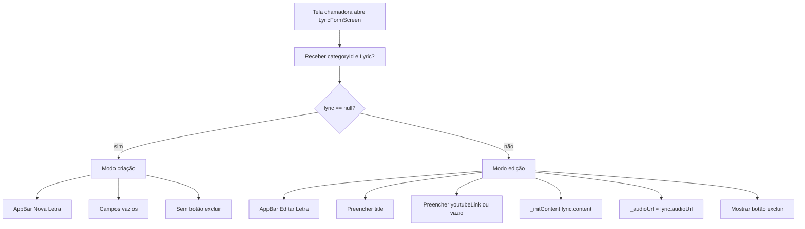

### Contrato do fluxo

- 🟢 **CONFIRMADO** — `categoryId` é obrigatório em criação e edição.
- 🟢 **CONFIRMADO** — `lyric == null` define criação.
- 🟢 **CONFIRMADO** — `lyric != null` define edição.
- 🟡 **INFERIDO** — O fluxo chamador deve aplicar RBAC antes de abrir o formulário.

## Fluxo 2 — Inicializar conteúdo textual legado

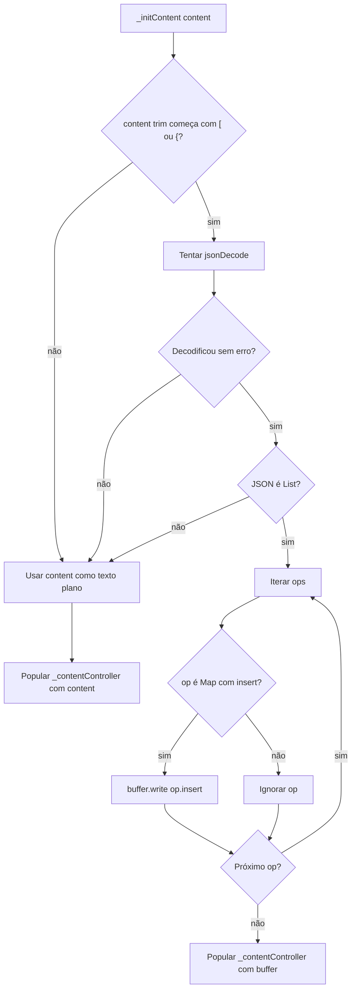

### Contrato do fluxo

- 🟢 **CONFIRMADO** — JSON inválido não quebra o formulário.
- 🟢 **CONFIRMADO** — Apenas operações com chave `insert` contribuem para o texto.
- 🟢 **CONFIRMADO** — Conteúdo não JSON é preservado.

## Fluxo 3 — Salvar nova letra

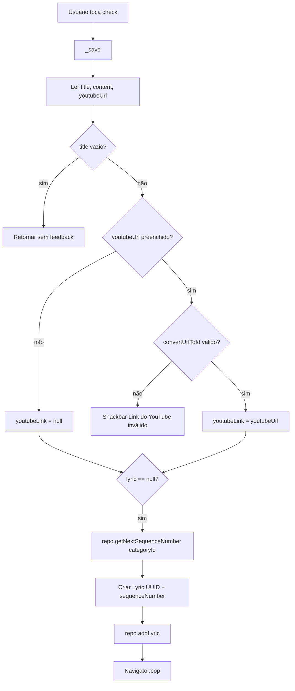

### Contrato do fluxo

- 🟢 **CONFIRMADO** — Título vazio bloqueia persistência silenciosamente.
- 🟢 **CONFIRMADO** — YouTube inválido bloqueia persistência com snackbar.
- 🟢 **CONFIRMADO** — Nova letra recebe UUID gerado no cliente.
- 🟢 **CONFIRMADO** — `sequenceNumber` é calculado antes de criar a letra.
- 🟢 **CONFIRMADO** — `audioUrl` atual do formulário é incluído na letra criada.

## Fluxo 4 — Salvar edição de letra

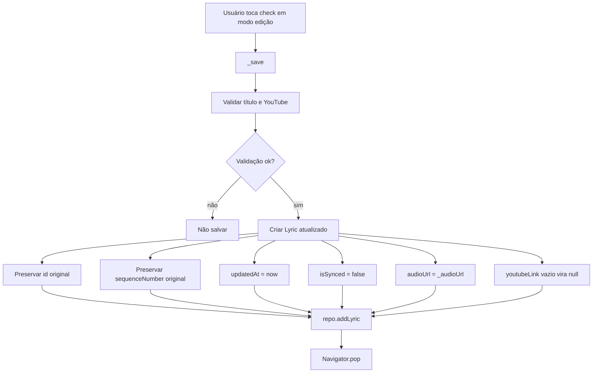

### Contrato do fluxo

- 🟢 **CONFIRMADO** — Edição usa `addLyric` como upsert.
- 🟢 **CONFIRMADO** — `id` e `sequenceNumber` não mudam.
- 🟢 **CONFIRMADO** — Letra editada fica pendente de sync.
- 🟢 **CONFIRMADO** — Conteúdo vazio pode ser salvo no legado.

## Fluxo 5 — Persistência offline-first

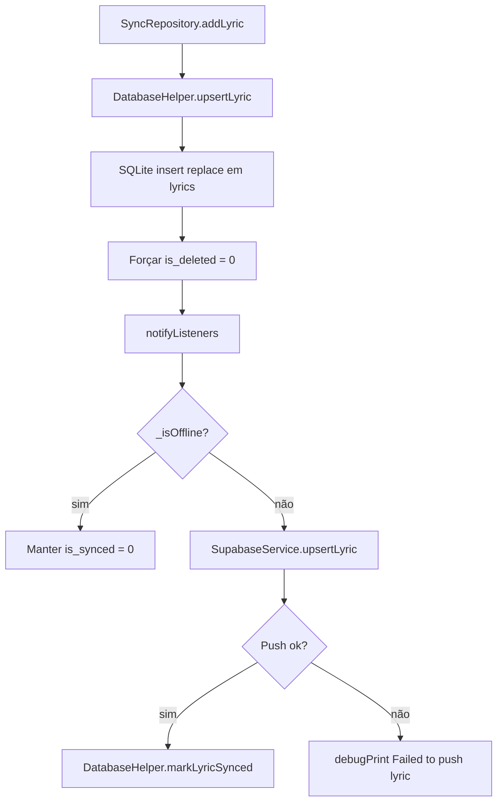

### Contrato do fluxo

- 🟢 **CONFIRMADO** — Persistência local acontece antes de push remoto.
- 🟢 **CONFIRMADO** — Falha remota não desfaz a escrita local.
- 🟢 **CONFIRMADO** — A sincronização posterior usa `is_synced = 0`.

## Fluxo 6 — Anexar áudio

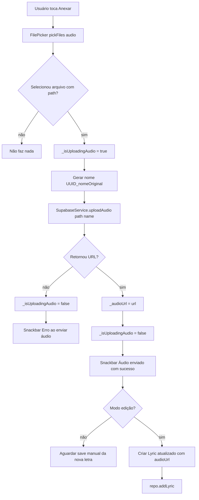

### Contrato do fluxo

- 🟢 **CONFIRMADO** — Upload depende de Supabase Storage.
- 🟢 **CONFIRMADO** — O arquivo é enviado para `audio/lyrics/`.
- 🟢 **CONFIRMADO** — Em edição, áudio anexado é salvo automaticamente na letra.
- 🟡 **INFERIDO** — Em criação, áudio enviado pode ficar órfão se a letra nunca for salva.

## Fluxo 7 — Erro ao selecionar/enviar áudio

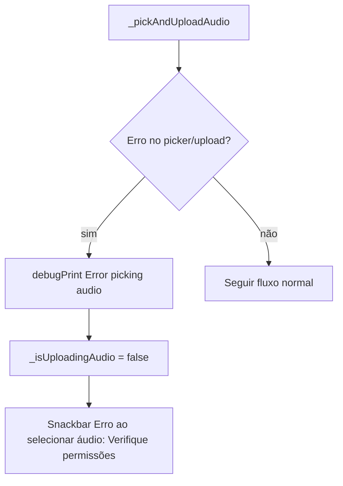

### Contrato do fluxo

- 🟢 **CONFIRMADO** — Erro é capturado.
- 🟢 **CONFIRMADO** — O loading é desligado no catch.
- 🟢 **CONFIRMADO** — O usuário recebe feedback genérico de seleção/permissão.

## Fluxo 8 — Remover áudio

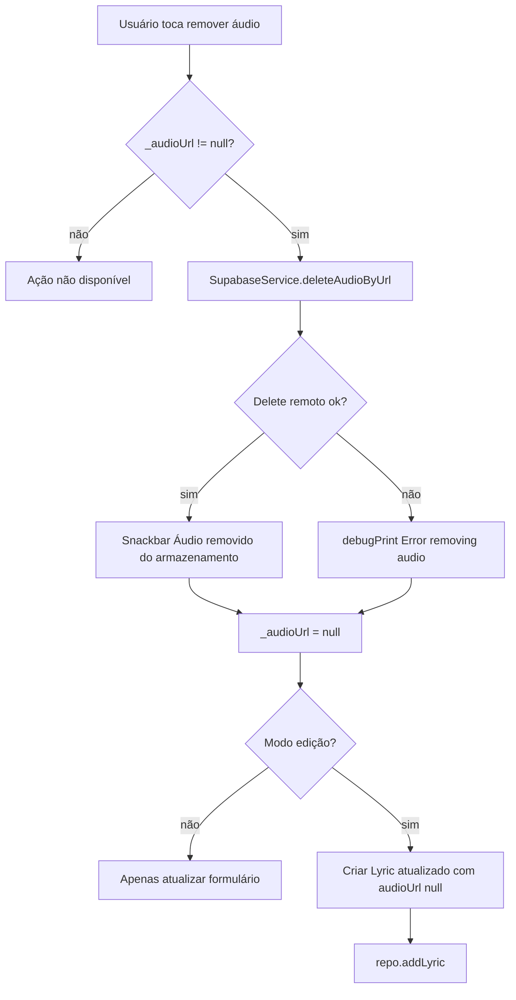

### Contrato do fluxo

- 🟢 **CONFIRMADO** — Mesmo com falha ao remover do storage, `_audioUrl` é limpo.
- 🟢 **CONFIRMADO** — Em edição, remoção salva automaticamente a letra.
- 🟡 **INFERIDO** — Esse comportamento pode deixar arquivo remoto sem referência se o delete falhar.

## Fluxo 9 — Excluir letra pelo formulário

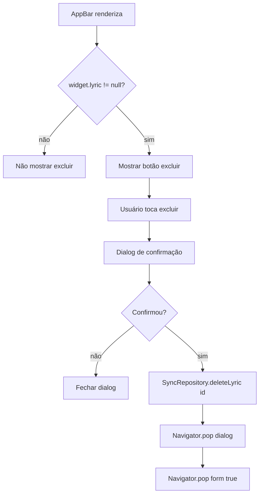

### Contrato do fluxo

- 🟢 **CONFIRMADO** — Só há exclusão em modo edição.
- 🟢 **CONFIRMADO** — Exclusão pede confirmação.
- 🟢 **CONFIRMADO** — O retorno `true` sinaliza exclusão para a tela anterior.

## Fluxo 10 — Delete local/remoto de letra

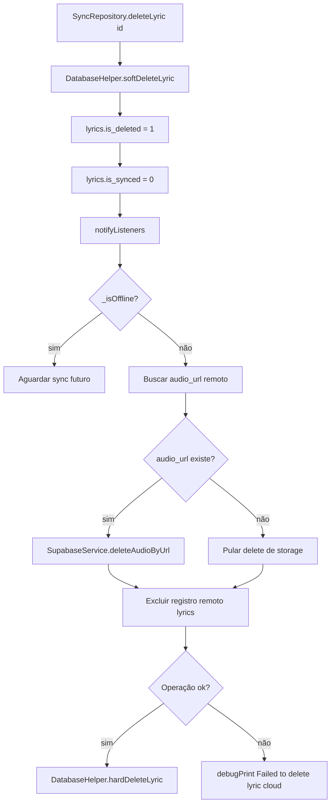

### Contrato do fluxo

- 🟢 **CONFIRMADO** — Delete local começa como soft delete.
- 🟢 **CONFIRMADO** — Offline mantém pendência local.
- 🟡 **INFERIDO** — O caminho online atual usa delete físico remoto via client, divergindo do soft delete de `SupabaseService.deleteLyric`.
- 🟡 **INFERIDO** — Uma reconstrução deve decidir entre hard delete remoto e soft delete consistente.

## Estados relevantes

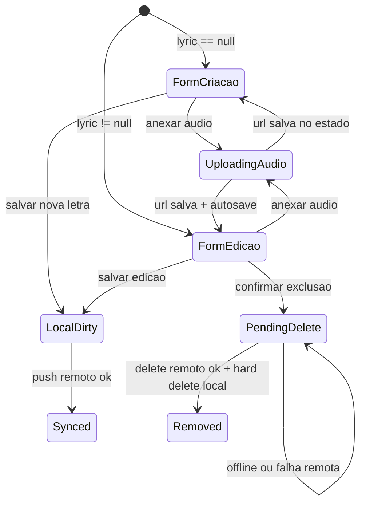

## Pontos de falha

| Falha | Comportamento legado | Confiança |
|---|---|---|
| Título vazio | Retorna sem salvar e sem snackbar | 🟢 |
| Conteúdo vazio | Pode salvar | 🟡 |
| YouTube inválido | Snackbar e bloqueia save | 🟢 |
| Erro no picker/upload | Desliga loading e mostra erro genérico | 🟢 |
| Upload retorna null | Mostra erro ao enviar áudio | 🟢 |
| Remoção do storage falha | Loga erro e limpa `_audioUrl` local | 🟢 |
| Push remoto de letra falha | Loga erro e mantém pendência local | 🟢 |
| Delete remoto falha | Loga erro e mantém registro soft-deleted local | 🟢 |
| Criação concorrente na mesma categoria | Sem lock explícito de sequência | 🟡 |
| Acesso direto ao formulário sem RBAC | Formulário não bloqueia internamente | 🟡 |

## Lacunas

- 🟡 **INFERIDO** — Decidir se título vazio deve exibir feedback.
- 🟡 **INFERIDO** — Decidir se conteúdo vazio deve ser bloqueado para alinhar com a regra de domínio.
- 🟡 **INFERIDO** — Decidir limpeza de áudio órfão em criação quando usuário abandona o formulário.
- 🟡 **INFERIDO** — Harmonizar delete remoto físico versus soft delete.
- 🟡 **INFERIDO** — Considerar proteção RBAC interna no formulário para defesa em profundidade.

