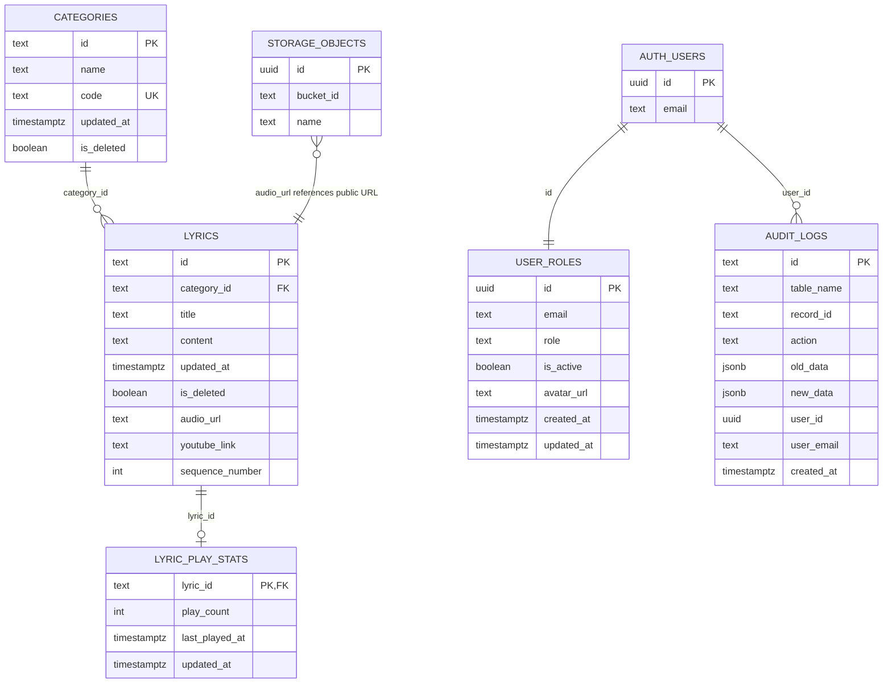

# ERD Completo — FMA_Pontos

## Notas de Confiança

- 🟢 **CONFIRMADO** — `categories`, `lyrics`, `user_roles`, `lyric_play_stats` aparecem em `supabase/supabase_schema.sql`.
- 🟢 **CONFIRMADO** — `lyrics.category_id` referencia `categories.id`.
- 🟢 **CONFIRMADO** — `lyric_play_stats.lyric_id` referencia `lyrics.id`.
- 🟢 **CONFIRMADO** — `user_roles.id` referencia `auth.users.id`.
- 🟡 **INFERIDO** — `audit_logs` é modelado pelo app e aparece em migration remota com revokes, mas o `CREATE TABLE`/triggers não estão claros nos arquivos atuais.
- 🟡 **INFERIDO** — Relação entre `lyrics.audio_url` e `storage.objects` é por URL/path, não FK relacional.
- 🟡 **INFERIDO** — `is_deleted` existe no modelo e serviços; no schema principal atual, algumas colunas podem depender de schema remoto/migrations não totalmente refletidas no arquivo principal.

