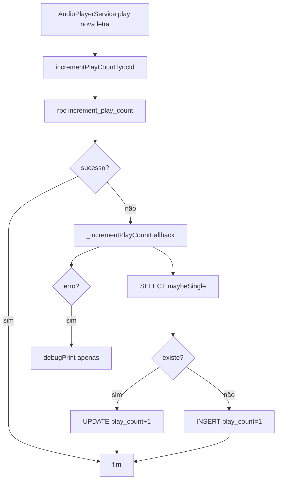
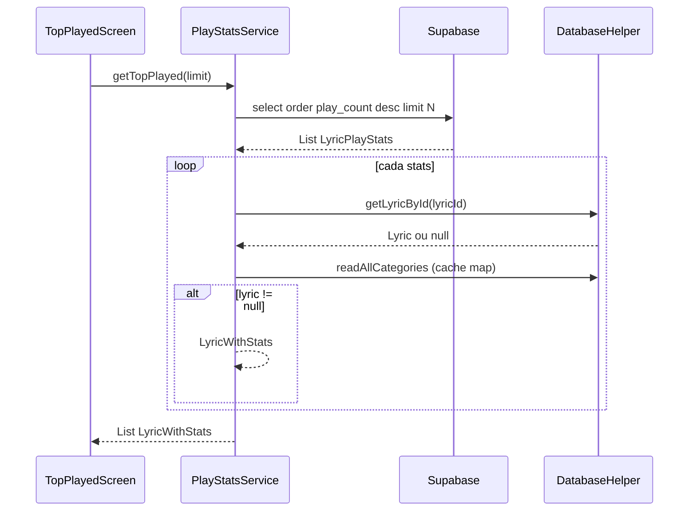
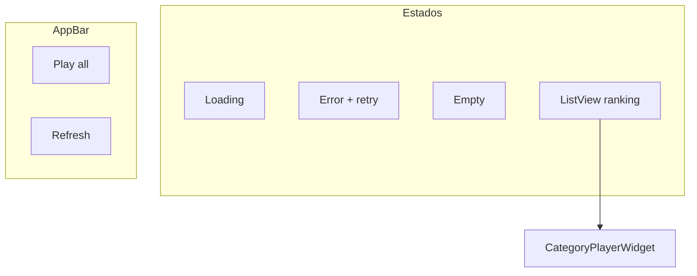

# Estatísticas / Mais Acessados — Design

> **Delta 2026-05-31:** Métrica alterada de reprodução no player para **acesso à letra** (`LyricViewScreen.initState` → `incrementAccessCount`). Coluna `play_count` e RPC `increment_play_count` mantidas (semântica de acesso no app). `AudioPlayerService` não incrementa mais stats.

## Decisão Arquitetural

🟢 **CONFIRMADO** — **Contador global remoto** em Postgres (Supabase), separado de favoritos locais.  
🟢 **CONFIRMADO** — **Híbrido read path**: stats remotos + join com SQLite para título/categoria.  
🟢 **CONFIRMADO** — Incremento **fire-and-forget** ao abrir visualização da letra (`LyricViewScreen`).  
🟢 **CONFIRMADO** — Estratégia **RPC-first com fallback** para compatibilidade com deploys sem função SQL.  
🔴 **LACUNA** — RPC `increment_play_count` deve ser criada no Supabase para atomicidade e segurança.

## Componentes

| Componente | Tipo | Responsabilidade | Dependências |
|------------|------|------------------|--------------|
| `PlayStatsService` | Service | Incremento e queries de stats | `SupabaseClient`, `DatabaseHelper` |
| `LyricPlayStats` | Model | Linha de stats remota | — |
| `LyricWithStats` | DTO | Lyric + playCount + categoryName | `Lyric` |
| `LyricViewScreen` | Produtor de eventos | Chama incremento ao abrir letra | `PlayStatsService` |
| `TopPlayedScreen` | UI | Ranking, play all, refresh | `PlayStatsService`, `AudioPlayerService` |
| `HomeScreen` | UI hub | Preview “Mais Acessados” (8 itens) + destaque categorias | `PlayStatsService`, `SyncRepository` |
| `CategoryPlayerWidget` | UI rodapé | Player compacto na tela | `Provider` |

## Schema Remoto — `lyric_play_stats`

| Coluna | Tipo | Constraint | Uso |
|--------|------|------------|-----|
| `lyric_id` | TEXT | PK, FK → `lyrics(id)` ON DELETE CASCADE | Identificador da letra |
| `play_count` | INTEGER | NOT NULL DEFAULT 0 | Contador global |
| `last_played_at` | TIMESTAMPTZ | DEFAULT now() | Última reprodução |
| `updated_at` | TIMESTAMPTZ | DEFAULT now() | Auditoria técnica |

🟢 **CONFIRMADO** — Índice `idx_lyric_play_stats_count ON (play_count DESC)` para ranking.

### RLS e Grants

| Operação | Quem | Policy |
|----------|------|--------|
| SELECT | anon + authenticated | `USING (true)` — leitura pública |
| INSERT | authenticated | `WITH CHECK (true)` |
| UPDATE | authenticated | `USING (true)` |

🟡 **INFERIDO** — Qualquer usuário autenticado (incluindo anônimo) pode incrementar via fallback.

## RPC Esperada (lacuna)

```sql
-- 🔴 LACUNA: não versionada no repo; inferida do cliente
increment_play_count(p_lyric_id TEXT)
-- Deveria: INSERT ... ON CONFLICT (lyric_id) DO UPDATE
--   SET play_count = lyric_play_stats.play_count + 1,
--       last_played_at = now(), updated_at = now()
```

## Fluxo de Incremento



### Pontos de disparo no áudio

| Método | Condição de incremento |
|--------|------------------------|
| `play(lyric)` | `_currentLyric?.id != lyric.id` após `playMediaItem` |
| `_playCurrentTrack()` | Sempre ao iniciar faixa da playlist |

🟢 **CONFIRMADO** — `play()` no ramo `else` (toggle pause/resume) **não** incrementa.

## Destaques na Home — `rankCategoriesByAccess`

🟢 **CONFIRMADO** — `HomeScreen._loadHomeData()` chama `rankCategoriesByAccess(categories, lyricsCountFor: repo.getLyricsCount, limit: 4)`.

| Prioridade | Critério de ordenação |
|------------|----------------------|
| 1 | Soma de `play_count` por `category_id` em `lyric_play_stats` (via `getPlayCountByCategory`) |
| 2 (fallback) | Contagem de letras por categoria quando não há dados de reprodução |

🟢 **CONFIRMADO** — Preview “Mais Tocados” na mesma tela usa `getTopPlayed(limit: 8)`.

## Fluxo `getTopPlayed`



🟢 **CONFIRMADO** — Categorias carregadas uma vez por request em mapa `id → name`.

🟡 **INFERIDO** — Ordem final preserva ordenação remota; itens sem local não "quebram" posições (gap no ranking exibido).

## UI — TopPlayedScreen



### Tile de ranking

| Elemento | Comportamento |
|----------|---------------|
| Rank 1-3 | Ícone `emoji_events` cores amber/grey/brown |
| Rank 4+ | Número do rank |
| Leading animado | `graphic_eq` quando `isPlaying` |
| Subtitle | pasta + nome categoria + ícone play + contagem |
| Trailing | play/pause + chevron |
| Tap linha | `LyricViewScreen` |
| Highlight | `primaryContainer` quando `currentLyric` |

## Integração Home

🟢 **CONFIRMADO** — `HomeScreen._onTabTapped(2)` → `Navigator.push(TopPlayedScreen())`.

Bottom navigation index 2 = "Mais Tocados" (entre Buscar e Gostei).

## Contratos de API

```dart
// PlayStatsService (🟢 CONFIRMADO)
Future<void> incrementPlayCount(String lyricId);
Future<List<LyricWithStats>> getTopPlayed({int limit = 20});
Future<int> getPlayCount(String lyricId); // 🟡 sem UI

// Modelos
class LyricPlayStats { lyricId, playCount, lastPlayedAt }
class LyricWithStats { lyric, playCount, categoryName? }
```

## Lacunas e Riscos

| Item | Severidade | Mitigação sugerida |
|------|------------|-------------------|
| RPC ausente no repo | 🔴 | Adicionar migration SQL atômica |
| Fallback race condition | 🟡 | Usar RPC ou `UPDATE ... RETURNING` |
| Lyrics só remotos omitidos | 🟡 | Sync antes de abrir ranking ou join remoto |
| `getPlayCount` não usado | 🟢 baixo | Exibir na `LyricViewScreen` futuramente |
| YouTube não conta plays | 🟡 | Documentado; incrementar se produto exigir |
