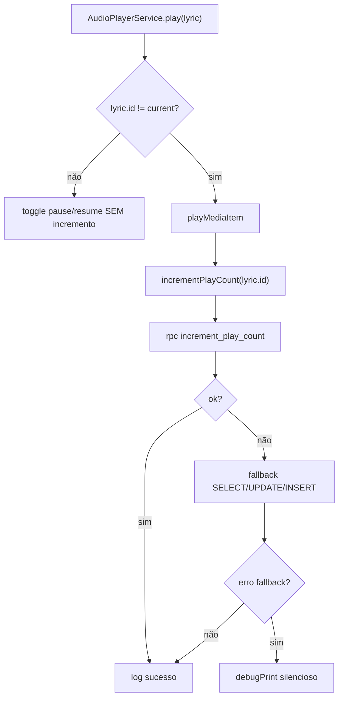
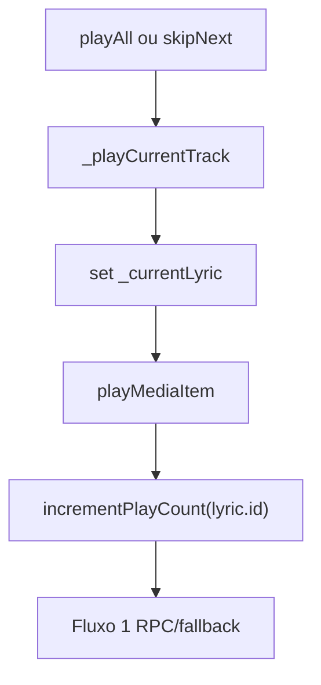
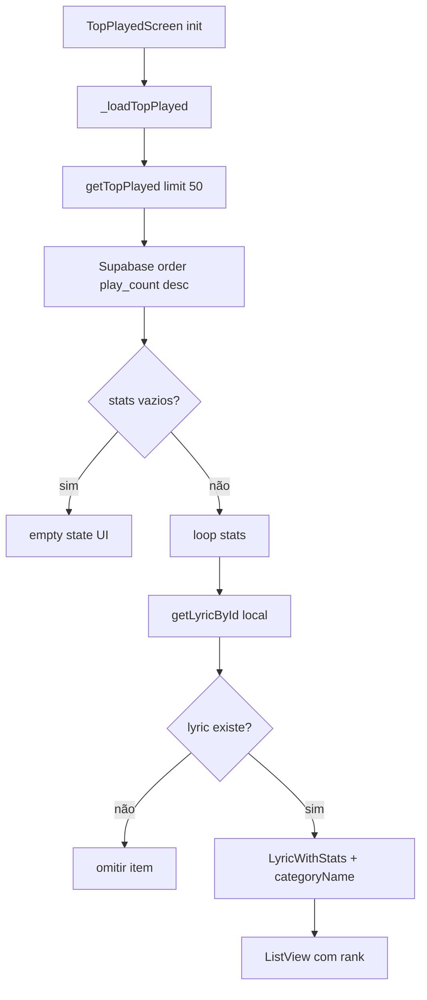
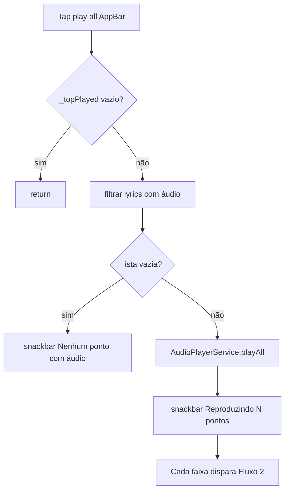
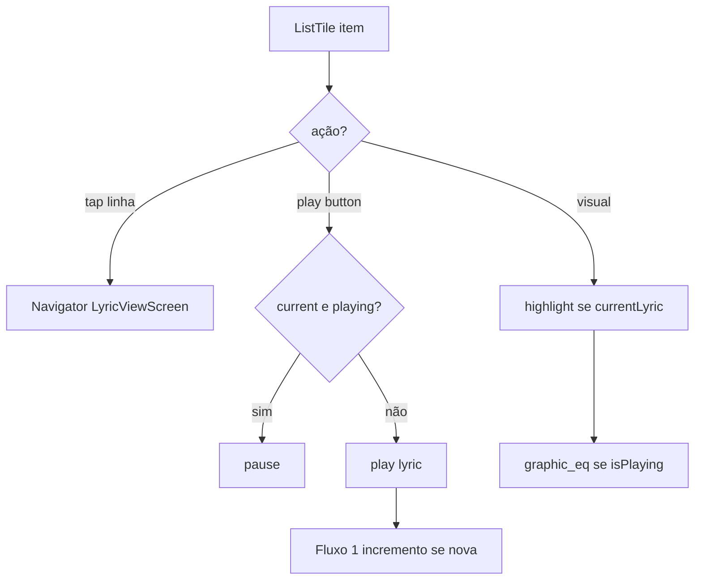
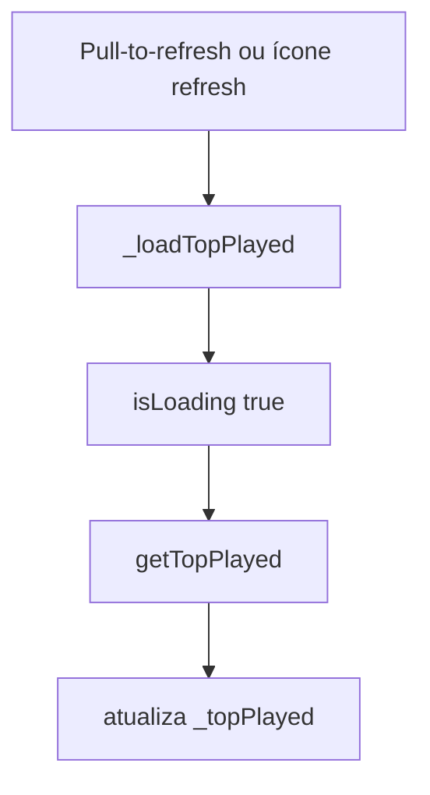
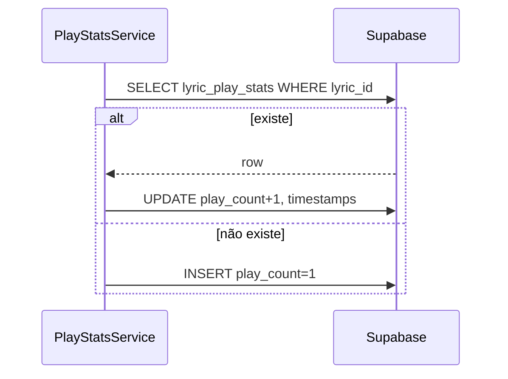
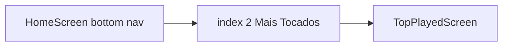

# Estatísticas / Mais Tocados — Fluxos Operacionais

## Fluxo 1 — Incrementar contador ao tocar áudio

### Contrato do fluxo

- 🟢 **CONFIRMADO** — Incremento é assíncrono e não bloqueia `playMediaItem`.
- 🟢 **CONFIRMADO** — Mesma letra em pause/resume não reconta.
- 🔴 **LACUNA** — RPC ideal não está no schema versionado.

## Fluxo 2 — Incremento em playlist (skip / play all)

### Contrato do fluxo

- 🟢 **CONFIRMADO** — Cada faixa nova na playlist incrementa uma vez ao iniciar.
- 🟢 **CONFIRMADO** — Repeat no fim da playlist reinicia do índice 0 e incrementa de novo ao tocar faixa 1.

## Fluxo 3 — Carregar ranking Mais Tocados

### Contrato do fluxo

- 🟢 **CONFIRMADO** — Limite 50 na tela vs default 20 no serviço.
- 🟢 **CONFIRMADO** — Erro de rede define `_error` e botão Tentar novamente.
- 🟡 **INFERIDO** — Ranking exibido pode ter menos itens que 50 se muitos IDs não existem localmente.

## Fluxo 4 — Tocar todos do ranking

### Contrato do fluxo

- 🟢 **CONFIRMADO** — Botão play all só visível se `_topPlayed.isNotEmpty`.
- 🟢 **CONFIRMADO** — Ordem da playlist segue ordem do ranking (após filtro).

## Fluxo 5 — Interação com item do ranking

### Contrato do fluxo

- 🟢 **CONFIRMADO** — `Consumer<AudioPlayerService>` atualiza ícones em tempo real.
- 🟢 **CONFIRMADO** — Top 3 mantém troféu mesmo quando não está tocando (exceto quando `isPlaying` substitui por equalizer).

## Fluxo 6 — Refresh da lista

### Contrato do fluxo

- 🟢 **CONFIRMADO** — Refresh não altera playback em andamento.
- 🟢 **CONFIRMADO** — Stats refletem incrementos remotos de outros dispositivos após reload.

## Fluxo 7 — Fallback manual de incremento

### Contrato do fluxo

- 🟢 **CONFIRMADO** — Usado apenas quando RPC falha.
- 🟡 **INFERIDO** — Concorrência pode perder incrementos sem transação.

## Fluxo 8 — Acesso pela Home

### Contrato do fluxo

- 🟢 **CONFIRMADO** — Push route; não altera tab index da Home (index 2 não seleciona aba home).

## Matriz fluxo × RF

| Fluxo | RF |
|-------|-----|
| Incremento play | RF-01, RF-02, RF-03, RF-04, RF-05 |
| Playlist increment | RF-01 |
| Carregar ranking | RF-06, RF-07, RF-12 |
| Play all | RF-10 |
| Item ranking | RF-08, RF-09, RF-11, RF-14 |
| Refresh | RF-12 |
| Fallback | RF-04 |
| Home nav | RF-06 |
