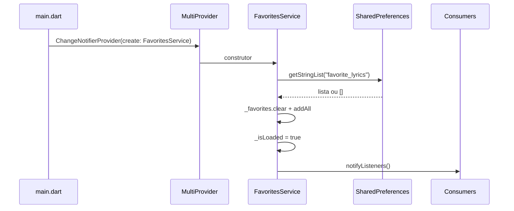
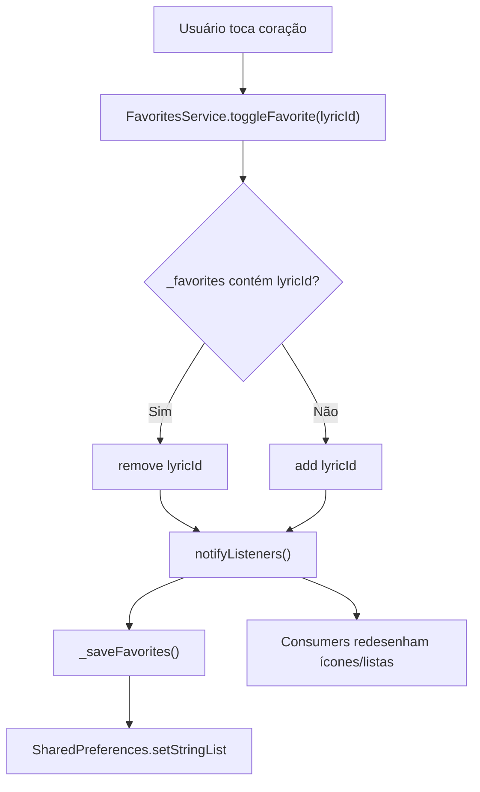
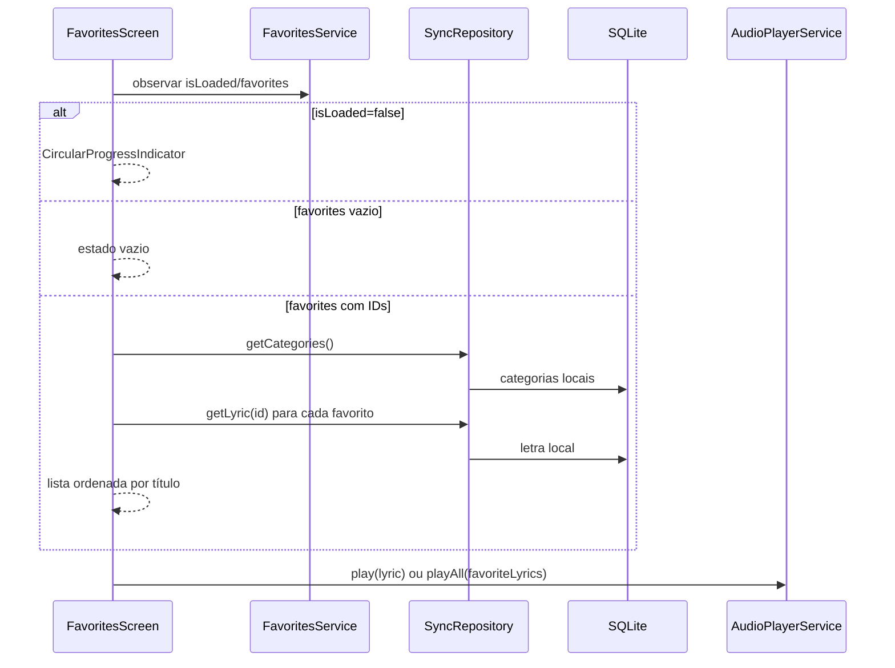

# Favoritos — Design

## Decisão Arquitetural

🟢 **CONFIRMADO** — Favoritos pertencem à camada de preferências locais do app, não ao domínio sincronizado.  
🟢 **CONFIRMADO** — O estado é exposto por `FavoritesService`, um `ChangeNotifier` registrado no `MultiProvider` principal.  
🟢 **CONFIRMADO** — A persistência usa `SharedPreferences` com uma lista de strings contendo IDs de letras.

## Componentes

| Componente | Tipo | Responsabilidade | Dependências |
|------------|------|------------------|--------------|
| `FavoritesService` | `ChangeNotifier` | Manter conjunto local de favoritos, carregar/salvar `SharedPreferences`, notificar UI | `SharedPreferences`, `foundation.dart` |
| `FavoritesScreen` | `StatefulWidget` | Listar favoritos, resolver dados de letra/categoria, remover favorito, tocar todos | `FavoritesService`, `SyncRepository`, `AudioPlayerService` |
| `LyricViewScreen` | Tela consumidora | Alternar favorito da letra exibida e mostrar feedback | `FavoritesService`, `SnackbarUtils` |
| `CategoryPlayerWidget` | Widget consumidor | Alternar favorito da letra atualmente reproduzida | `FavoritesService`, `AudioPlayerService` |
| `HomeScreen` | Navegação | Abrir tela "Gostei" | `FavoritesScreen` |

## Modelo de Dados Local

### SharedPreferences

| Chave | Tipo | Conteúdo | Observação |
|-------|------|----------|------------|
| `favorite_lyrics` | `List<String>` | IDs de `Lyric` favoritados | Não sincronizado e não versionado por usuário remoto |

### Estado em Memória

```dart
final Set<String> _favorites = {};
bool _isLoaded = false;
```

Regras:

- 🟢 **CONFIRMADO** — `Set<String>` evita duplicidade em memória.
- 🟢 **CONFIRMADO** — Getter `favorites` retorna `Set.unmodifiable(_favorites)`.
- 🟢 **CONFIRMADO** — Getter `count` deriva de `_favorites.length`.
- 🟢 **CONFIRMADO** — Getter `isLoaded` sinaliza conclusão da leitura inicial.

## Fluxo de Inicialização



Falhas:

- 🟢 **CONFIRMADO** — Exceção de leitura é capturada.
- 🟢 **CONFIRMADO** — Mesmo com erro, `_isLoaded = true` e listeners são notificados.
- 🟡 **INFERIDO** — A decisão favorece continuidade da UI sobre exibir erro persistente de preferências.

## Fluxo de Toggle



Características:

- 🟢 **CONFIRMADO** — UI é notificada antes do término da escrita em `SharedPreferences`.
- 🟢 **CONFIRMADO** — Erro de escrita é apenas registrado em `debugPrint`.
- 🟡 **INFERIDO** — Em caso de falha na escrita, a UI pode exibir estado otimista não persistido até reiniciar o app.

## Fluxo da Tela "Gostei"



Regras de montagem:

- 🟢 **CONFIRMADO** — Categorias são carregadas uma vez e indexadas por ID.
- 🟢 **CONFIRMADO** — Cada favorito chama `repo.getLyric(id)`.
- 🟢 **CONFIRMADO** — Letras não encontradas são ignoradas.
- 🟢 **CONFIRMADO** — Categoria ausente usa fallback `Categoria` e código `??`.
- 🟢 **CONFIRMADO** — Resultado é ordenado por `a.lyric.title.compareTo(b.lyric.title)`.

## Integração com Playback

| Ponto | Comportamento |
|-------|---------------|
| Lista "Gostei" | Exibe botão de play apenas quando a letra tem `audioUrl` ou `localAudioPath`. |
| Item atual | Destaca item quando `AudioPlayerService.currentLyric?.id == lyric.id`. |
| Item tocando | Usa ícone de pausa quando item atual está reproduzindo. |
| Tocar todas | Coleta letras favoritas existentes, ordena por título e chama `playAll`. |
| Player compacto | Permite alternar favorito da letra atual sem sair do player. |

## Estados de UI

| Estado | Critério | UI |
|--------|----------|----|
| Carregando preferências | `FavoritesService.isLoaded == false` | `CircularProgressIndicator` central |
| Vazio | `favorites.isEmpty` | Ícone de coração contornado e texto orientativo |
| IDs órfãos | IDs existem, mas `repo.getLyric(id)` retorna `null` para todos | Mensagem "Músicas favoritas não encontradas" |
| Lista | Há letras resolvidas | `ListView.builder` com título, código/categoria, coração e play opcional |
| Tocando | Letra do item é `currentLyric` | Container destacado e indicador visual de reprodução |

## Contratos Públicos do Serviço

| API | Entrada | Saída | Efeito |
|-----|---------|-------|--------|
| `favorites` | Nenhuma | `Set<String>` imutável | Exposição segura do conjunto |
| `count` | Nenhuma | `int` | Contagem derivada |
| `isLoaded` | Nenhuma | `bool` | Estado da leitura inicial |
| `isFavorite` | `String lyricId` | `bool` | Consulta local sem I/O |
| `toggleFavorite` | `String lyricId` | `Future<void>` | Alterna, notifica e salva |
| `addFavorite` | `String lyricId` | `Future<void>` | Adiciona se ausente, notifica e salva |
| `removeFavorite` | `String lyricId` | `Future<void>` | Remove se presente, notifica e salva |
| `clearAll` | Nenhuma | `Future<void>` | Limpa todos, notifica e salva |

## Limites de Escopo

- 🟢 **CONFIRMADO** — Não há tabela SQLite dedicada para favoritos.
- 🟢 **CONFIRMADO** — Não há coluna de favorito em `lyrics`.
- 🟢 **CONFIRMADO** — Não há contrato Supabase para favoritos.
- 🟢 **CONFIRMADO** — Não há permissão RBAC associada a favoritar.
- 🟢 **CONFIRMADO** — Não há sincronização entre dispositivos ou usuários.

## Riscos e Trade-offs

| Risco | Impacto | Mitigação existente | Confiança |
|-------|---------|---------------------|-----------|
| ID órfão em `SharedPreferences` | Favorito salvo não aparece na lista | Tela ignora letras não encontradas e mostra estado "não encontradas" | 🟢 |
| Falha ao salvar preferências | Estado visual pode divergir após reinício | Erro é capturado e logado, mas não há retry/feedback | 🟡 |
| Ordem de `Set.toList()` ao salvar | Ordem persistida não é relevante | Exibição ordena por título após resolver letras | 🟢 |
| Lista grande de favoritos | Várias chamadas sequenciais a `getLyric(id)` | Sem mitigação específica; acervo esperado parece pequeno/médio | 🟡 |
| Favoritos por dispositivo | Usuário perde favoritos em outro aparelho | Comportamento intencional do legado local-only | 🟢 |

## Rastreabilidade

| Requisito | Design |
|-----------|--------|
| RF-01 | Inicialização do `FavoritesService` e `_loadFavorites` |
| RF-02, RF-03 | API `isFavorite` e `toggleFavorite` |
| RF-04 | `_saveFavorites` com `SharedPreferences.setStringList` |
| RF-05 | `ChangeNotifier` + `Consumer<FavoritesService>` |
| RF-06, RF-07 | Consumo em `LyricViewScreen` |
| RF-08 | Consumo em `CategoryPlayerWidget` |
| RF-09 a RF-14 | `FavoritesScreen` e `_getFavoriteLyricsWithCategory` |
| RF-15 | `_playAllFavorites` + `AudioPlayerService.playAll` |

