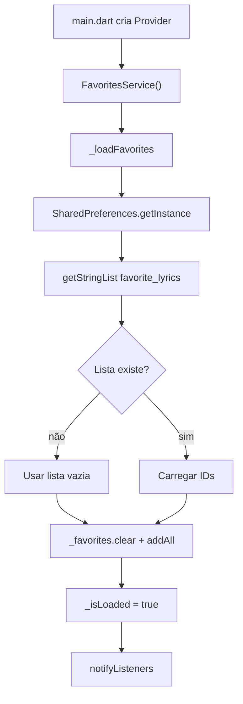
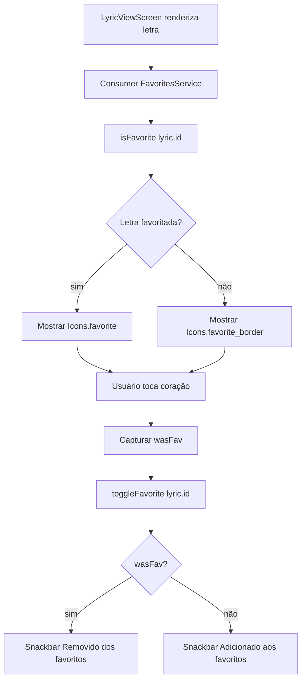
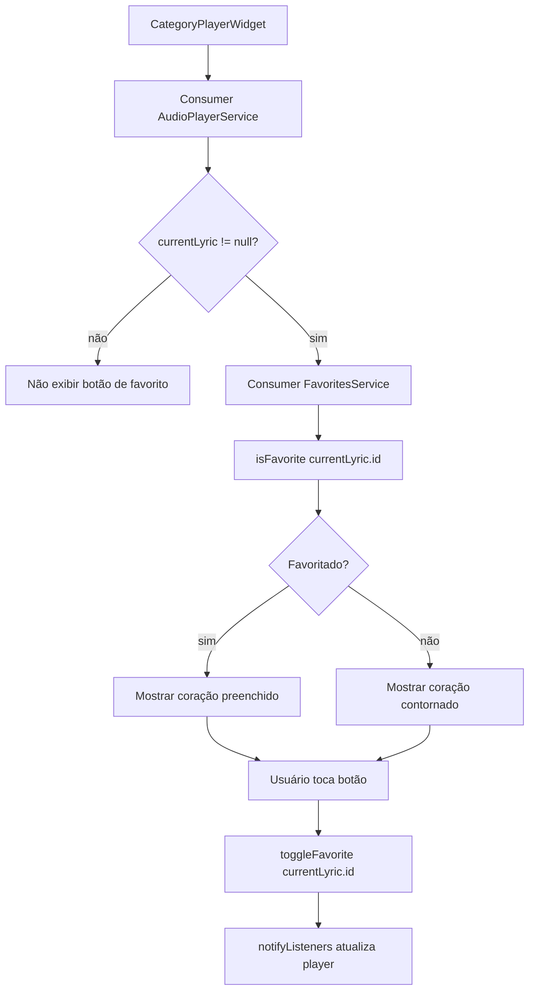
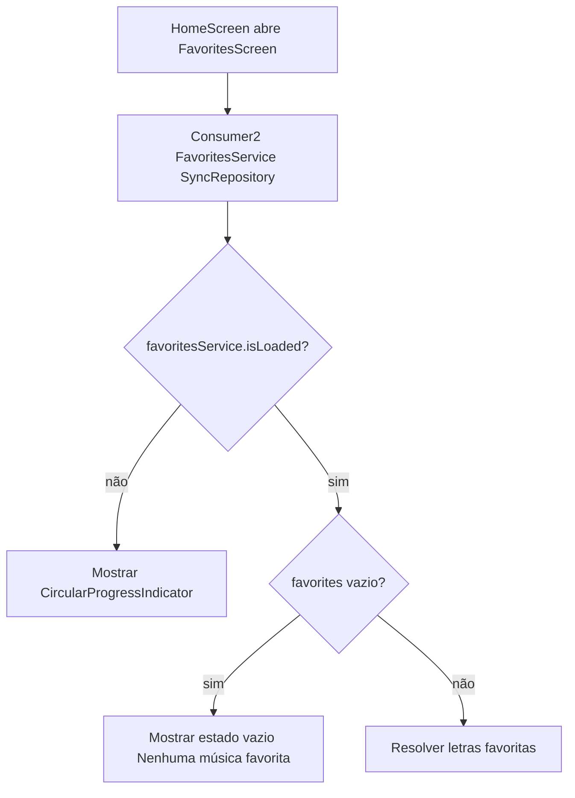
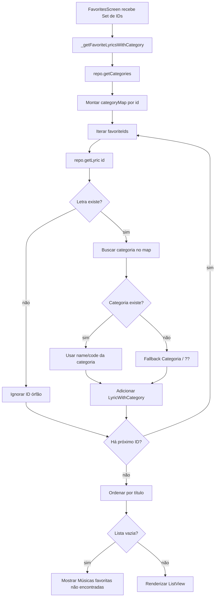
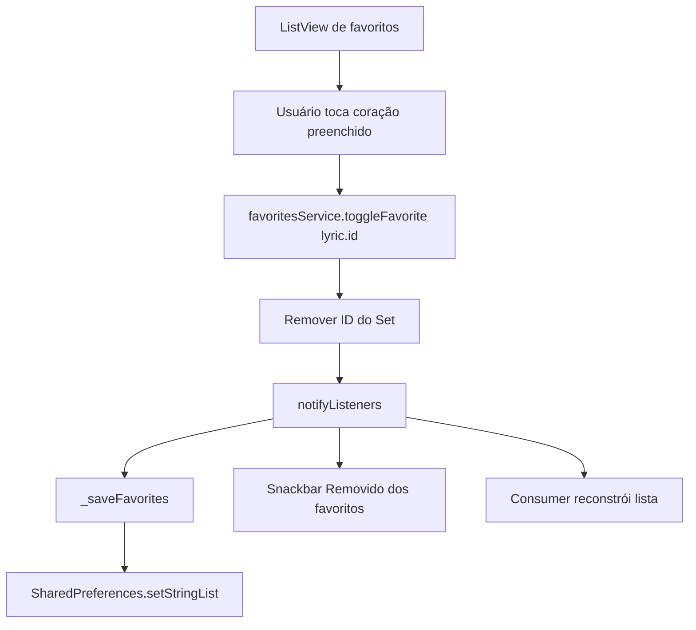
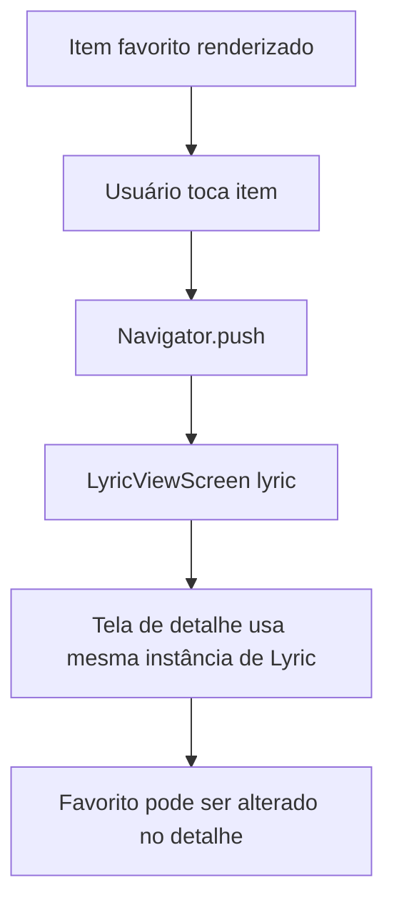
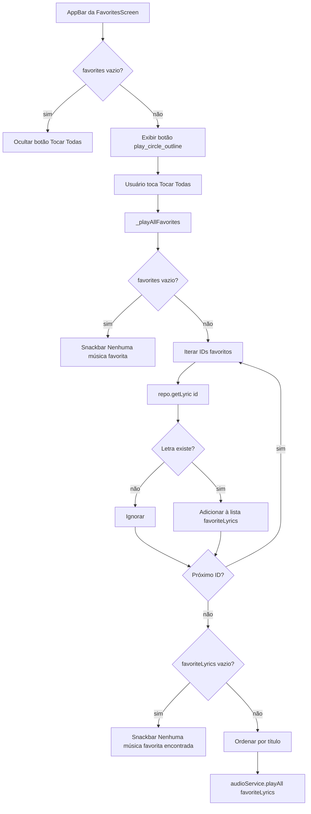
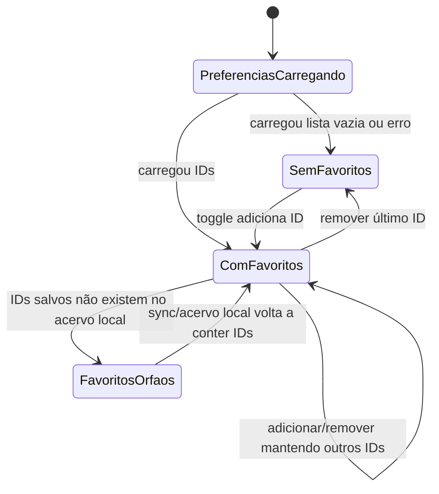

# Favoritos — Fluxos Operacionais

## Fluxo 1 — Inicializar favoritos locais

### Contrato do fluxo

- 🟢 **CONFIRMADO** — A chave de persistência é `favorite_lyrics`.
- 🟢 **CONFIRMADO** — O serviço carrega favoritos automaticamente no construtor.
- 🟢 **CONFIRMADO** — O estado carregado é exposto por `isLoaded`.
- 🟢 **CONFIRMADO** — Falha de leitura é capturada, marca `isLoaded = true` e notifica listeners.

## Fluxo 2 — Favoritar ou remover favorito na tela de letra

### Contrato do fluxo

- 🟢 **CONFIRMADO** — O ícone é derivado de `FavoritesService.isFavorite(_lyric.id)`.
- 🟢 **CONFIRMADO** — A mensagem do snackbar depende do estado antes do toggle.
- 🟢 **CONFIRMADO** — A operação não exige login ou role.
- 🟢 **CONFIRMADO** — `notifyListeners()` atualiza o botão após a alteração.

## Fluxo 3 — Alternar favorito no player compacto

### Contrato do fluxo

- 🟢 **CONFIRMADO** — O botão só existe quando há letra atual no player.
- 🟢 **CONFIRMADO** — O player compacto alterna favorito sem navegar para outra tela.
- 🟢 **CONFIRMADO** — O estado visual usa a mesma fonte (`FavoritesService`) da tela de letra e da lista "Gostei".

## Fluxo 4 — Abrir tela "Gostei" vazia ou carregando

### Contrato do fluxo

- 🟢 **CONFIRMADO** — Antes de `isLoaded`, a tela mostra loading.
- 🟢 **CONFIRMADO** — Quando não há favoritos, a tela exibe orientação para tocar no coração.
- 🟢 **CONFIRMADO** — O botão "Tocar Todas" não aparece quando `favorites` está vazio.

## Fluxo 5 — Resolver e listar favoritos

### Contrato do fluxo

- 🟢 **CONFIRMADO** — A tela resolve letras a partir dos IDs locais usando `SyncRepository.getLyric`.
- 🟢 **CONFIRMADO** — IDs sem letra correspondente não são exibidos.
- 🟢 **CONFIRMADO** — Categoria ausente usa fallback visual.
- 🟢 **CONFIRMADO** — A ordenação final é alfabética por `lyric.title`.

## Fluxo 6 — Remover favorito pela lista "Gostei"

### Contrato do fluxo

- 🟢 **CONFIRMADO** — O botão da lista sempre representa remoção, pois todo item listado já é favorito.
- 🟢 **CONFIRMADO** — A mensagem exibida é "Removido dos favoritos".
- 🟢 **CONFIRMADO** — A lista é reconstruída a partir do novo conjunto.

## Fluxo 7 — Navegar de favorito para visualização

### Contrato do fluxo

- 🟢 **CONFIRMADO** — O destino é `LyricViewScreen(lyric: lyric)`.
- 🟢 **CONFIRMADO** — A navegação não recarrega a letra remotamente.
- 🟢 **CONFIRMADO** — Alterar favorito no detalhe reflete na lista ao retornar, pois ambas consomem `FavoritesService`.

## Fluxo 8 — Tocar todas as favoritas

### Contrato do fluxo

- 🟢 **CONFIRMADO** — A ação é disponibilizada apenas quando há IDs favoritos.
- 🟢 **CONFIRMADO** — Letras órfãs são ignoradas também na playlist.
- 🟢 **CONFIRMADO** — A playlist é ordenada por título antes de tocar.
- 🟢 **CONFIRMADO** — O fluxo chama `AudioPlayerService.playAll`, sem filtro explícito local na tela para remover letras sem áudio antes da chamada.

## Estados relevantes

## Pontos de falha

| Falha | Comportamento legado | Confiança |
|---|---|---|
| Erro ao carregar `SharedPreferences` | Loga erro, marca carregado e continua com conjunto vazio | 🟢 |
| Erro ao salvar `SharedPreferences` | Loga erro, UI mantém estado em memória | 🟢 |
| ID favorito sem letra local | Ignora ID na lista e na playlist | 🟢 |
| Categoria da letra não encontrada | Exibe fallback `Categoria` e `??` | 🟢 |
| Tocar todas sem letras resolvidas | Snackbar `Nenhuma música favorita encontrada.` | 🟢 |
| Sincronização de favoritos entre aparelhos | Não existe no legado | 🟢 |

## Lacunas

- 🟡 **INFERIDO** — Não há rollback do estado em memória quando salvar em `SharedPreferences` falha.
- 🟡 **INFERIDO** — Não há rotina para limpar IDs órfãos da chave `favorite_lyrics`.
- 🟡 **INFERIDO** — Não há otimização em lote para resolver muitos favoritos; o legado usa chamadas sequenciais a `getLyric`.

