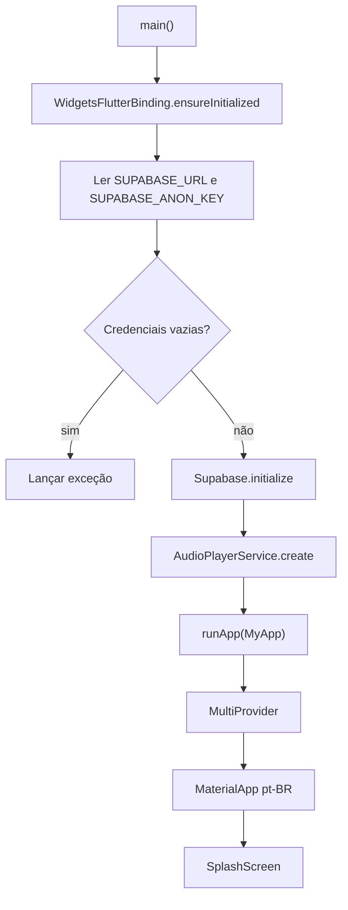

# Fluxograma — app-bootstrap

```mermaid
flowchart TD
  A["main()"] --> B["WidgetsFlutterBinding.ensureInitialized"]
  B --> C["Ler SUPABASE_URL e SUPABASE_ANON_KEY"]
  C --> D{"Credenciais vazias?"}
  D -- "sim" --> E["Lançar exceção"]
  D -- "não" --> F["Supabase.initialize"]
  F --> G["AudioPlayerService.create"]
  G --> H["runApp(MyApp)"]
  H --> I["MultiProvider"]
  I --> J["MaterialApp pt-BR"]
  J --> K["SplashScreen"]
```

