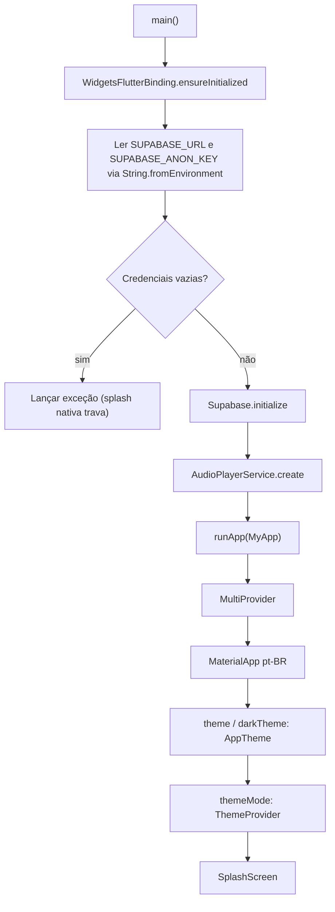
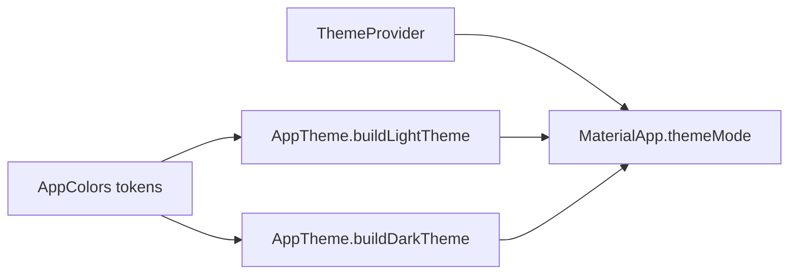
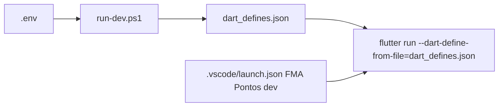

# Fluxograma — app-bootstrap

## Tema (🟢 re-extração visual 2026-05-31)

- 🟢 **CONFIRMADO** — `ThemeProvider` default `ThemeMode.dark` (sem prefs).
- 🟢 **CONFIRMADO** — `AppTheme` usa Plus Jakarta Sans e `ColorScheme` explícito (verde `#1DB954`).

## Desenvolvimento local (🟢 re-extração 2026-05-21)

- 🟢 **CONFIRMADO** — Release/CI continuam usando `--dart-define=SUPABASE_URL=...` direto (GitHub Actions).
- 🟢 **CONFIRMADO** — `dart_defines.example.json` documenta formato JSON esperado.
- 🟡 **INFERIDO** — Sem `--dart-define`, app falha antes de `runApp` (tela branca = splash nativa Android).
