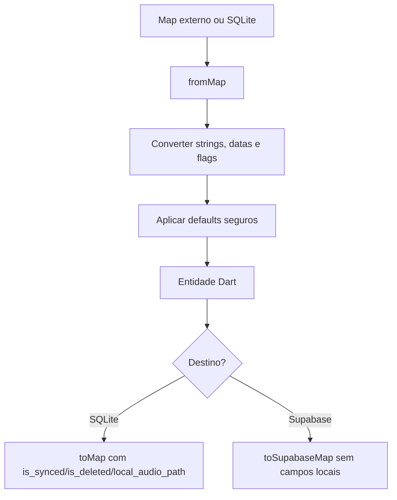

# Fluxograma — models

```mermaid
flowchart TD
  A["Map externo ou SQLite"] --> B["fromMap"]
  B --> C["Converter strings, datas e flags"]
  C --> D["Aplicar defaults seguros"]
  D --> E["Entidade Dart"]
  E --> F{"Destino?"}
  F -- "SQLite" --> G["toMap com is_synced/is_deleted/local_audio_path"]
  F -- "Supabase" --> H["toSupabaseMap sem campos locais"]
```

