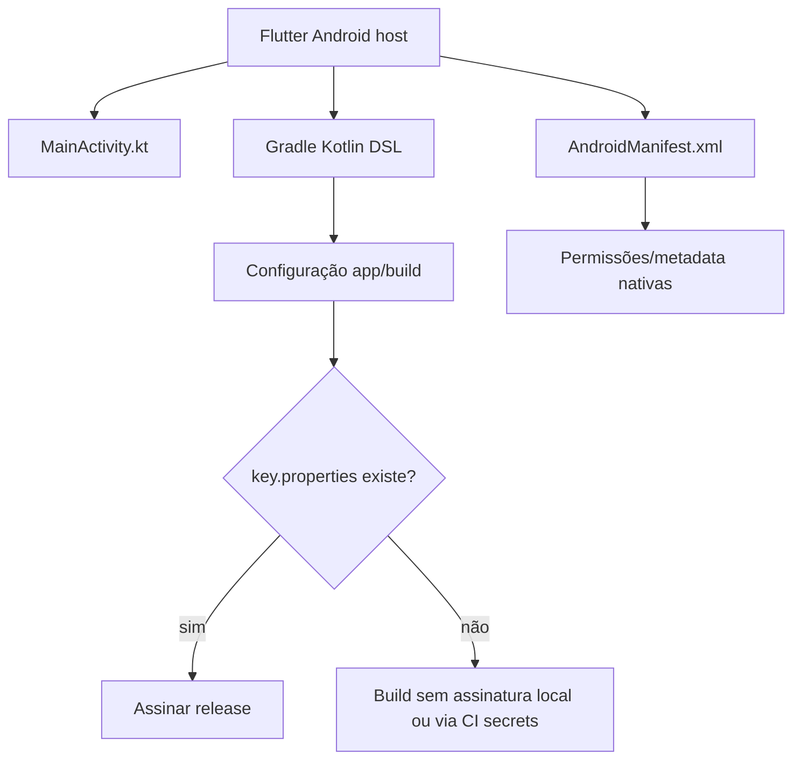

# Fluxograma — platform-android

```mermaid
flowchart TD
  A["Flutter Android host"] --> B["MainActivity.kt"]
  A --> C["AndroidManifest.xml"]
  A --> D["Gradle Kotlin DSL"]
  D --> E["Configuração app/build"]
  E --> F{"key.properties existe?"}
  F -- "sim" --> G["Assinar release"]
  F -- "não" --> H["Build sem assinatura local ou via CI secrets"]
  C --> I["Permissões/metadata nativas"]
```

