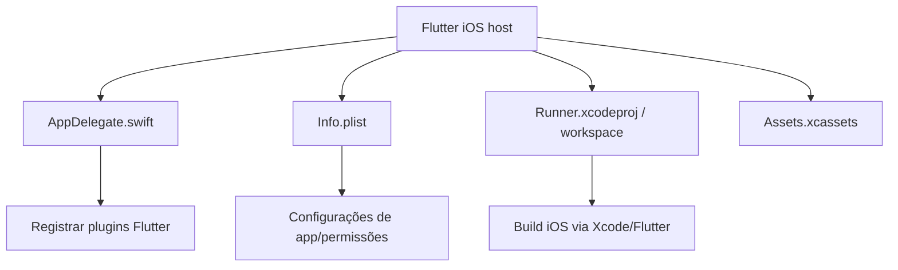

# Fluxograma — platform-ios

```mermaid
flowchart TD
  A["Flutter iOS host"] --> B["AppDelegate.swift"]
  A --> C["Info.plist"]
  A --> D["Runner.xcodeproj / workspace"]
  A --> E["Assets.xcassets"]
  B --> F["Registrar plugins Flutter"]
  C --> G["Configurações de app/permissões"]
  D --> H["Build iOS via Xcode/Flutter"]
```

