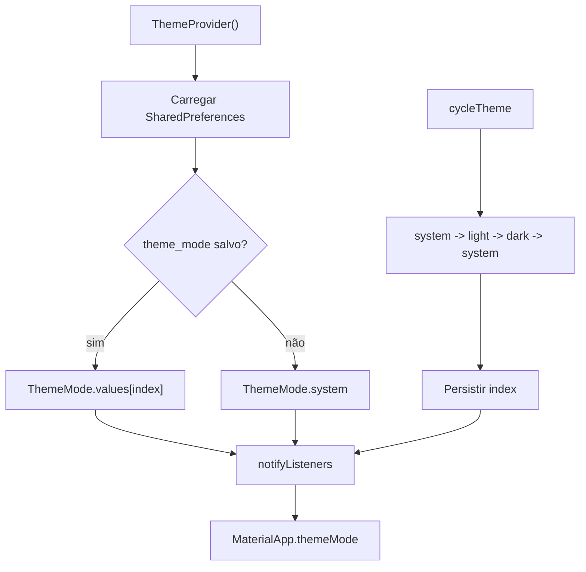

# Fluxograma — providers

```mermaid
flowchart TD
  A["ThemeProvider()"] --> B["Carregar SharedPreferences"]
  B --> C{"theme_mode salvo?"}
  C -- "sim" --> D["ThemeMode.values[index]"]
  C -- "não" --> E["ThemeMode.system"]
  D --> F["notifyListeners"]
  E --> F
  F --> G["MaterialApp.themeMode"]
  H["cycleTheme"] --> I["system -> light -> dark -> system"]
  I --> J["Persistir index"]
  J --> F
```

