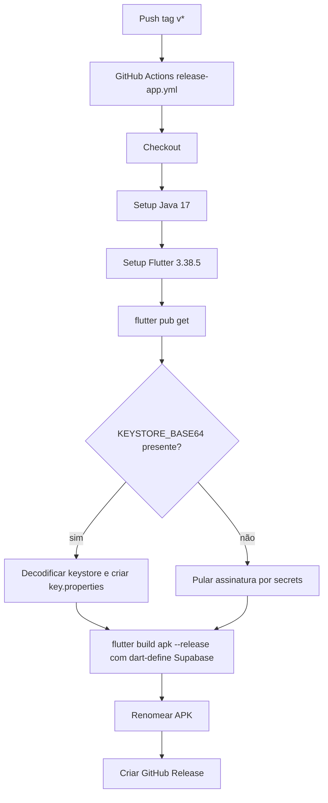

# Fluxograma — release-pipeline

```mermaid
flowchart TD
  A["Push tag v*"] --> B["GitHub Actions release-app.yml"]
  B --> C["Checkout"]
  C --> D["Setup Java 17"]
  D --> E["Setup Flutter 3.38.5"]
  E --> F["flutter pub get"]
  F --> G{"KEYSTORE_BASE64 presente?"}
  G -- "sim" --> H["Decodificar keystore e criar key.properties"]
  G -- "não" --> I["Pular assinatura por secrets"]
  H --> J["flutter build apk --release com dart-define Supabase"]
  I --> J
  J --> K["Renomear APK"]
  K --> L["Criar GitHub Release"]
```

