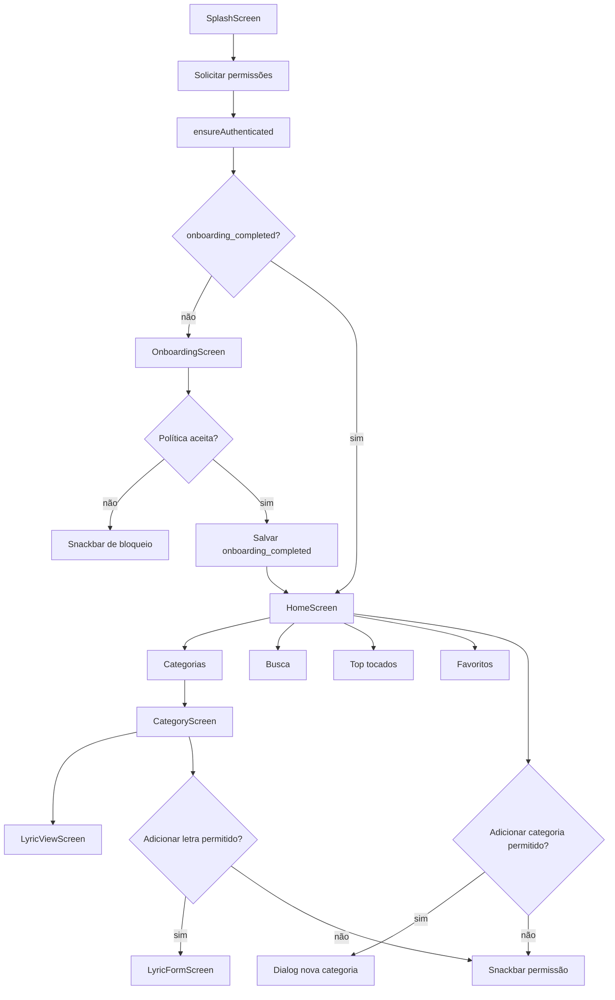

# Fluxograma — screens

```mermaid
flowchart TD
  A["SplashScreen"] --> B["Solicitar permissões"]
  B --> C["ensureAuthenticated"]
  C --> D{"onboarding_completed?"}
  D -- "não" --> E["OnboardingScreen"]
  E --> F{"Política aceita?"}
  F -- "não" --> G["Snackbar de bloqueio"]
  F -- "sim" --> H["Salvar onboarding_completed"]
  D -- "sim" --> I["HomeScreen"]
  H --> I
  I --> J["Categorias"]
  I --> K["Busca"]
  I --> L["Top tocados"]
  I --> M["Favoritos"]
  I --> N{"Adicionar categoria permitido?"}
  N -- "sim" --> O["Dialog nova categoria"]
  N -- "não" --> P["Snackbar permissão"]
  J --> Q["CategoryScreen"]
  Q --> R["LyricViewScreen"]
  Q --> S{"Adicionar letra permitido?"}
  S -- "sim" --> T["LyricFormScreen"]
  S -- "não" --> P
```

