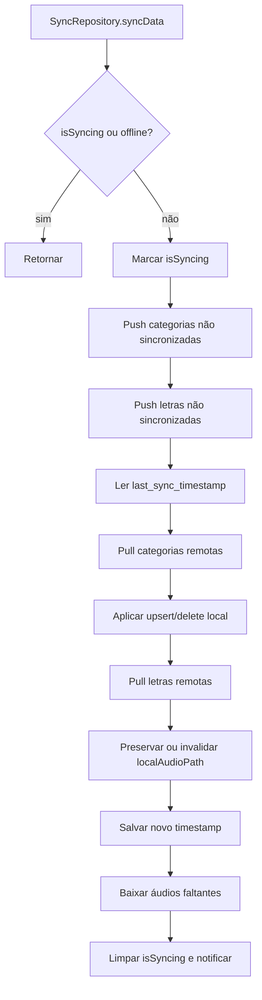

# Fluxograma — services

```mermaid
flowchart TD
  A["SyncRepository.syncData"] --> B{"isSyncing ou offline?"}
  B -- "sim" --> C["Retornar"]
  B -- "não" --> D["Marcar isSyncing"]
  D --> E["Push categorias não sincronizadas"]
  E --> F["Push letras não sincronizadas"]
  F --> G["Ler last_sync_timestamp"]
  G --> H["Pull categorias remotas"]
  H --> I["Aplicar upsert/delete local"]
  I --> J["Pull letras remotas"]
  J --> K["Preservar ou invalidar localAudioPath"]
  K --> L["Salvar novo timestamp"]
  L --> M["Baixar áudios faltantes"]
  M --> N["Limpar isSyncing e notificar"]
```

