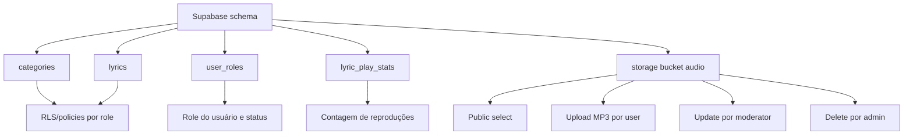

# Fluxograma — supabase-data

```mermaid
flowchart TD
  A["Supabase schema"] --> B["categories"]
  A --> C["lyrics"]
  A --> D["user_roles"]
  A --> E["lyric_play_stats"]
  A --> F["storage bucket audio"]
  B --> G["RLS/policies por role"]
  C --> G
  D --> H["Role do usuário e status"]
  E --> I["Contagem de reproduções"]
  F --> J["Public select"]
  F --> K["Upload MP3 por user"]
  F --> L["Update por moderator"]
  F --> M["Delete por admin"]
```

