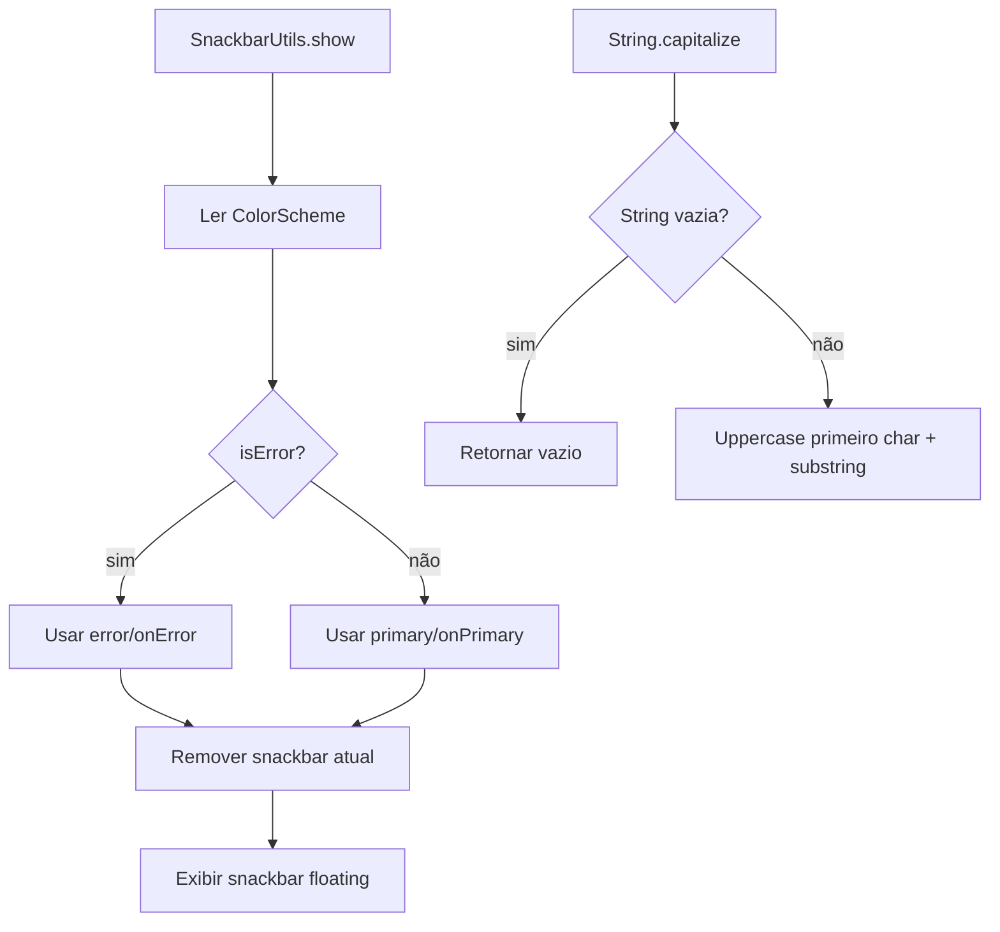

# Fluxograma — utils

```mermaid
flowchart TD
  A["SnackbarUtils.show"] --> B["Ler ColorScheme"]
  B --> C{"isError?"}
  C -- "sim" --> D["Usar error/onError"]
  C -- "não" --> E["Usar primary/onPrimary"]
  D --> F["Remover snackbar atual"]
  E --> F
  F --> G["Exibir snackbar floating"]
  H["String.capitalize"] --> I{"String vazia?"}
  I -- "sim" --> J["Retornar vazio"]
  I -- "não" --> K["Uppercase primeiro char + substring"]
```

