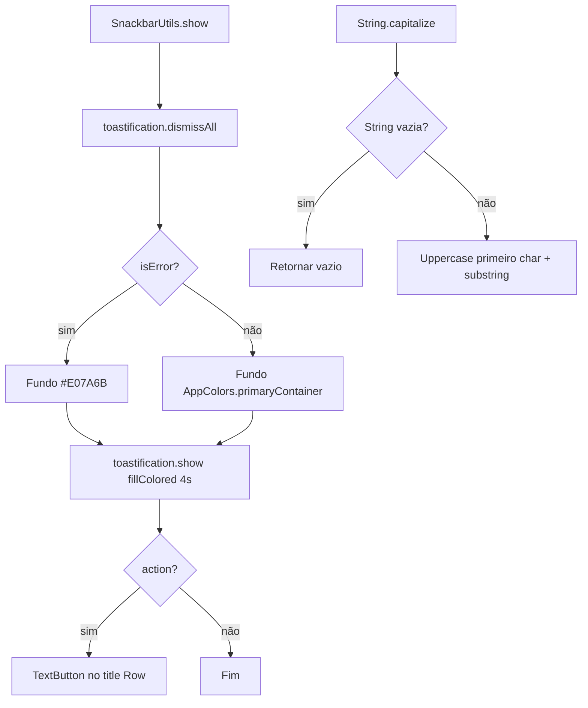

# Fluxograma — utils

```mermaid
flowchart TD
  A["SnackbarUtils.show"] --> B["toastification.dismissAll"]
  B --> C{"isError?"}
  C -- "sim" --> D["Fundo #E07A6B"]
  C -- "não" --> E["Fundo AppColors.primaryContainer"]
  D --> F["toastification.show fillColored 4s"]
  E --> F
  F --> G{"action?"}
  G -- "sim" --> H["TextButton no title Row"]
  G -- "não" --> I["Fim"]
  J["String.capitalize"] --> K{"String vazia?"}
  K -- "sim" --> L["Retornar vazio"]
  K -- "não" --> M["Uppercase primeiro char + substring"]
```

> 🟢 Re-extração 2026-05-31 (rodada 2): feedback global via `ToastificationWrapper` em `main.dart` (margem inferior 110dp para mini-player).

