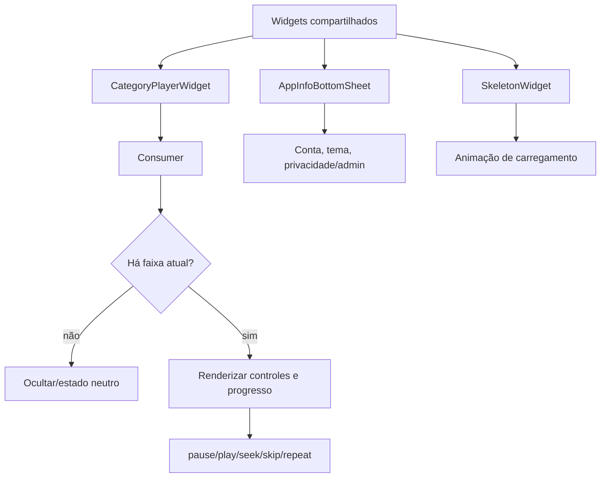

# Fluxograma — widgets

```mermaid
flowchart TD
  A["Widgets compartilhados"] --> B["CategoryPlayerWidget"]
  B --> C["Consumer<AudioPlayerService>"]
  C --> D{"Há faixa atual?"}
  D -- "não" --> E["Ocultar/estado neutro"]
  D -- "sim" --> F["Renderizar controles e progresso"]
  F --> G["pause/play/seek/skip/repeat"]
  A --> H["AppInfoBottomSheet"]
  H --> I["Conta, tema, privacidade/admin"]
  A --> J["SkeletonWidget"]
  J --> K["Animação de carregamento"]
```

