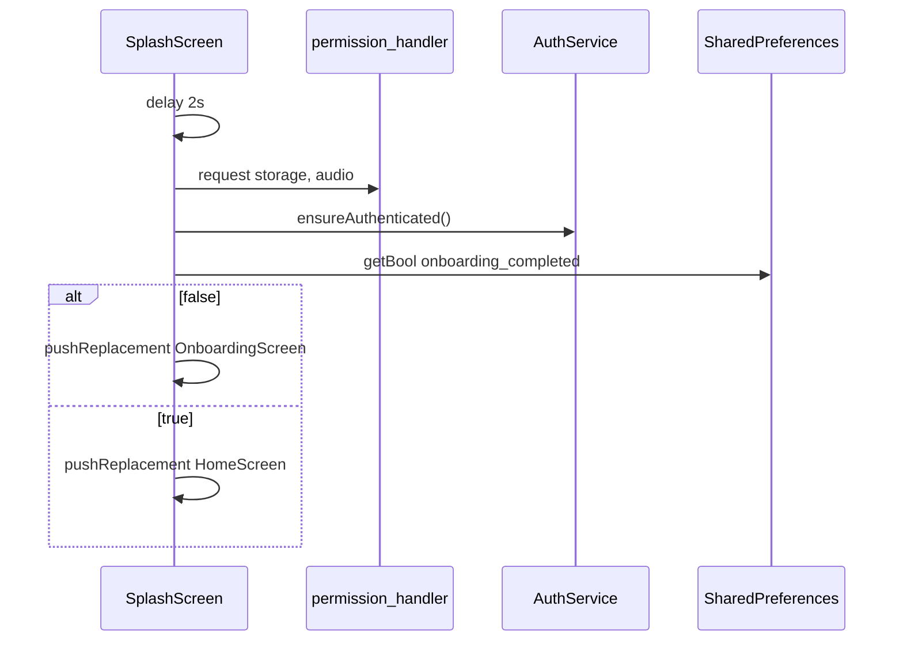
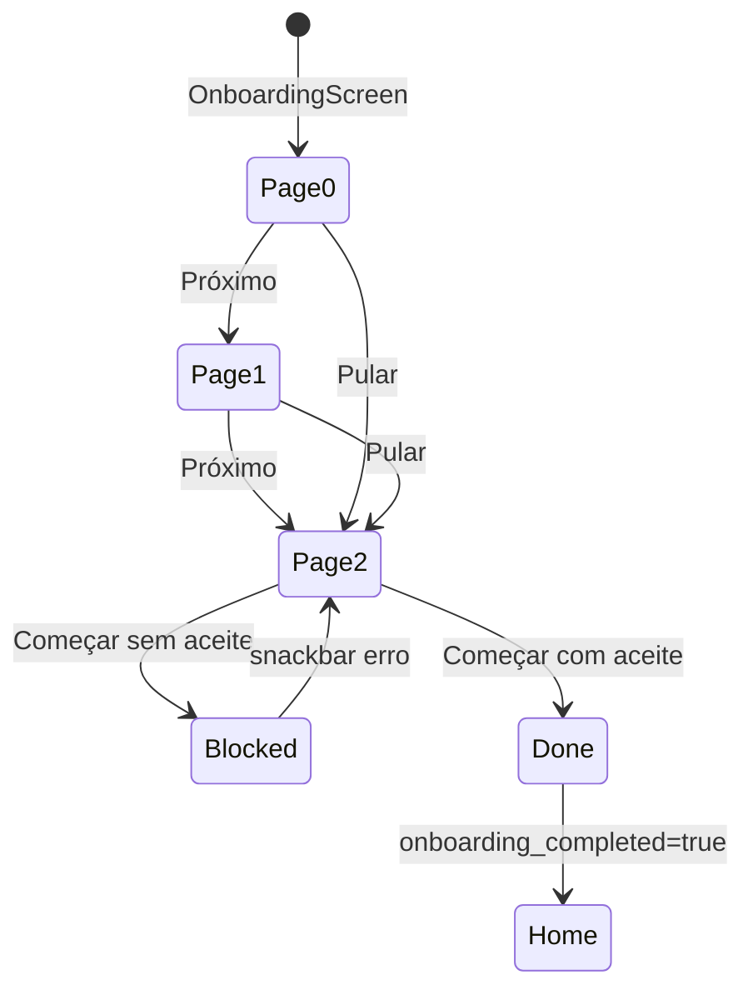
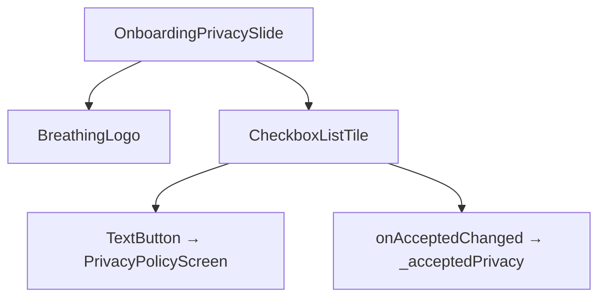

# Onboarding e Privacidade — Design

## Decisão Arquitetural

🟢 **CONFIRMADO** — **Onboarding nativo Flutter** com `PageView` (sem WebView para política no fluxo crítico — política em tela scroll nativa).  
🟢 **CONFIRMADO** — **Consentimento local** via `SharedPreferences` booleano — simples, offline, sem backend de compliance.  
🟢 **CONFIRMADO** — **Política embarcada** como string constante — disponível offline, versionada com o binário do app.  
🟢 **CONFIRMADO** — Ordem de bootstrap na splash: delay → permissões → auth anônima → gate onboarding.

## Componentes

| Componente | Tipo | Responsabilidade |
|------------|------|------------------|
| `SplashScreen` | Tela | Permissões, auth, roteamento inicial |
| `OnboardingScreen` | StatefulWidget | PageController, estado aceite, finish |
| `OnboardingSlide` | Widget | Slides 1–2 com animação |
| `OnboardingPrivacySlide` | Widget | Slide 3 + checkbox + link |
| `BreathingLogo` | Widget | Imagem `assets/images/maria.png` |
| `PrivacyPolicyScreen` | StatelessWidget | Renderiza `_policyText` |
| `app_info_bottom_sheet` | Navegação secundária | Releitura da política |

## Fluxo de Bootstrap (Splash)



🟢 **CONFIRMADO** — Auth ocorre **antes** do onboarding; usuário já tem sessão Supabase ao ver slides.

## Máquina de Estados — Onboarding



## Estrutura das Páginas

| Índice | Widget | Título | Conteúdo |
|--------|--------|--------|----------|
| 0 | `OnboardingSlide` | Firmeza e organização | Guardar pontos para giras |
| 1 | `OnboardingSlide` | Seu ponto sempre à mão | Categorizar, favoritar, buscar |
| 2 | `OnboardingPrivacySlide` | Respeito e privacidade | Checkbox + link política |

🟢 **CONFIRMADO** — Slides 0–1 incluem tagline "Axé, com organização." e frase "Quem tem pemba joga fora."

## Slide de Privacidade — UI



| Elemento | Comportamento |
|----------|---------------|
| Checkbox | Obrigatório para finish |
| Link inline | Push `PrivacyPolicyScreen` (não marca checkbox automaticamente) |
| Texto | "Li e concordo com a Política de Privacidade e com o uso dos meus dados..." |

## Persistência

| Chave | Tipo | Escrita | Leitura |
|-------|------|---------|---------|
| `onboarding_completed` | bool | `_finishOnboarding` | `SplashScreen` |

🟡 **INFERIDO** — Não há timestamp de aceite, versão da política aceita nem hash do texto.

## PrivacyPolicyScreen

🟢 **CONFIRMADO** — `static const String _policyText` com 19 seções (definições → disposições gerais).  
🟢 **CONFIRMADO** — Layout: `AppBar` + `SingleChildScrollView` + `Text` bodyMedium.  
🟢 **CONFIRMADO** — Mesmo componente usado no onboarding e no bottom sheet.

### Seções principais (resumo)

| # | Tema |
|---|------|
| 1–2 | Definições, objeto do app |
| 3–4 | Elegibilidade, regras de uso |
| 5 | Propriedade intelectual |
| 6–8 | Coleta, finalidades, bases legais LGPD |
| 9–11 | Compartilhamento, segurança, retenção |
| 12 | Direitos do titular |
| 13–14 | Cookies/tecnologias, marketing |
| 15–19 | Responsabilidade, alterações, encerramento, contato, foro |

## Animações (`OnboardingSlide`)

Parâmetros derivados de `controller.page` vs `index`:

| Propriedade | Fórmula | Efeito |
|-------------|---------|--------|
| opacity | `easeOutCubic(1 - delta)` | fade entre páginas |
| translateY | `36 * (1 - t)` | entrada vertical |
| scale | `0.96 + 0.04 * t` | leve zoom |

🟢 **CONFIRMADO** — Mesma lógica em `OnboardingPrivacySlide`.

## Assets

| Asset | Uso |
|-------|-----|
| `assets/images/maria.png` | Logo 220×220 nos slides |

## Lacunas e Riscos

| Item | Notas |
|------|-------|
| Policy vs dados reais | Texto amplo (CPF, localização) pode exceder coleta efetiva |
| Sem re-consent em update | Nova versão legal não força novo aceite |
| Pular não aceita automaticamente | Correto para compliance; UX pode confundir |
| Permissões antes do consentimento | Storage/audio pedidos na splash antes do checkbox LGPD |
| Prova de aceite | Apenas flag local — insuficiente para auditoria forte |

## Contratos

```dart
// OnboardingScreen state (🟢 CONFIRMADO)
PageController _pageController;
int _currentPage; // 0..2
bool _acceptedPrivacy;
static const int _totalPages = 3;

// Finish (🟢 CONFIRMADO)
Future<void> _finishOnboarding() // requires _acceptedPrivacy
await prefs.setBool('onboarding_completed', true);
Navigator.pushReplacement(HomeScreen);

// Skip (🟢 CONFIRMADO)
void _skip() // animateToPage(_totalPages - 1)
```
