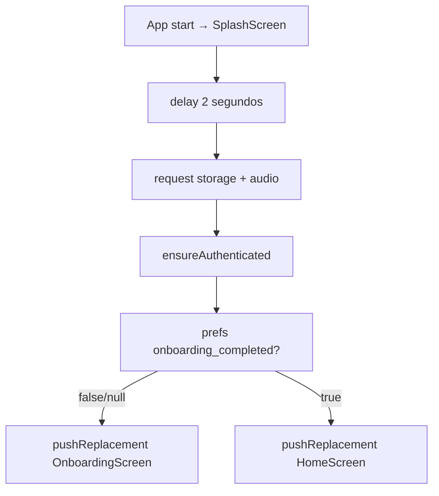
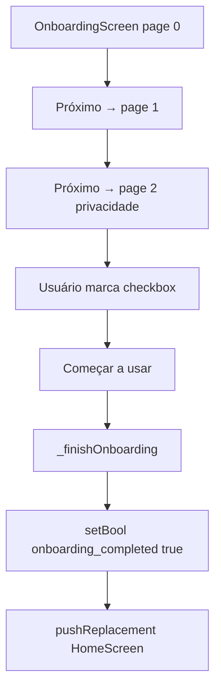
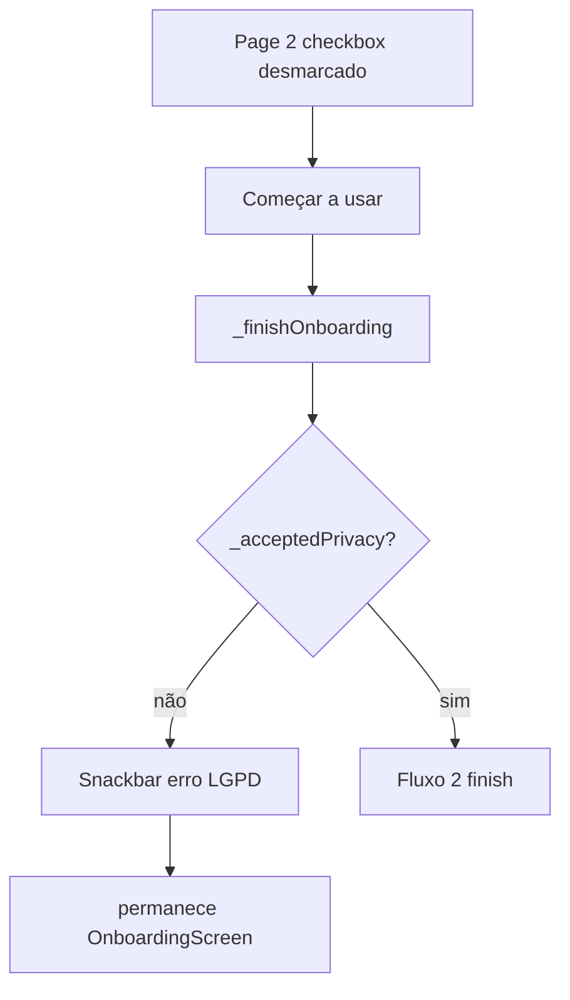
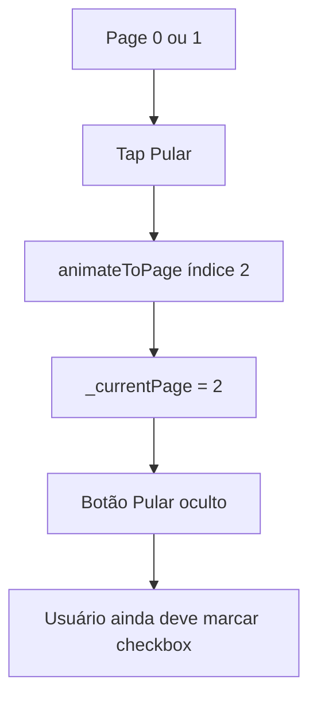
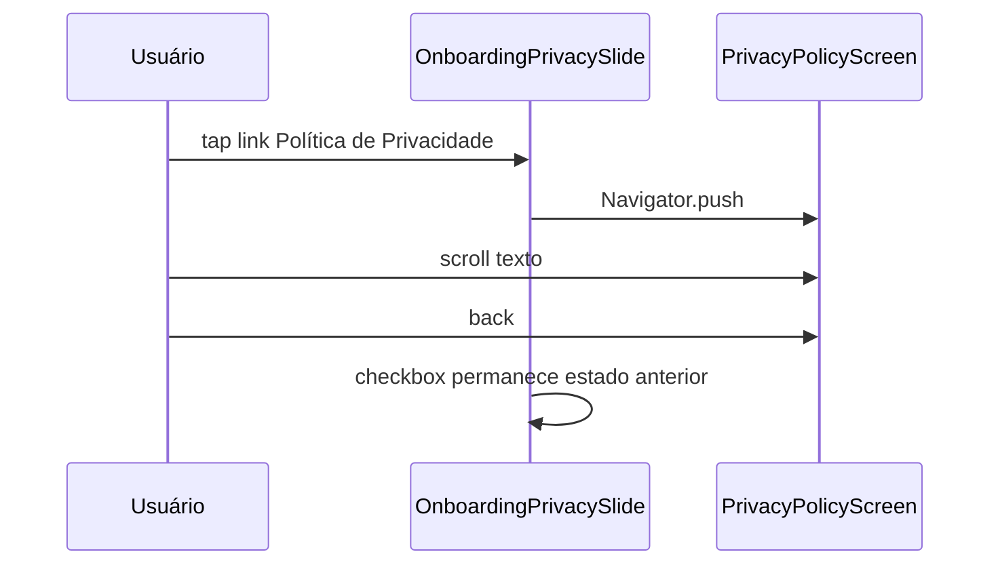
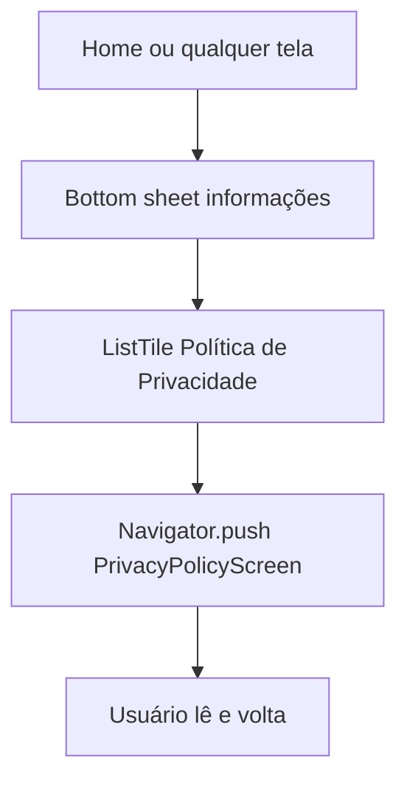
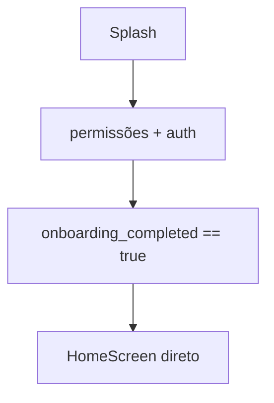
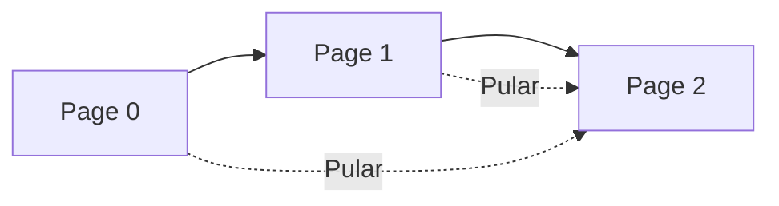

# Onboarding e Privacidade — Fluxos Operacionais

## Fluxo 1 — Primeira abertura do app (splash → onboarding)

### Contrato do fluxo

- 🟢 **CONFIRMADO** — Permissões e auth ocorrem mesmo na primeira vez, antes do aceite LGPD.
- 🟢 **CONFIRMADO** — Não há rota para Home sem passar pelo onboarding na primeira instalação.

## Fluxo 2 — Percorrer onboarding (happy path)

### Contrato do fluxo

- 🟢 **CONFIRMADO** — Três toques em Próximo/Começar no caminho mínimo (ou Pular + checkbox + Começar).

## Fluxo 3 — Tentativa de concluir sem aceite

### Contrato do fluxo

- 🟢 **CONFIRMADO** — Mensagem: "Para continuar, confirme que leu e concorda com a Política de Privacidade."

## Fluxo 4 — Pular slides introdutórios

### Contrato do fluxo

- 🟢 **CONFIRMADO** — Pular **não** define `_acceptedPrivacy = true`.
- 🟢 **CONFIRMADO** — Indicadores atualizam para terceiro dot.

## Fluxo 5 — Ler política durante onboarding

### Contrato do fluxo

- 🟢 **CONFIRMADO** — Leitura não implica aceite automático.
- 🟢 **CONFIRMADO** — Política disponível offline (string local).

## Fluxo 6 — Reabrir política após onboarding

### Contrato do fluxo

- 🟢 **CONFIRMADO** — Não altera `onboarding_completed`.
- 🟢 **CONFIRMADO** — Disponível para anônimos e autenticados.

## Fluxo 7 — Reabertura do app (usuário recorrente)

### Contrato do fluxo

- 🟢 **CONFIRMADO** — Onboarding não reaparece enquanto prefs persistirem.
- 🟡 **INFERIDO** — Clear data / reinstall reinicia fluxo 1.

## Fluxo 8 — Navegação entre páginas (indicadores)

### Contrato do fluxo

- 🟢 **CONFIRMADO** — Swipe horizontal também muda página (`PageView`).
- 🟢 **CONFIRMADO** — Dots animados: largura 20 ativo, 8 inativo.

## Matriz fluxo × RF

| Fluxo | RF |
|-------|-----|
| Splash gate | RF-01, RF-02, RF-09 |
| Happy path finish | RF-03, RF-06, RF-07 |
| Bloqueio sem aceite | RF-03 |
| Pular | RF-05 |
| Ler política | RF-04, RF-08 |
| Reabertura app | RF-02 |
| Bottom sheet política | RF-08 |
