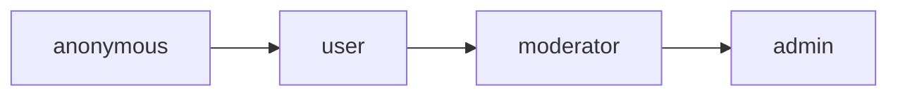

# Permissões e RBAC — FMA_Pontos

Gerado pelo Reversa Detective em 2026-05-19T02:03:06Z.

## Papéis

| Papel | Descrição | Confiança |
|---|---|---|
| `anonymous` | Usuário com sessão anônima Supabase. Pode consultar, mas não alterar conteúdo. | 🟢 CONFIRMADO |
| `user` | Usuário autenticado comum. Pode adicionar letras e fazer upload de áudio. | 🟢 CONFIRMADO |
| `moderator` | Usuário com permissão editorial. Herda `user`, edita letras/categorias e gerencia upload/update de áudio. | 🟢 CONFIRMADO |
| `admin` | Administrador. Herda `moderator`, exclui conteúdo, gerencia roles/status e acessa admin. | 🟢 CONFIRMADO |

## Hierarquia

## Matriz de Permissões de UI

| Funcionalidade | anonymous | user | moderator | admin | Evidência |
|---|---:|---:|---:|---:|---|
| Ver categorias/letras | Sim | Sim | Sim | Sim | `HomeScreen`, `CategoryScreen`, policies read |
| Buscar letras | Sim | Sim | Sim | Sim | `SearchScreen` |
| Reproduzir áudio/vídeo | Sim | Sim | Sim | Sim | `LyricViewScreen`, `AudioPlayerService` |
| Favoritar localmente | Sim | Sim | Sim | Sim | `FavoritesService` não depende de auth |
| Adicionar letra | Não | Sim | Sim | Sim | `AuthService.canAddLyrics` |
| Editar letra | Não | Não | Sim | Sim | `AuthService.canEditLyrics` |
| Excluir letra | Não | Não | Não | Sim | `AuthService.canDeleteLyrics` |
| Adicionar categoria | Não | Não | Sim | Sim | `AuthService.canAddCategories` |
| Editar categoria | Não | Não | Sim | Sim | `AuthService.canEditCategories` |
| Excluir categoria | Não | Não | Não | Sim | `AuthService.canDeleteCategories` |
| Acessar área admin | Não | Não | Não | Sim | `AuthService.isAdmin`, bottom sheet |
| Alterar role/status de usuários | Não | Não | Não | Sim | `AdminService`, `AdminScreen` |
| Consultar logs de auditoria | Não | Não | Não | Sim | UI admin; policy precisa validação |

## Matriz de Permissões Supabase

| Recurso | Operação | Papel mínimo | Bloqueia anônimo? | Confiança |
|---|---|---|---:|---|
| `categories` | SELECT | público/autenticado conforme policy | Não | 🟢 CONFIRMADO |
| `categories` | INSERT | `moderator` | Sim | 🟢 CONFIRMADO |
| `categories` | UPDATE | `moderator` | Sim | 🟢 CONFIRMADO |
| `categories` | DELETE | `admin` | Sim | 🟢 CONFIRMADO |
| `lyrics` | SELECT | público/autenticado conforme policy | Não | 🟢 CONFIRMADO |
| `lyrics` | INSERT | `user` | Sim | 🟢 CONFIRMADO |
| `lyrics` | UPDATE | `moderator` | Sim | 🟢 CONFIRMADO |
| `lyrics` | DELETE | `admin` | Sim | 🟢 CONFIRMADO |
| `user_roles` | SELECT própria role | próprio usuário | N/A | 🟢 CONFIRMADO |
| `user_roles` | ALL | `admin` | Sim | 🟢 CONFIRMADO |
| `storage.objects/audio` | SELECT | público | Não | 🟢 CONFIRMADO |
| `storage.objects/audio` | INSERT | `user` | Não explicitamente no policy | 🟢 CONFIRMADO |
| `storage.objects/audio` | UPDATE | `moderator` | Não explicitamente no policy | 🟢 CONFIRMADO |
| `storage.objects/audio` | DELETE | `admin` | Não explicitamente no policy | 🟢 CONFIRMADO |
| `lyric_play_stats` | SELECT/INSERT/UPDATE | usuário autenticado | 🟡 Ver policy final | 🟢 CONFIRMADO |

## Funções de Permissão

🟢 **CONFIRMADO** — O app e SQL implementam a mesma hierarquia:

- `hasRole('user')`: `user`, `moderator`, `admin`
- `hasRole('moderator')`: `moderator`, `admin`
- `hasRole('admin')`: apenas `admin`

## Riscos e Lacunas

- 🟢 **CONFIRMADO** — `is_active = false` bloqueia o login do usuário, conforme implementado no `AuthService` do aplicativo e na coluna `is_active` em `user_roles`.
- 🟢 **CONFIRMADO** — A tabela `audit_logs` e os triggers `audit_categories` e `audit_lyrics` foram criados e versionados em `supabase/migrations/20260519000000_fix_reversa_gaps.sql`, garantindo rastreabilidade total de escrita.
- 🟢 **CONFIRMADO** — Apenas usuários logados (não anônimos) podem realizar escritas em `categories` e `lyrics`. A política legada `allow anon insert` foi formalmente removida no banco remoto via migration `20260519000000_fix_reversa_gaps.sql`.
- 🟢 **CONFIRMADO** — A RPC `increment_play_count` está devidamente criada e configurada no banco com permissão para usuários autenticados.

