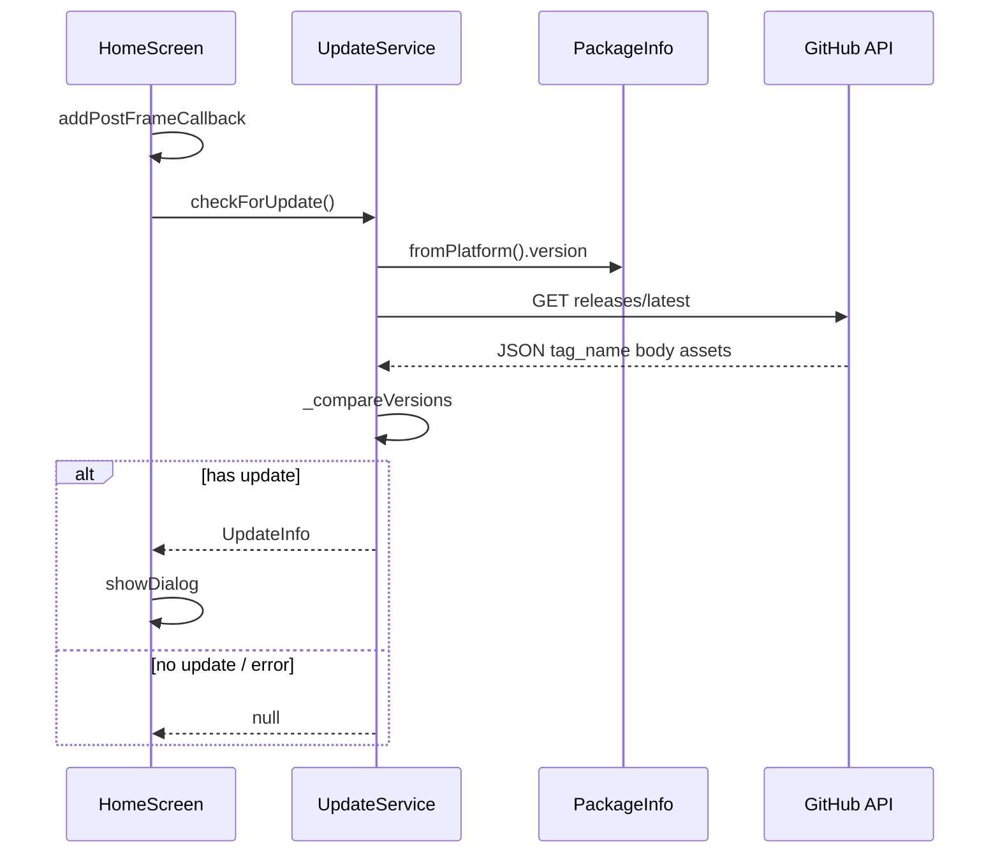
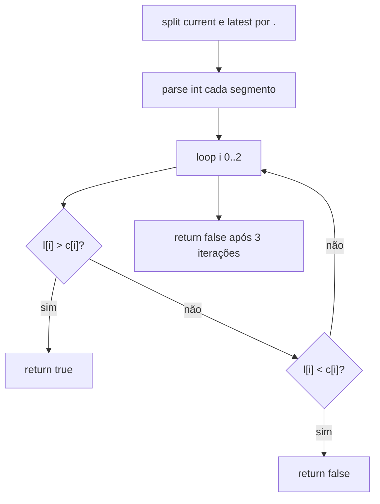
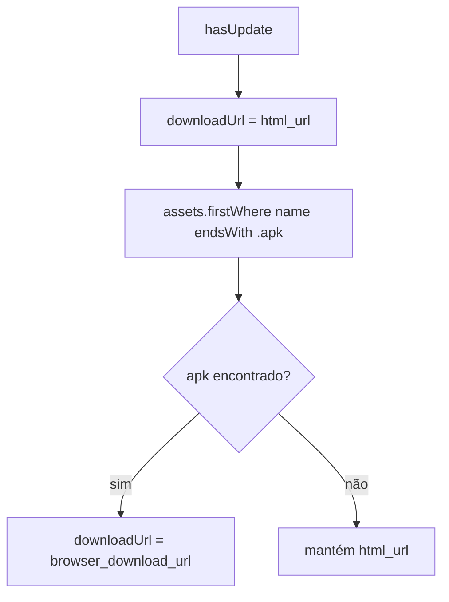
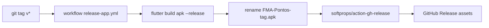

# Release e Atualização — Design

## Decisão Arquitetural

🟢 **CONFIRMADO** — **Distribuição Android via GitHub Releases** (APK direto), não Google Play In-App Updates.  
🟢 **CONFIRMADO** — **Pull model**: app consulta API na abertura da Home (não push notification de update).  
🟢 **CONFIRMADO** — **Comparação semver simplificada** no cliente (3 inteiros separados por `.`).  
🟢 **CONFIRMADO** — **CI/CD tag-driven**: apenas tags `v*` disparam build release.

## Componentes

| Componente | Tipo | Responsabilidade |
|------------|------|------------------|
| `UpdateService` | Service estático | HTTP GitHub, compare, montar `UpdateInfo` |
| `UpdateInfo` | DTO | version, url, changelog, hasUpdate |
| `HomeScreen` | UI | Dispara check, dialog, launch URL |
| `package_info_plus` | Plugin | Versão instalada |
| `url_launcher` | Plugin | Abrir download externo |
| `release-app.yml` | GitHub Actions | Build APK + softprops/action-gh-release |

## Sequência — Check na Home



## API GitHub — Contrato consumido

**Endpoint:** `https://api.github.com/repos/Rdinda/FMA_Pontos/releases/latest`

| Campo JSON | Uso |
|------------|-----|
| `tag_name` | Versão (`v1.0.20` → `1.0.20`) |
| `body` | Changelog markdown/texto |
| `html_url` | Fallback download (página release) |
| `assets[].name` | Busca primeiro terminando em `.apk` |
| `assets[].browser_download_url` | URL preferida de download |

🟢 **CONFIRMADO** — Sem header `Authorization` (repo público assumido).

## Algoritmo `_compareVersions`



| Caso | Resultado |
|------|-----------|
| `1.0.19` vs `1.0.20` | true |
| `1.0.19` vs `1.0.19` | false |
| `1.1.0` vs `1.0.99` | true |
| parse error | false + log |

🟡 **INFERIDO** — Não suporta prerelease (`1.0.0-beta`) nem build metadata (`+1`).

## Seleção de URL de download



🟡 **INFERIDO** — `firstWhere(..., orElse: () => null)` — padrão frágil se tipagem estrita.

## UI — Dialog de atualização

| Propriedade | Valor |
|-------------|-------|
| `barrierDismissible` | false |
| Título | Nova Atualização Disponível |
| Conteúdo | versão + changelog opcional |
| Ação 1 | Depois → `Navigator.pop` |
| Ação 2 | Baixar → pop + `_launchUpdateUrl` |

🟢 **CONFIRMADO** — `LaunchMode.externalApplication` para handler externo (navegador/downloader).

## Pipeline CI/CD



### Inputs do build

| Variável | Fonte |
|----------|-------|
| `SUPABASE_URL` | GitHub secret |
| `SUPABASE_ANON_KEY` | GitHub secret |
| Flutter | 3.38.5 stable |
| Java | 17 Zulu |

### Signing (condicional)

🟢 **CONFIRMADO** — Se `KEYSTORE_BASE64` secret existe: decode JKS + `key.properties` para release signing.  
🟡 **INFERIDO** — Sem secrets, build pode ser APK unsigned/debug-signed conforme config local.

## Versionamento

| Fonte | Exemplo | Uso |
|-------|---------|-----|
| `pubspec.yaml` `version` | `1.0.19` | PackageInfo.version no app |
| Git tag | `v1.0.20` | Release GitHub |
| `versionCode` Android | do Flutter tooling | Play/sideload increment |

🟢 **CONFIRMADO** — Tag e pubspec devem ser alinhadas manualmente na release.

## Lacunas e Riscos

| Item | Impacto |
|------|---------|
| Sem verificação SHA256 do APK | Supply-chain no sideload |
| Rate limit GitHub API | Check falha silenciosamente |
| Repo hardcoded | Fork/renome exige rebuild |
| iOS sem estratégia de update | Usuários iOS fora do fluxo |
| `_forceCurrentVersion` comentado | Debug hook não ativo |
| Erro de check invisível ao usuário | Admin não sabe se API falhou |

## Contratos

```dart
class UpdateInfo {
  final String version;
  final String url;
  final String changelog;
  final bool hasUpdate;
}

class UpdateService {
  static Future<UpdateInfo?> checkForUpdate();
  static bool _compareVersions(String current, String latest);
}
```
