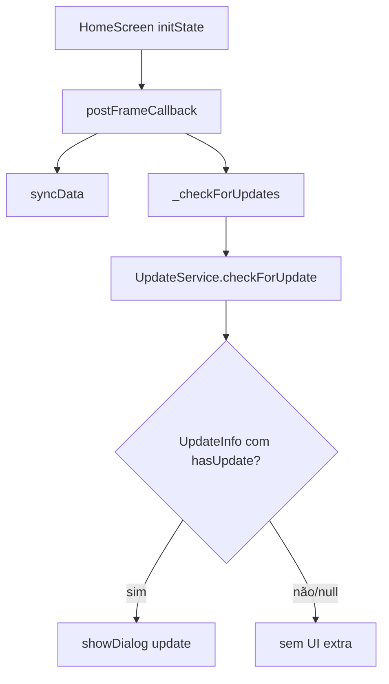
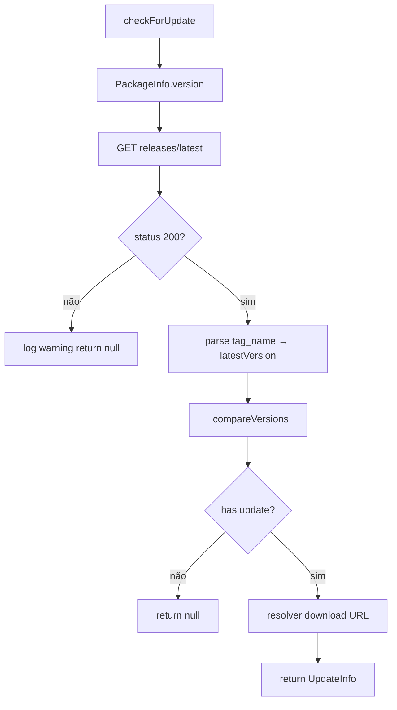
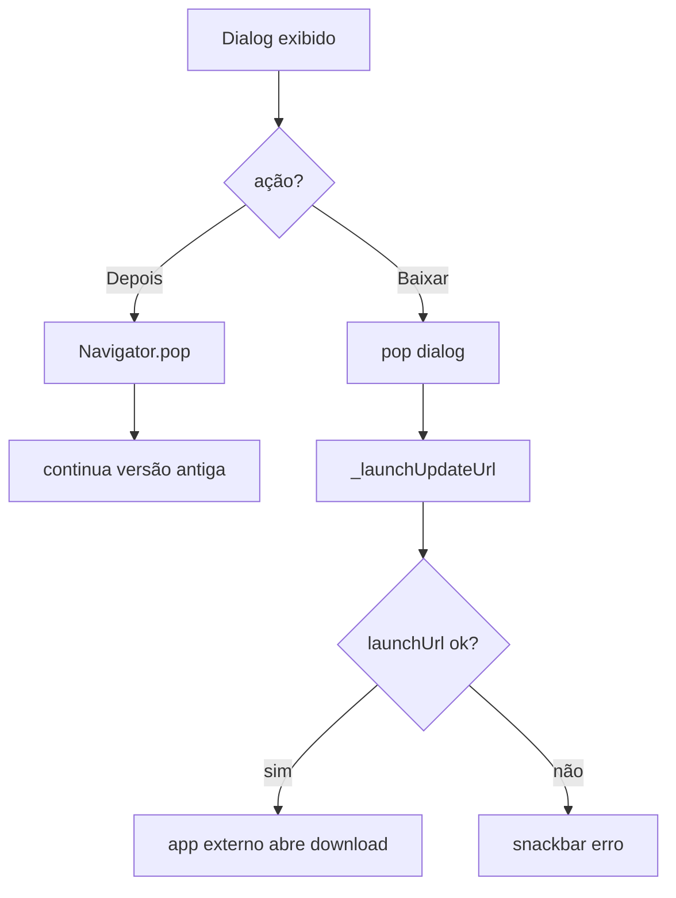
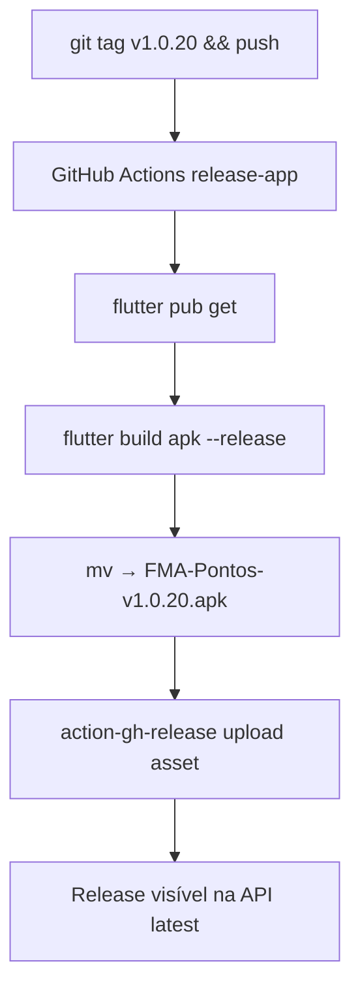
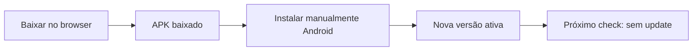
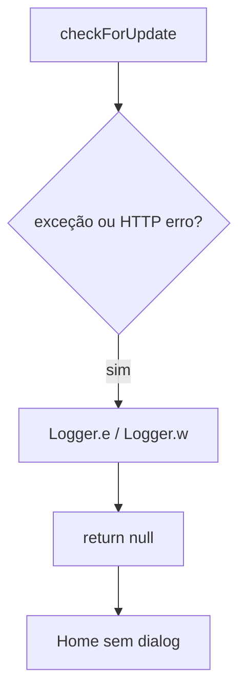
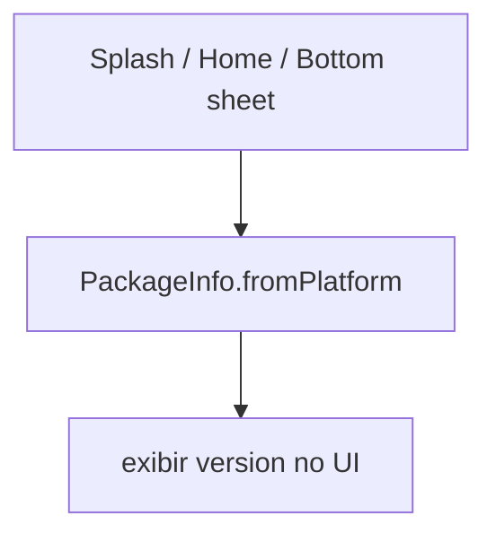

# Release e Atualização — Fluxos Operacionais

## Fluxo 1 — Verificação automática na Home

### Contrato do fluxo

- 🟢 **CONFIRMADO** — Check não bloqueia render da Home (async pós-frame).
- 🟢 **CONFIRMADO** — Sync e update rodam no mesmo callback (paralelo implícito).

## Fluxo 2 — Consulta GitHub e comparação

### Contrato do fluxo

- 🟢 **CONFIRMADO** — Prefixo `v` removido de `tag_name`.
- 🟢 **CONFIRMADO** — `body` vira changelog (pode ser markdown bruto).

## Fluxo 3 — Dialog e decisão do usuário

### Contrato do fluxo

- 🟢 **CONFIRMADO** — Tap fora do dialog não fecha (`barrierDismissible: false`).
- 🟢 **CONFIRMADO** — Usuário pode adiar indefinidamente.

## Fluxo 4 — Publicação de release (CI)

### Contrato do fluxo

- 🟢 **CONFIRMADO** — `generate_release_notes: true` preenche body automaticamente quando GitHub gera notas.
- 🟢 **CONFIRMADO** — APK embute credenciais Supabase do secret (não do repo).

## Fluxo 5 — Instalação pelo usuário (fora do app)

### Contrato do fluxo

- 🟡 **INFERIDO** — App **não** instala APK automaticamente (sem permissão REQUEST_INSTALL_PACKAGES no fluxo documentado).
- 🟡 **INFERIDO** — Usuário precisa habilitar "fontes desconhecidas" conforme OEM.

## Fluxo 6 — Falha silenciosa de check

### Contrato do fluxo

- 🟢 **CONFIRMADO** — Usuário não vê mensagem de falha do check (apenas logs).

## Fluxo 7 — Exibição de versão (contexto)

### Contrato do fluxo

- 🟢 **CONFIRMADO** — Versão exibida independente do check de update.
- 🟢 **CONFIRMADO** — `pubspec.yaml` `1.0.19` é fonte para comparação.

## Matriz fluxo × RF

| Fluxo | RF |
|-------|-----|
| Check Home | RF-01, RF-02, RF-03, RF-08 |
| GitHub compare | RF-02, RF-03, RF-04 |
| Dialog | RF-05, RF-06, RF-07 |
| CI release | RF-09 |
| Instalação manual | (externo) |
| Falha silenciosa | RF-08 |
| Launch URL erro | RF-10 |
