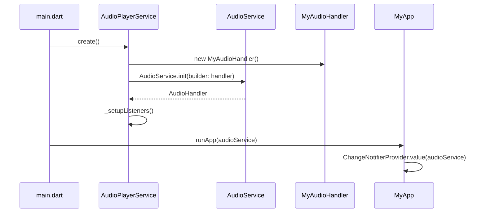
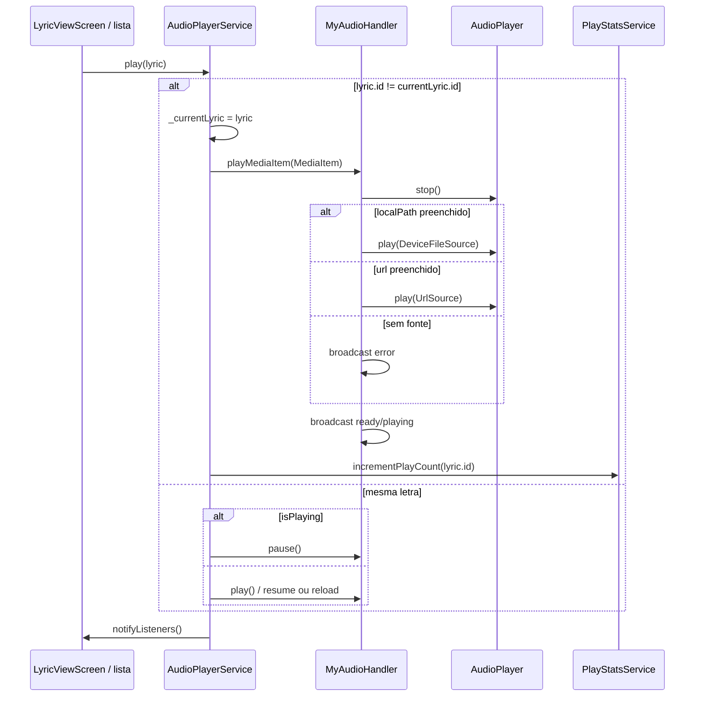
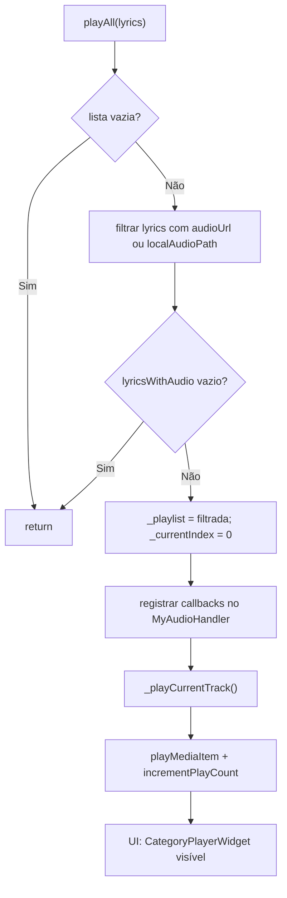
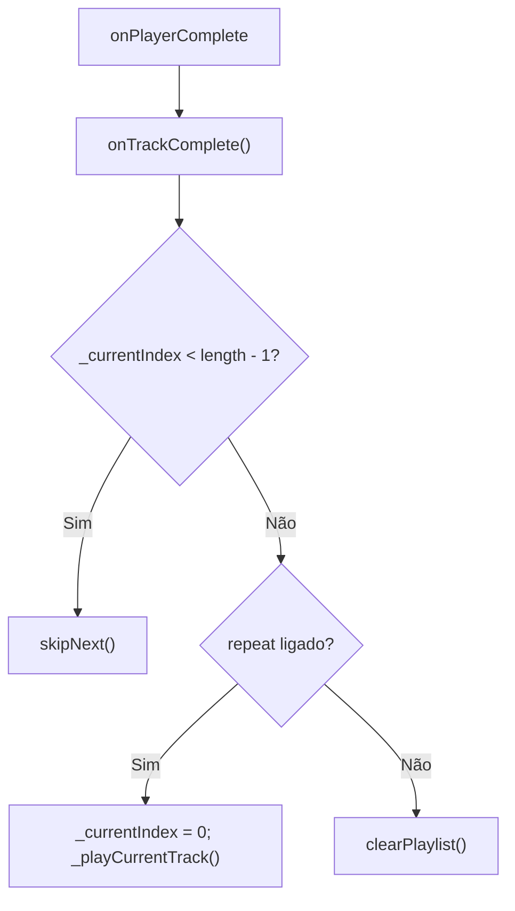
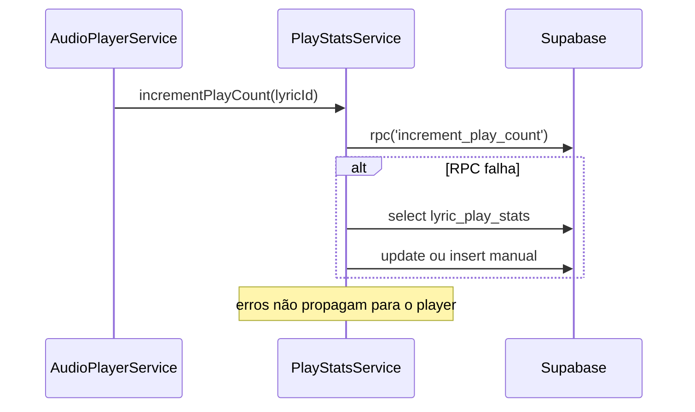

# Reprodução de Áudio — Design

## Decisão Arquitetural

🟢 **CONFIRMADO** — A reprodução de áudio é centralizada em `AudioPlayerService`, um `ChangeNotifier` singleton inicializado em `main()` antes de `runApp`.  
🟢 **CONFIRMADO** — O playback real ocorre em `MyAudioHandler` (`BaseAudioHandler`), que encapsula `audioplayers.AudioPlayer` e integra com `audio_service` para notificação Android e controles do sistema.  
🟢 **CONFIRMADO** — Playlist, índice atual, repeat e letra corrente são gerenciados no service; o handler só executa fonte, seek, pause/play e dispara callbacks de fim de faixa.  
🟢 **CONFIRMADO** — Reprodução unitária (`play(lyric)`) e reprodução em fila (`playAll`) compartilham o mesmo handler, mas apenas `playAll` popula `_playlist` e habilita o player compacto.  
🟡 **INFERIDO** — A separação service/handler permite UI reativa via `Provider` sem acoplar telas ao `AudioPlayer` nativo.

## Componentes

| Componente | Tipo | Responsabilidade | Dependências |
|------------|------|------------------|--------------|
| `AudioPlayerService` | `ChangeNotifier` | Estado de UI, playlist, repeat, orquestração de faixas | `AudioHandler`, `MyAudioHandler`, `PlayStatsService` |
| `MyAudioHandler` | `BaseAudioHandler` | Fonte de áudio, broadcast de `playbackState`, callbacks de playlist | `audioplayers`, `audio_service` |
| `PlayStatsService` | Service | Incrementar contador remoto de plays | Supabase RPC / fallback `lyric_play_stats` |
| `CategoryPlayerWidget` | `StatefulWidget` | Player compacto com controles, letra expansível e favorito | `AudioPlayerService`, `FavoritesService` |
| `LyricViewScreen` | Tela consumidora | Play/pause/seek de faixa única no detalhe da letra | `AudioPlayerService` |
| `CategoryScreen` | Tela consumidora | `playAll`, play por item, `bottomSheet` do player | `SyncRepository`, `AudioPlayerService` |
| `FavoritesScreen` | Tela consumidora | Mesmo padrão de playlist da categoria | Idem |
| `TopPlayedScreen` | Tela consumidora | Mesmo padrão de playlist do ranking | Idem |
| `main.dart` | Bootstrap | `AudioPlayerService.create()` e provider global | `MultiProvider` |

## Interface

### MediaItem (ponte service → handler)

| Campo | Origem | Uso |
|-------|--------|-----|
| `id` | `Lyric.id` | Identificação da faixa |
| `album` | Constante `'Pontos'` | Metadado de notificação |
| `title` | `Lyric.title` | Título exibido |
| `artist` | Constante `'FMA Pontos'` | Metadado de notificação |
| `extras['localPath']` | `Lyric.localAudioPath` | Fonte local prioritária |
| `extras['url']` | `Lyric.audioUrl` | Fonte remota de fallback |

### API pública do AudioPlayerService

| Método | Assinatura | Comportamento | Confiança |
|--------|-----------|---------------|-----------|
| `create` | `static Future<AudioPlayerService>` | Inicializa `AudioService` + handler | 🟢 |
| `play` | `Future<void> play(Lyric lyric)` | Troca faixa ou toggle pause/resume na mesma | 🟢 |
| `playAll` | `Future<void> playAll(List<Lyric> lyrics)` | Filtra com áudio, monta playlist, toca índice 0 | 🟢 |
| `skipNext` | `Future<void>` | Avança índice ou loop com repeat | 🟢 |
| `skipPrevious` | `Future<void>` | Reinicia faixa (>3s) ou volta índice | 🟢 |
| `toggleRepeat` | `void` | Alterna `_isRepeatEnabled` | 🟢 |
| `clearPlaylist` | `Future<void>` | Limpa fila, callbacks, estado e `stop()` | 🟢 |
| `seek` | `Future<void> seek(Duration)` | Delega ao handler | 🟢 |
| `togglePlayPause` | `Future<void>` | Pause/resume sem trocar faixa | 🟢 |

### Getters expostos à UI

| Getter | Tipo | Descrição |
|--------|------|-----------|
| `currentLyric` | `Lyric?` | Faixa em reprodução ou selecionada |
| `isPlaying` | `bool` | Espelha `playbackState.playing` |
| `duration` / `position` | `Duration` | Streams do `AudioPlayer` |
| `playlist` | `List<Lyric>` | Fila ativa (vazia fora de `playAll`) |
| `currentIndex` | `int` | Índice na fila (-1 se inativo) |
| `hasPlaylist` | `bool` | `_playlist.isNotEmpty` |
| `hasNext` / `hasPrevious` | `bool` | Considera repeat |
| `isRepeatEnabled` | `bool` | Repeat de playlist inteira |

## Estado Interno

```dart
// AudioPlayerService
Lyric? _currentLyric;
bool _isPlaying = false;
Duration _duration = Duration.zero;
Duration _position = Duration.zero;
List<Lyric> _playlist = [];
int _currentIndex = -1;
bool _isRepeatEnabled = false;

// MyAudioHandler — callbacks opcionais
VoidCallback? onTrackComplete;
VoidCallback? onSkipNext;
VoidCallback? onSkipPrevious;
VoidCallback? onToggleRepeat;
AudioServiceRepeatMode _repeatMode = AudioServiceRepeatMode.none;
```

Regras:

- 🟢 **CONFIRMADO** — `mediaItem` do handler pode ser `null` após `stop()`, mas `_currentLyric` no service só é limpo em `clearPlaylist()`.
- 🟢 **CONFIRMADO** — `hasNext`/`hasPrevious` retornam `true` quando repeat está ligado, mesmo nos extremos da fila.
- 🟢 **CONFIRMADO** — Callbacks de playlist são registrados somente em `playAll` e removidos em `clearPlaylist`/`dispose`.

## Fluxo de Bootstrap



Configuração Android (`AudioServiceConfig`):

- 🟢 Canal: `com.fmapontos.channel.audio`
- 🟢 `androidStopForegroundOnPause: false` — notificação permanece ao pausar
- 🟢 Ícone: `mipmap/ic_launcher`

## Fluxo Principal — Reproduzir uma letra



## Fluxo Principal — Playlist (`playAll`)



### Auto-avanço ao fim da faixa



## Fluxos Alternativos

### Skip anterior com regra dos 3 segundos

- 🟢 **CONFIRMADO** — Se `_position.inSeconds > 3`, executa `seek(Duration.zero)` na faixa atual.
- 🟢 **CONFIRMADO** — Se posição ≤ 3s e há faixa anterior, decrementa `_currentIndex` e toca.
- 🟢 **CONFIRMADO** — Se posição ≤ 3s, repeat ligado e índice 0, vai para última faixa.
- 🟢 **CONFIRMADO** — Se posição ≤ 3s e já está no início sem repeat, reinicia faixa atual.

### Resume após stop

- 🟢 **CONFIRMADO** — `MyAudioHandler.play()` detecta `PlayerState.stopped` ou `completed` e chama `playMediaItem` novamente com o `mediaItem` corrente, pois `resume()` não funciona após `stop()`.

### Erro de fonte ou exceção

- 🟢 **CONFIRMADO** — Sem `localPath` e sem `url`, emite `AudioProcessingState.error` e retorna sem tocar.
- 🟢 **CONFIRMADO** — Exceções em `play()` são logadas e convertidas em estado de erro no broadcast.

### Repeat via notificação do sistema

- 🟢 **CONFIRMADO** — `setRepeatMode` no handler alterna `_repeatMode` local e chama `onToggleRepeat`, que delega a `AudioPlayerService.toggleRepeat()`.
- 🟡 **INFERIDO** — O repeat da notificação e o `_isRepeatEnabled` do service são sincronizados indiretamente pelo callback, não por espelhamento direto de enum.

## Player Compacto (`CategoryPlayerWidget`)

Condição de exibição:

- 🟢 **CONFIRMADO** — Renderiza somente quando `audioService.hasPlaylist == true`.
- 🟢 **CONFIRMADO** — Play de faixa única via `play(lyric)` **não** ativa o widget compacto.

Elementos:

| Controle | Ação | Destino |
|----------|------|---------|
| Fechar | `clearPlaylist()` | Para handler, limpa fila e estado |
| Artigo | Expande painel com `currentLyric.content` (até 65% da altura da tela) | Estado local `_showLyrics` |
| Coração | `FavoritesService.toggleFavorite(currentLyric.id)` | Unit Favoritos |
| Repeat | `toggleRepeat()` | `_isRepeatEnabled` |
| Anterior / Play-Pause / Próximo | `skipPrevious`, `togglePlayPause`, `skipNext` | Service |
| Barra de progresso | Somente leitura (não arrastável no compacto) | `position` / `duration` |

Telas que embutem o widget via `bottomSheet`:

- 🟢 `CategoryScreen`
- 🟢 `FavoritesScreen`
- 🟢 `TopPlayedScreen`

## Integração com Estatísticas



- 🟢 **CONFIRMADO** — Incremento ocorre em `play()` (faixa nova) e `_playCurrentTrack()` (playlist).
- 🟢 **CONFIRMADO** — Toggle pause/resume na mesma faixa **não** incrementa novamente.
- 🔴 **LACUNA** — Definição SQL da RPC `increment_play_count` não encontrada no repositório analisado.

## Dependências

| Dependência | Pacote / módulo | Papel |
|-------------|-----------------|-------|
| Playback nativo | `audioplayers` | `AudioPlayer`, `DeviceFileSource`, `UrlSource` |
| Background + notificação | `audio_service` | `AudioService.init`, `MediaControl`, `playbackState` |
| Estado global UI | `provider` | `ChangeNotifierProvider<AudioPlayerService>` |
| Modelo | `Lyric` | `audioUrl`, `localAudioPath`, `title`, `content` |
| Estatísticas | `PlayStatsService` | Contagem remota de reproduções |
| Favoritos (compacto) | `FavoritesService` | Toggle no player de playlist |

## Decisões de Design Identificadas

| Decisão | Evidência no código | Confiança |
|---------|---------------------|-----------|
| Priorizar arquivo local sobre URL remota | `playMediaItem`: `localPath` antes de `url` | 🟢 |
| Singleton criado antes do app | `main.dart`: `await AudioPlayerService.create()` | 🟢 |
| Playlist filtrada — sem tentativa de tocar letras sem áudio | `playAll` + `where` em `audioUrl`/`localAudioPath` | 🟢 |
| Callbacks do handler para lógica de fila no service | `onTrackComplete`, `onSkipNext`, etc. | 🟢 |
| Player compacto só para modo playlist | `hasPlaylist` em `CategoryPlayerWidget` | 🟢 |
| Estatísticas fire-and-forget | `incrementPlayCount` sem `await` no service; fallback silencioso | 🟢 |
| Áudio focus Android `gain` + iOS `playback` | `setAudioContext` em `MyAudioHandler._init` | 🟢 |
| Repeat de playlist no service, não repeat de faixa única | `_isRepeatEnabled` afeta índices, não loop do `AudioPlayer` | 🟢 |

## Observabilidade

| Evento | Mecanismo | Onde |
|--------|-----------|------|
| Mudança de faixa/playlist | `notifyListeners()` | `AudioPlayerService` |
| Posição/duração | Streams → listeners | `onPositionChanged`, `onDurationChanged` |
| Estado playing | `playbackState` stream | `_setupListeners` |
| Debug operacional | `debugPrint` prefixado | Service e handler |
| Erro de play count | `debugPrint` sem throw | `PlayStatsService` |

Não há integração com crash analytics ou métricas estruturadas além de logs locais.

## Riscos e Lacunas

- 🔴 **LACUNA** — Contrato SQL/RPC de `increment_play_count` não versionado no repo; fallback pode mascarar ausência da função em produção.
- 🔴 **LACUNA** — Comportamento offline de `incrementPlayCount` (sem rede) não está explicitado; provável falha silenciosa sem fila local.
- 🟡 **INFERIDO** — `setRepeatMode` da notificação e `toggleRepeat` da UI podem divergir visualmente do `_repeatMode` interno do handler em edge cases.
- 🟡 **INFERIDO** — Reprodução remota sem arquivo local depende de conectividade; não há pré-buffer explícito além do `audioplayers`.
- 🟡 **INFERIDO** — Play unitário e playlist simultâneos: `play(lyric)` durante playlist ativa troca `_currentLyric` mas não reindexa `_playlist` automaticamente.

## Rastreabilidade de Código

| Arquivo | Símbolos relevantes |
|---------|---------------------|
| `lib/services/audio_player_service.dart` | `AudioPlayerService`, `MyAudioHandler` |
| `lib/widgets/category_player_widget.dart` | `CategoryPlayerWidget` |
| `lib/services/play_stats_service.dart` | `incrementPlayCount`, `_incrementPlayCountFallback` |
| `lib/main.dart` | bootstrap e provider |
| `lib/screens/lyric_view_screen.dart` | `_togglePlay`, seek, `Consumer<AudioPlayerService>` |
| `lib/screens/category_screen.dart` | `_playAllLyrics`, `bottomSheet` |
| `lib/screens/favorites_screen.dart` | playlist + player |
| `lib/screens/top_played_screen.dart` | playlist + player |
| `lib/models/lyric.dart` | campos de áudio |
