# Reprodução de Áudio — Fluxos Operacionais

## Fluxo 1 — Inicializar serviço de áudio no bootstrap

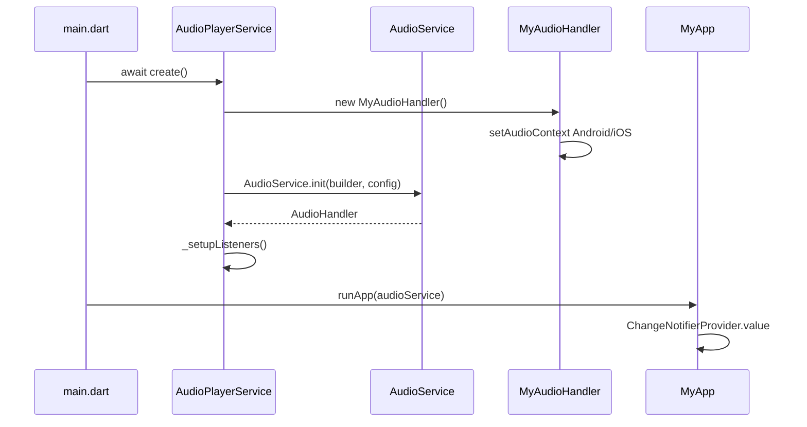

### Contrato do fluxo

- 🟢 **CONFIRMADO** — `AudioPlayerService.create()` termina antes de `runApp`.
- 🟢 **CONFIRMADO** — Canal Android: `com.fmapontos.channel.audio`.
- 🟢 **CONFIRMADO** — `androidStopForegroundOnPause: false` mantém notificação ao pausar.
- 🟢 **CONFIRMADO** — Listeners de duração, posição e `playbackState` são registrados na criação.

## Fluxo 2 — Reproduzir uma letra (faixa única)

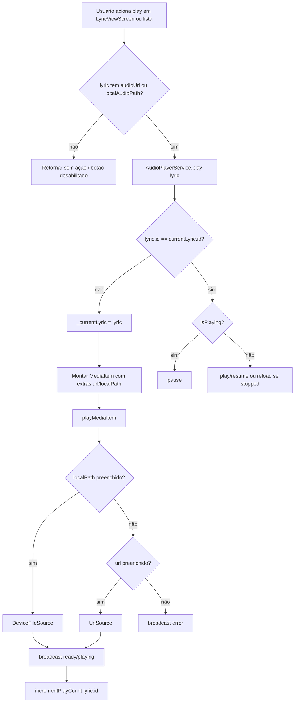

### Contrato do fluxo

- 🟢 **CONFIRMADO** — Faixa local tem prioridade sobre URL remota.
- 🟢 **CONFIRMADO** — Segundo play na mesma letra alterna pause/resume sem novo incremento de estatística.
- 🟢 **CONFIRMADO** — `play(lyric)` isolado **não** popula `_playlist`.
- 🟢 **CONFIRMADO** — Player compacto permanece oculto (`hasPlaylist == false`).

## Fluxo 3 — Iniciar playlist com "Tocar Todas"

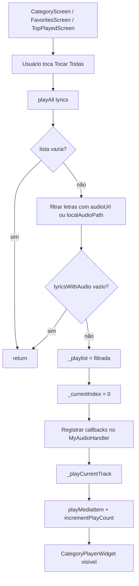

### Contrato do fluxo

- 🟢 **CONFIRMADO** — Letras sem áudio são excluídas da fila.
- 🟢 **CONFIRMADO** — Playlist sempre começa no índice 0.
- 🟢 **CONFIRMADO** — Callbacks `onTrackComplete`, `onSkipNext`, `onSkipPrevious`, `onToggleRepeat` são ligados somente em `playAll`.
- 🟢 **CONFIRMADO** — Telas de lista embutem `CategoryPlayerWidget` via `bottomSheet`.

## Fluxo 4 — Auto-avanço ao fim da faixa

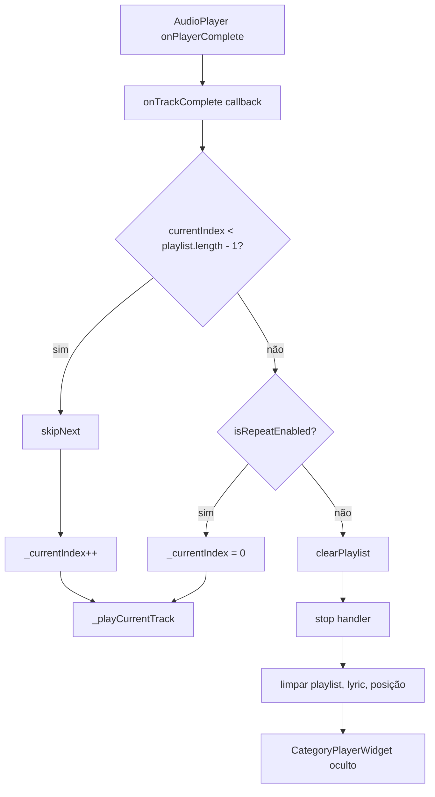

### Contrato do fluxo

- 🟢 **CONFIRMADO** — Há próxima faixa: avanço automático via `skipNext`.
- 🟢 **CONFIRMADO** — Última faixa + repeat: reinicia do índice 0.
- 🟢 **CONFIRMADO** — Última faixa sem repeat: `clearPlaylist` encerra fila e notificação.

## Fluxo 5 — Pular para próxima faixa

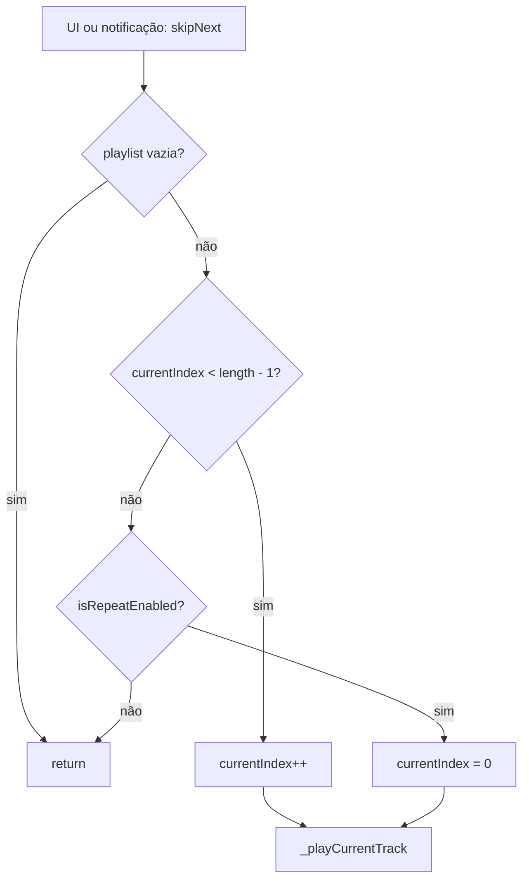

### Contrato do fluxo

- 🟢 **CONFIRMADO** — No último índice sem repeat, `skipNext` não avança.
- 🟢 **CONFIRMADO** — Com repeat no fim, volta para a primeira faixa.
- 🟢 **CONFIRMADO** — Cada faixa nova dispara `incrementPlayCount`.

## Fluxo 6 — Voltar faixa ou reiniciar (regra dos 3 segundos)

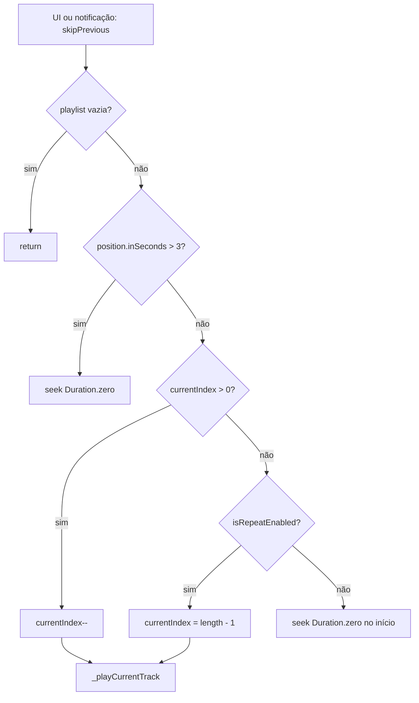

### Contrato do fluxo

- 🟢 **CONFIRMADO** — Após 3 segundos de reprodução, "anterior" reinicia a faixa atual.
- 🟢 **CONFIRMADO** — Nos primeiros 3 segundos, volta para faixa anterior se existir.
- 🟢 **CONFIRMADO** — No início com repeat, vai para a última faixa da playlist.

## Fluxo 7 — Alternar repeat e pause/play

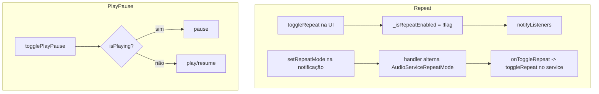

### Contrato do fluxo

- 🟢 **CONFIRMADO** — Repeat afeta limites de `hasNext`/`hasPrevious` e loop nos extremos.
- 🟢 **CONFIRMADO** — Repeat de playlist não faz loop de faixa única no `AudioPlayer`.
- 🟡 **INFERIDO** — Repeat da notificação e flag do service são sincronizados via callback, não por espelhamento direto de enum.

## Fluxo 8 — Fechar playlist e player compacto

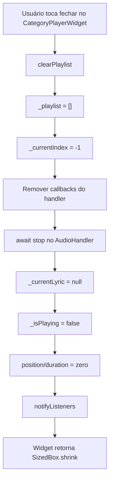

### Contrato do fluxo

- 🟢 **CONFIRMADO** — `stop()` limpa `mediaItem` e remove notificação.
- 🟢 **CONFIRMADO** — Estado de UI é totalmente resetado após fechar.
- 🟢 **CONFIRMADO** — Callbacks de playlist são anulados para evitar avanço fantasma.

## Fluxo 9 — Player compacto: letra e favorito

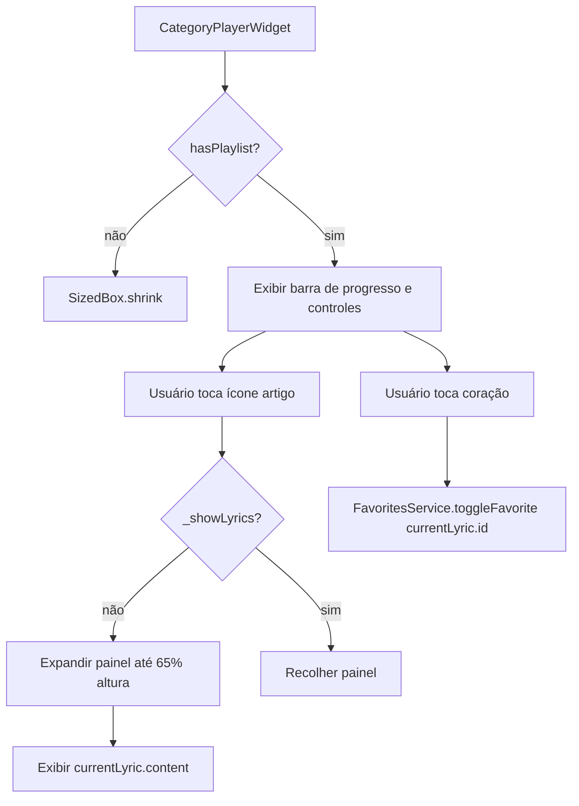

### Contrato do fluxo

- 🟢 **CONFIRMADO** — Barra de progresso é somente leitura (sem seek no compacto).
- 🟢 **CONFIRMADO** — Favorito delega à unit Favoritos.
- 🟢 **CONFIRMADO** — Índice exibido como `(currentIndex + 1)/total`.

## Fluxo 10 — Registrar estatística de reprodução

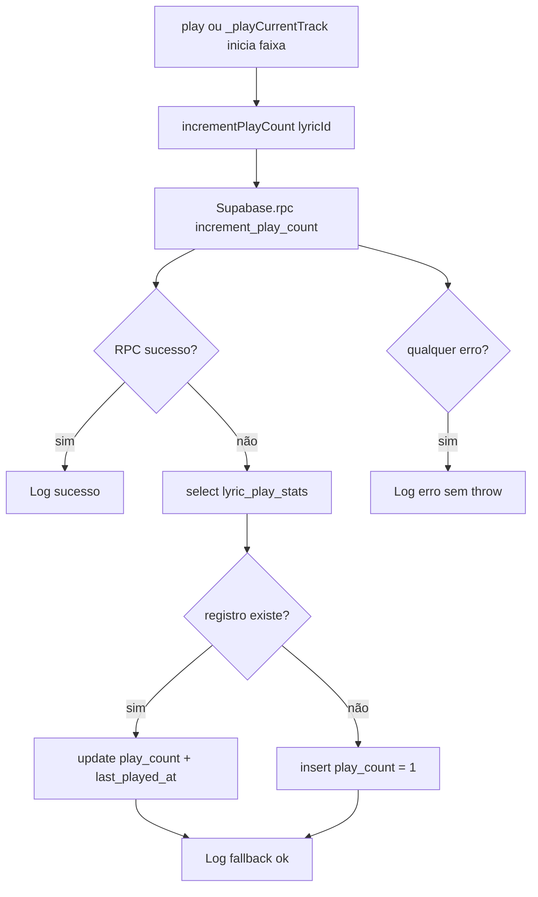

### Contrato do fluxo

- 🟢 **CONFIRMADO** — Falha de estatística não interrompe playback.
- 🟢 **CONFIRMADO** — Toggle na mesma faixa não dispara novo incremento.
- 🔴 **LACUNA** — SQL da RPC `increment_play_count` não versionado no repositório.

## Fluxo 11 — Controles de notificação e sistema

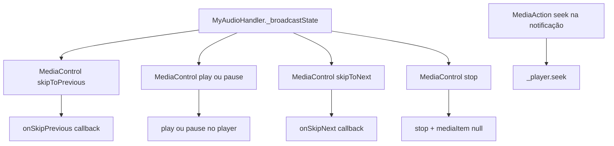

### Contrato do fluxo

- 🟢 **CONFIRMADO** — Controles compactos na notificação: índices [0,1,2] = anterior, play/pause, próximo.
- 🟢 **CONFIRMADO** — `systemActions` inclui seek forward/backward e `setRepeatMode`.
- 🟢 **CONFIRMADO** — Skip na notificação delega lógica de playlist ao service via callbacks.

## Fluxo 12 — Áudio na visualização de letra (integração)

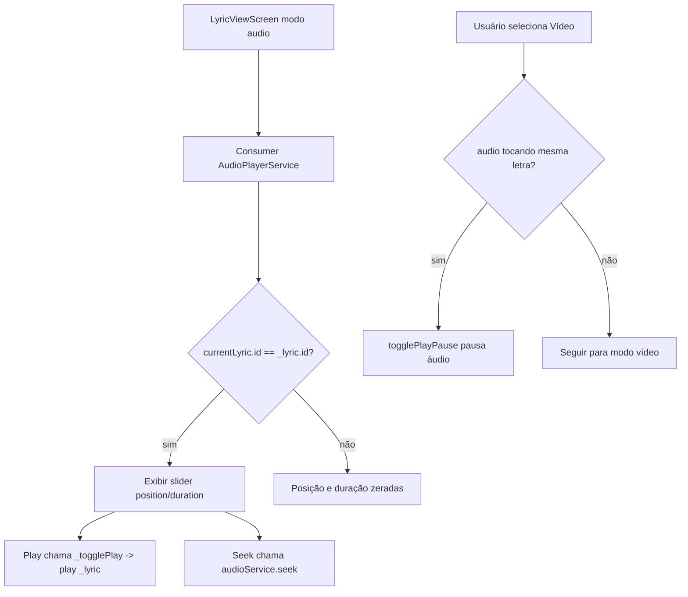

### Contrato do fluxo

- 🟢 **CONFIRMADO** — Seek só afeta slider quando a letra exibida é a faixa atual.
- 🟢 **CONFIRMADO** — Alternar para vídeo pausa áudio da mesma letra se estiver tocando.
- 🟢 **CONFIRMADO** — Detalhe da letra usa `play` unitário, não `playAll`.

## Estados relevantes

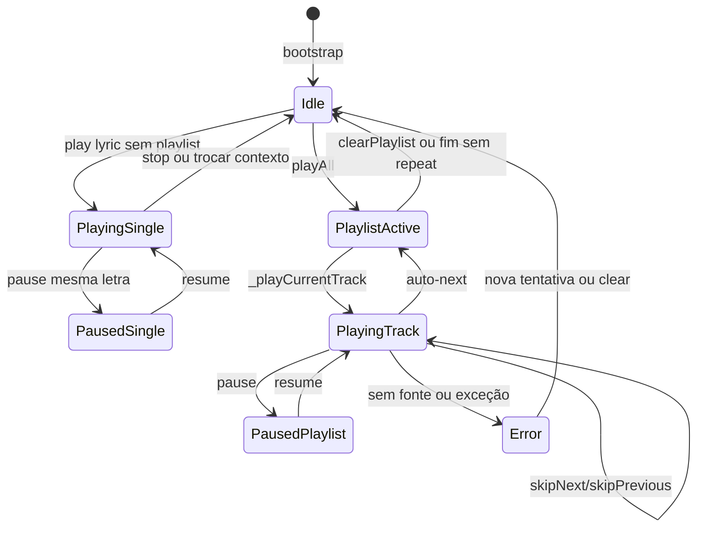

## Pontos de falha

| Falha | Comportamento legado | Confiança |
|-------|----------------------|-----------|
| Sem `localPath` e sem `url` | `AudioProcessingState.error`, não toca | 🟢 |
| Exceção em `play()` | Log + broadcast error | 🟢 |
| `playAll` com lista sem áudio | Retorna sem iniciar playlist | 🟢 |
| RPC de estatística indisponível | Fallback manual em `lyric_play_stats` | 🟢 |
| Fallback de estatística falha | Log apenas, playback continua | 🟢 |
| Resume após `stop` | `play()` recarrega `playMediaItem` | 🟢 |
| Rede indisponível para URL remota | Depende do `audioplayers`; sem retry explícito | 🟡 |
| `play(lyric)` durante playlist ativa | Troca `currentLyric` sem reindexar playlist | 🟡 |

## Lacunas

- 🔴 **LACUNA** — Contrato SQL da RPC `increment_play_count` ausente no repo.
- 🟡 **INFERIDO** — Comportamento offline de estatísticas e de URL remota não está formalizado.
- 🟡 **INFERIDO** — Conflito entre faixa única e playlist simultânea não tem regra explícita no código.
