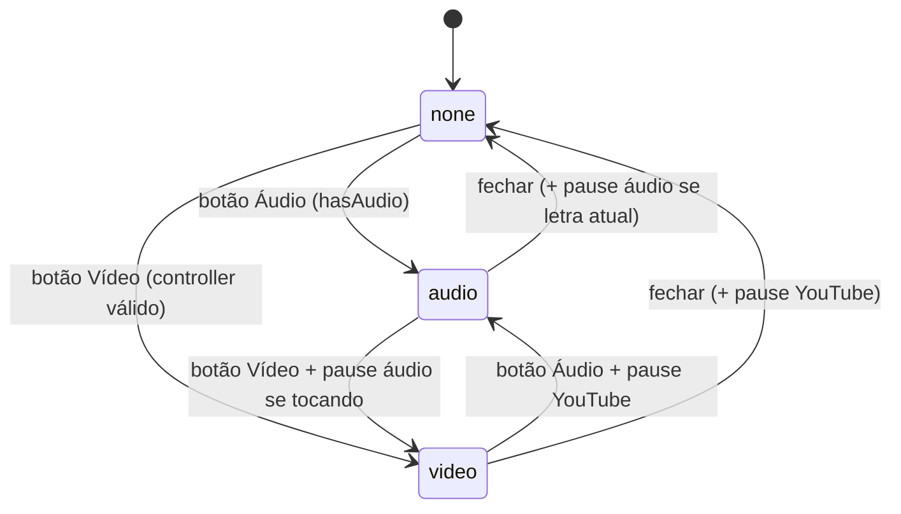
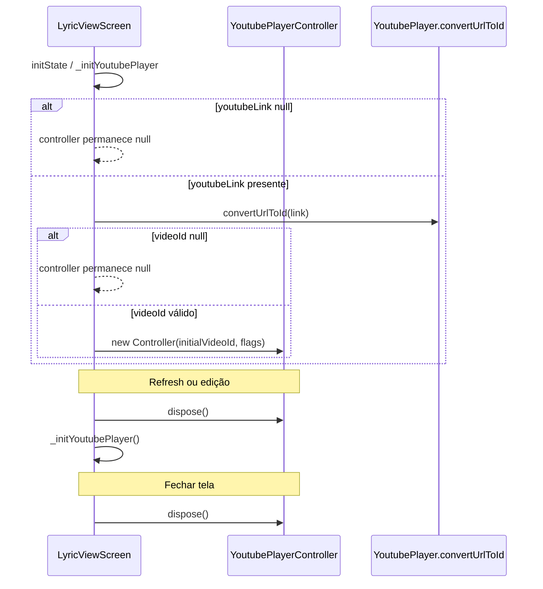

# Reprodução YouTube — Design

## Decisão Arquitetural

🟢 **CONFIRMADO** — Vídeo YouTube é tratado como mídia opcional por letra, independente do pipeline de áudio (`AudioPlayerService` / `audio_service`).  
🟢 **CONFIRMADO** — A reprodução usa `youtube_player_flutter` com controller local à `LyricViewScreen`, sem service global nem singleton.  
🟢 **CONFIRMADO** — Validação de URL ocorre no momento do save (`LyricFormScreen`); a tela de visualização só tenta converter URL já persistida.  
🟢 **CONFIRMADO** — Exclusividade áudio/vídeo é implementada via enum `_PlayerMode { none, audio, video }` e pausas explícitas ao trocar modo.  
🟡 **INFERIDO** — Separar YouTube do áudio evita complexidade de notificação/background e limitações do `audio_service` para streams de vídeo.

Referência: ADR 004 — `_reversa_sdd/adrs/004-youtube-support.md`.

## Componentes

| Componente | Tipo | Responsabilidade | Dependências |
|------------|------|------------------|--------------|
| `Lyric` | Model | Campo `youtubeLink` / coluna `youtube_link` | SQLite, Supabase |
| `DbHelper` | Service | Schema e migration da coluna | `sqflite` |
| `LyricFormScreen` | Tela | Captura link, valida com `convertUrlToId`, persiste | `SyncRepository`, `youtube_player_flutter` |
| `LyricViewScreen` | Tela | Ciclo de vida do controller, UI do player, `_PlayerMode` | `YoutubePlayerController`, `AudioPlayerService` |
| `SyncRepository` | Service | Replica `youtubeLink` no sync | `Lyric.toSupabaseMap` / `fromMap` |
| `CategoryScreen` | Consumidor | Indicador `hasVideo` em tiles | `Lyric.youtubeLink` |
| `youtube_player_flutter` | Pacote | Conversão URL→ID, widget embed, controles | API YouTube (rede) |

## Modelo de Dados

### Campo `youtubeLink`

| Aspecto | Valor | Confiança |
|---------|-------|-----------|
| Tipo Dart | `String?` | 🟢 |
| Coluna SQLite | `youtube_link TEXT` | 🟢 |
| Coluna Supabase | `youtube_link` (via `toSupabaseMap`) | 🟢 |
| Alias legado leitura | `youtube_url` em `fromMap` | 🟢 |
| Valor vazio no form | Persistido como `null` | 🟢 |

### Serialização

```text
Lyric.youtubeLink  →  toMap['youtube_link']
                  →  toSupabaseMap['youtube_link']
fromMap['youtube_link' | 'youtube_url']  →  Lyric.youtubeLink
```

## Interface do Player

### Criação do controller

| Parâmetro | Valor | Confiança |
|-----------|-------|-----------|
| `initialVideoId` | `YoutubePlayer.convertUrlToId(youtubeLink!)` | 🟢 |
| `autoPlay` | `false` | 🟢 |
| `mute` | `false` | 🟢 |
| `enableCaption` | `true` | 🟢 |

### Widget `YoutubePlayer` (modo vídeo)

| Propriedade | Comportamento |
|-------------|---------------|
| `showVideoProgressIndicator` | `true` |
| `progressIndicatorColor` | `colorScheme.primary` |
| `progressColors` | `playedColor` e `handleColor` = primary |
| `bottomActions` | Posição atual, barra, tempo restante, velocidade, fullscreen |

## Máquina de Estados — `_PlayerMode`



### Efeitos colaterais por transição

| De | Para | Ação obrigatória | Confiança |
|----|------|------------------|-----------|
| `none` | `audio` | `_youtubeController?.pause()` | 🟢 |
| `none` | `video` | `togglePlayPause()` se áudio da letra tocando | 🟢 |
| `audio` | `video` | Idem | 🟢 |
| `video` | `audio` | `_youtubeController?.pause()` | 🟢 |
| `audio` | `none` | `togglePlayPause()` se letra atual tocando | 🟢 |
| `video` | `none` | `_youtubeController?.pause()` | 🟢 |

## Ciclo de Vida do Controller



## Validação de URL (formulário)

| Etapa | Comportamento | Confiança |
|-------|---------------|-----------|
| Trim | `youtubeUrl = _youtubeController.text.trim()` | 🟢 |
| Vazio | `youtubeLink: null` na `Lyric` | 🟢 |
| Preenchido | `convertUrlToId == null` → snackbar erro, abort save | 🟢 |
| Válido | Persiste URL original (não só ID) | 🟢 |

🟡 **INFERIDO** — Armazenar URL completa (não só `videoId`) permite revalidação futura e compatibilidade com formatos suportados pelo pacote.

## Integração com Áudio

| Cenário | Comportamento YouTube | Comportamento Áudio |
|---------|----------------------|---------------------|
| Só vídeo | Player no modo `video` | Botão Áudio desabilitado |
| Só áudio | Botão Vídeo desabilitado | Controles no modo `audio` |
| Ambos | Alternância exclusiva | Pausa mútua |
| Nenhum | Card informativo "Sem mídia..." | — |
| `playAll` em lista | Não aplicável | Unit `reproducao-audio` |

## Indicador em Listas (`CategoryScreen`)

🟡 **INFERIDO** — `hasVideo = lyric.youtubeLink?.isNotEmpty ?? false` é heurística mais fraca que `convertUrlToId != null` usada na tela de detalhe. Links malformados podem mostrar affordance de vídeo sem player funcional.

## Sync

🟢 **CONFIRMADO** — `SyncRepository` inclui `youtubeLink` ao montar `Lyric` no push e preserva no pull/upsert local, alinhado às demais colunas da entidade.

## Lacunas e Riscos

| Item | Severidade | Descrição |
|------|------------|-----------|
| Embed bloqueado | 🔴 | Sem UI de erro quando vídeo não pode ser reproduzido (privado, removido, região). |
| Heurística `hasVideo` | 🟡 | Lista não valida ID; pode induzir expectativa incorreta. |
| Offline | 🟡 | Sem mensagem explícita de "vídeo requer internet". |
| Dependência de terceiros | 🟡 | Mudanças na API/embed do YouTube podem quebrar o pacote. |

## Rastreabilidade

| Artefato legado | Spec |
|-----------------|------|
| `lib/screens/lyric_view_screen.dart` | RF-04 a RF-14, máquina `_PlayerMode` |
| `lib/screens/lyric_form_screen.dart` | RF-03 (validação) |
| `lib/models/lyric.dart` | RF-01 |
| `lib/services/db_helper.dart` | RF-02 |
| `test/unit/lyric_test.dart` | RF-17 |
