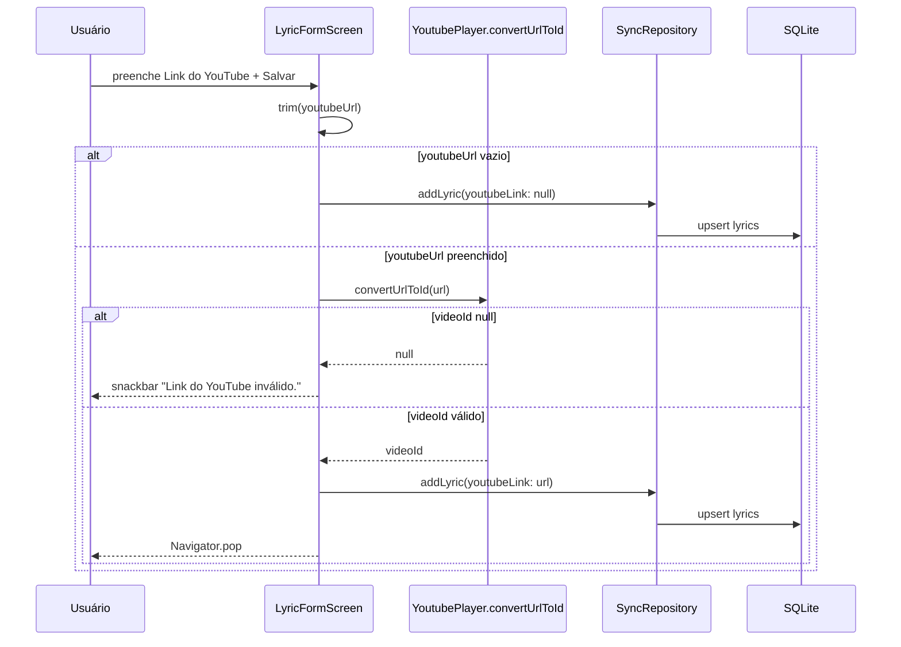
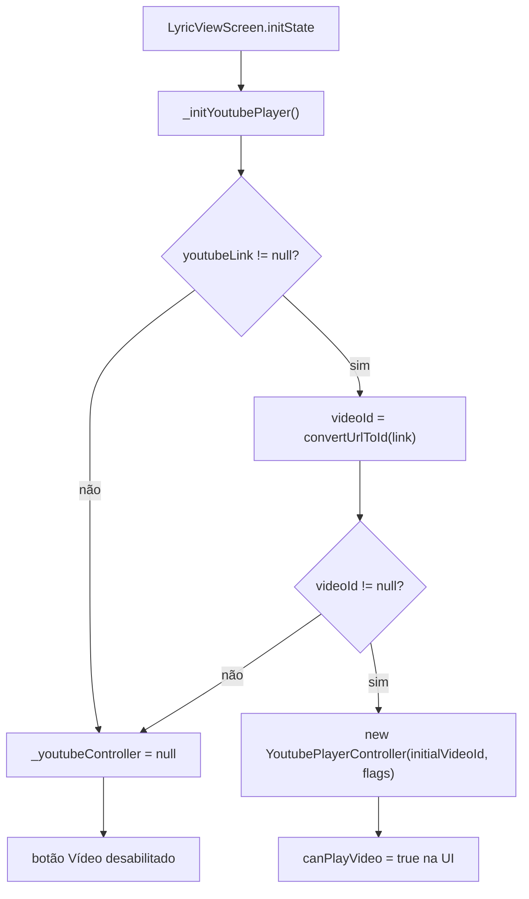
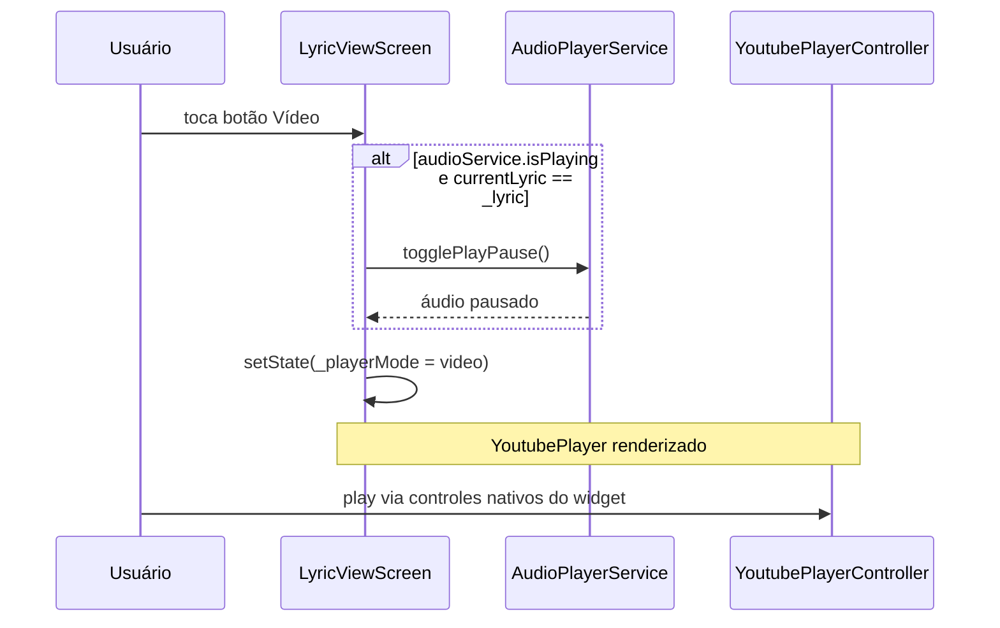
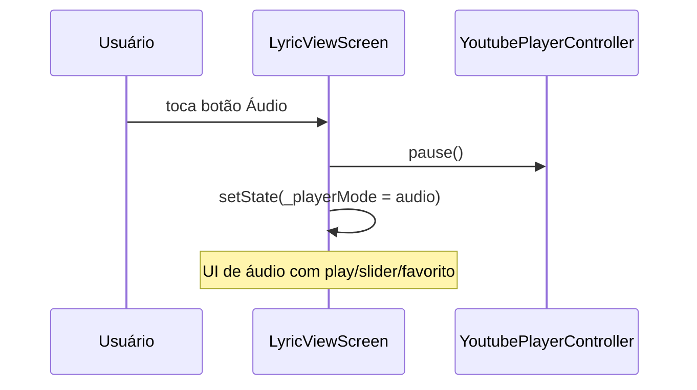
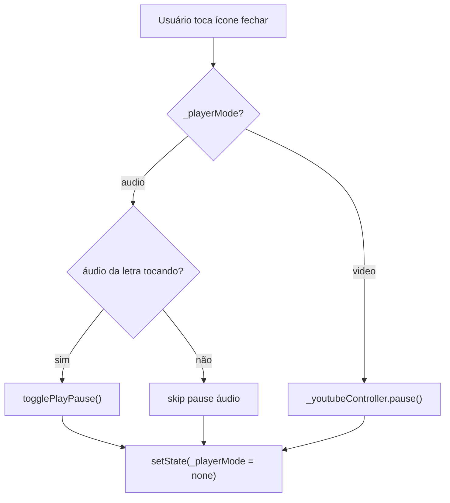
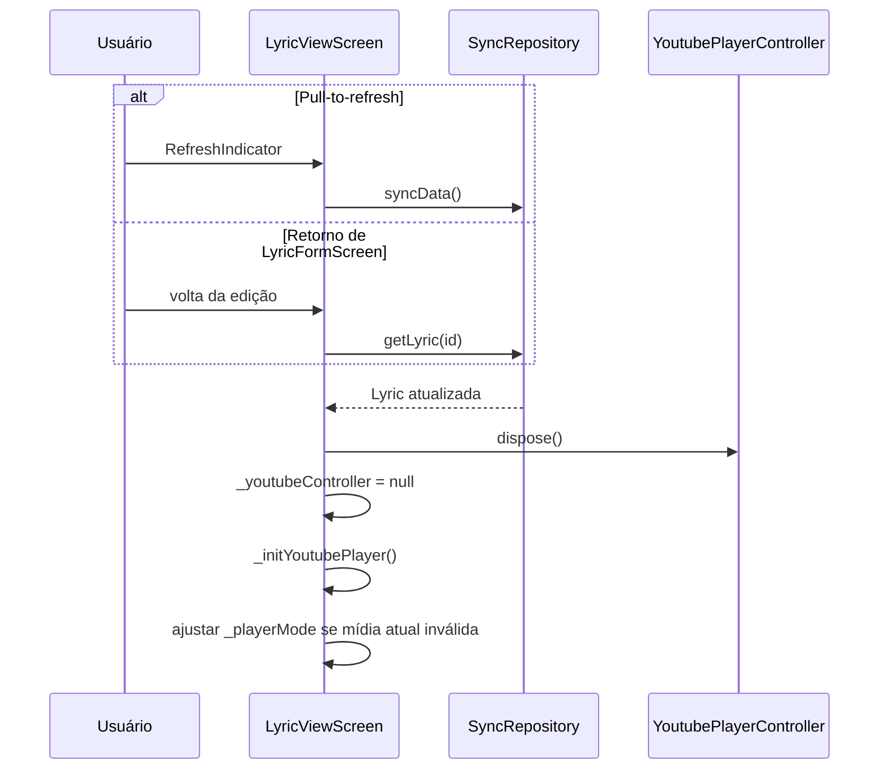
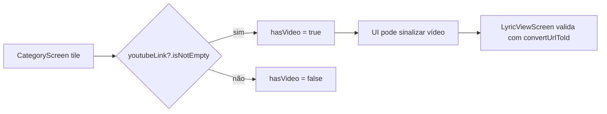

# Reprodução YouTube — Fluxos Operacionais

## Fluxo 1 — Persistir link YouTube no formulário

### Contrato do fluxo

- 🟢 **CONFIRMADO** — Validação ocorre apenas no save, não em tempo real no campo.
- 🟢 **CONFIRMADO** — URL original é persistida, não apenas o `videoId`.
- 🟢 **CONFIRMADO** — Título vazio aborta save antes da validação YouTube (`if (title.isEmpty) return`).
- 🟡 **INFERIDO** — Edição e criação compartilham a mesma regra de validação.

## Fluxo 2 — Inicializar player na abertura da letra

### Contrato do fluxo

- 🟢 **CONFIRMADO** — `autoPlay: false` — vídeo não inicia até usuário escolher modo `Vídeo`.
- 🟢 **CONFIRMADO** — `enableCaption: true` por padrão.
- 🟢 **CONFIRMADO** — Link inválido persistido (ex.: dados legados) resulta em ausência de controller, não crash.

## Fluxo 3 — Alternar para modo vídeo (com exclusividade de áudio)

### Contrato do fluxo

- 🟢 **CONFIRMADO** — Alternância para vídeo não chama `AudioPlayerService.play`.
- 🟢 **CONFIRMADO** — Controles de play/pause do YouTube são do próprio `youtube_player_flutter`.
- 🟡 **INFERIDO** — Estatísticas de play (`PlayStatsService`) não são incrementadas ao assistir vídeo.

## Fluxo 4 — Alternar para modo áudio (pausar YouTube)

### Contrato do fluxo

- 🟢 **CONFIRMADO** — YouTube pausa antes da troca de modo, mesmo se estava tocando.
- 🟢 **CONFIRMADO** — Modo áudio reutiliza `AudioPlayerService` da unit `reproducao-audio`.

## Fluxo 5 — Fechar card de mídia

### Contrato do fluxo

- 🟢 **CONFIRMADO** — Fechar não descarta o controller; apenas pausa e oculta UI do player.
- 🟢 **CONFIRMADO** — Usuário pode reabrir modo áudio ou vídeo sem recarregar a tela.

## Fluxo 6 — Recriar player após refresh ou edição

### Contrato do fluxo

- 🟢 **CONFIRMADO** — `RefreshIndicator` sincroniza antes de recarregar letra local.
- 🟢 **CONFIRMADO** — Se formulário retorna `true` (exclusão), tela de visualização fecha sem recriar player.
- 🟢 **CONFIRMADO** — Modo `video` sem controller válido após reload → `none`.

## Fluxo 7 — Indicador de vídeo em lista (heurística)

### Contrato do fluxo

- 🟡 **INFERIDO** — Lista não garante player funcional; detalhe é fonte de verdade para reprodução.
- 🟢 **CONFIRMADO** — Navegação para detalhe não depende de `hasVideo` para abrir a tela.

## Matriz de cenários

| Cenário | Controller | Botão Vídeo | Botão Áudio | UI |
|---------|------------|-------------|-------------|-----|
| Sem link | null | desabilitado | conforme áudio | "Sem mídia" ou só áudio |
| Link inválido | null | desabilitado | conforme áudio | idem |
| Link válido, modo none | criado | habilitado | conforme áudio | "Escolha um player" |
| Modo video | ativo | destacado | habilitado | YoutubePlayer |
| Modo audio | criado mas pausado | habilitado | destacado | controles áudio |
| Após dispose tela | — | — | — | recursos liberados |
