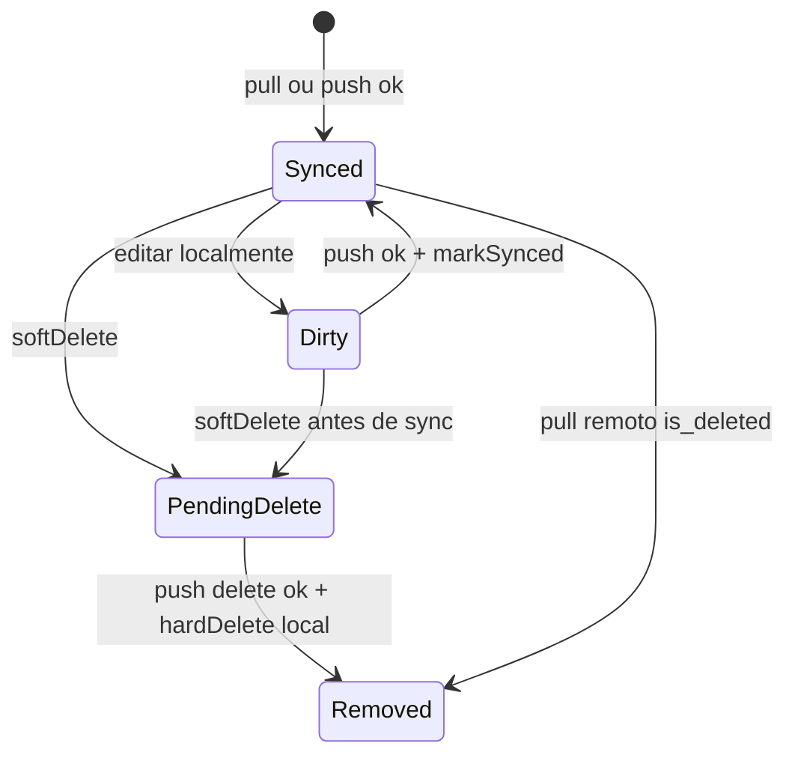
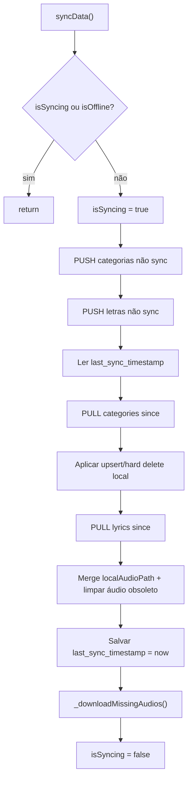
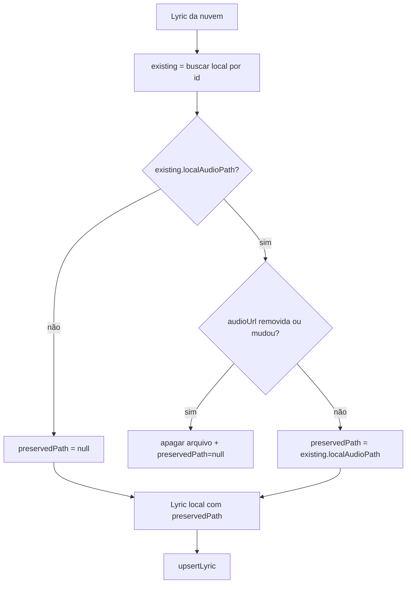

# Sincronização Offline — Design

> **Contrato arquitetural:** [`../architecture-contract.md`](../architecture-contract.md) — regras **R-01–R-02**, **W-01–W-03**, **A-01–A-04**, **S-01–S-08**.

## Decisão Arquitetural

🟢 **CONFIRMADO** — Padrão **offline-first com SQLite como source of truth imediata** e Supabase como réplica compartilhada.  
🟢 **CONFIRMADO** — `SyncRepository` centraliza orquestração; UI não acessa `DatabaseHelper` nem `SupabaseService` diretamente para domínio de acervo.  
🟢 **CONFIRMADO** — Sincronização em três fases sequenciais: **PUSH → PULL → DOWNLOAD** (+ segundo PUSH após merge no PULL).  
🟢 **CONFIRMADO** — Exclusões usam soft delete na nuvem e local até confirmação; hard delete local remove o registro fisicamente.  
🟢 **CONFIRMADO** — **Merge por campo** em conflito via `lib/services/sync_merge.dart` (Roberto, 2026-05-20; legado corrigido 2026-05-19).

## Componentes

| Componente | Tipo | Responsabilidade | Dependências |
|------------|------|------------------|--------------|
| `SyncRepository` | `ChangeNotifier` | Orquestra sync, CRUD, conectividade, download | `DatabaseHelper`, `SupabaseService`, `connectivity_plus`, `shared_preferences`, `http` |
| `DatabaseHelper` | Singleton | Schema SQLite, queries, flags sync/delete | `sqflite` |
| `SupabaseService` | Service | REST/Storage Supabase | `supabase_flutter` |
| `Category` / `Lyric` | Models | Entidades com `isSynced`, `isDeleted`, `updatedAt` | — |
| Telas (`Home`, `Category`, etc.) | Consumidores | Leitura local + `syncData` manual | `Provider` |

## Schema Local (SQLite v5)

### Tabela `categories`

| Coluna | Tipo | Uso |
|--------|------|-----|
| `id` | TEXT PK | Identificador UUID |
| `name` | TEXT NOT NULL | Nome |
| `code` | TEXT | Prefixo visual |
| `updated_at` | TEXT ISO8601 | Cursor incremental |
| `is_synced` | INTEGER 0/1 | Fila de push |
| `is_deleted` | INTEGER 0/1 | Soft delete |

### Tabela `lyrics`

| Coluna | Tipo | Uso |
|--------|------|-----|
| `id` | TEXT PK | UUID |
| `category_id` | TEXT FK | Categoria |
| `title`, `content` | TEXT | Conteúdo |
| `updated_at` | TEXT | Cursor incremental |
| `is_synced`, `is_deleted` | INTEGER | Sync/delete |
| `audio_url` | TEXT nullable | URL pública Storage |
| `local_audio_path` | TEXT nullable | **Somente local** |
| `youtube_link` | TEXT nullable | Vídeo |
| `sequence_number` | INTEGER | Ordenação na categoria |

🟢 **CONFIRMADO** — `local_audio_path` não vai em `toSupabaseMap()`; nuvem não conhece paths locais.

## Máquina de Estados — Registro Local

## Ciclo `syncData()`

### PUSH — decisão por item

| `isDeleted` | Ação remota | Ação local pós-sucesso |
|-------------|-------------|------------------------|
| `true` | `deleteCategory` / `deleteLyric` (soft) | `hardDelete*` |
| `false` | `upsert*` | `mark*Synced` |

### PULL — decisão por item

| `isDeleted` (remoto) | Ação local |
|----------------------|------------|
| `true` | Hard delete + apagar MP3 local se existir |
| `false` | Upsert com merge de `localAudioPath` |

## Merge de `localAudioPath` no PULL

🟢 **CONFIRMADO** — PULL usa `getLyricById` por item (otimizado em relação ao loop com `readAllLyrics`).

## Conectividade

| Evento | Comportamento |
|--------|---------------|
| Construtor `SyncRepository` | Registra `onConnectivityChanged` |
| `ConnectivityResult.none` | `_isOffline = true`, `notifyListeners` |
| Qualquer outra conectividade | `_isOffline = false`, chama `syncData()` |
| Check inicial | `checkConnectivity()` define estado offline |

🟢 **CONFIRMADO** — Estado inicial `_isOffline = true` até primeiro check (janela curta offline no boot).

## Download de Áudios

| Aspecto | Valor |
|---------|-------|
| Diretório | `{ApplicationDocumentsDirectory}/audios/` |
| Seleção | `audioUrl != null && localAudioPath == null` |
| Nome arquivo | Último segmento da URL (`url.split('/').last`) |
| HTTP | `http.get` sequencial |
| Progresso | `completed/total`, status `"Baixando áudios: x/y"` |
| Arquivo existente | Atualiza só DB com path existente |

🟡 **INFERIDO** — Colisão de nomes de arquivo diferentes URLs com mesmo basename sobrescreveria arquivo.

## CRUD — Caminhos Rápidos vs Fila

### `addCategory` / `addLyric`

1. `upsert` local (sempre)
2. `notifyListeners`
3. Se online: `upsert` remoto **assíncrono** (`.then markSynced`, `.catchError` log)

🟡 **INFERIDO** — Falha no push imediato deixa item na fila para próximo `syncData`.

### `deleteCategory`

1. `softDeleteCategory` local (+ letras da categoria)
2. Se online: `deleteCategory` remoto → `hardDeleteCategory` local

### `deleteLyric`

🟢 **CONFIRMADO** — Online e offline usam soft delete remoto (`is_deleted=true`), igual ao PUSH (Roberto, 2026-05-20; contrato **W-03**).

1. `softDeleteLyric` local
2. Se online: `SupabaseService.deleteLyric` (soft) → `hardDeleteLyric` local após sucesso

## API Remota (`SupabaseService`)

| Operação | Implementação |
|----------|---------------|
| `fetchCategories/Lyrics({since})` | `.select()` + `.gt('updated_at', since)` opcional |
| `upsert*` | `.upsert(toSupabaseMap())` |
| `delete*` | `.update({is_deleted: true, updated_at: now})` |
| `uploadAudio` | Storage bucket `audio`, path `lyrics/{sanitized}` |
| `deleteAudioByUrl` | Parse URL → `deleteAudio(fileName)` |

## Estado Exposto à UI

| Getter | Tipo | Uso |
|--------|------|-----|
| `isSyncing` | `bool` | Sync em andamento |
| `isOffline` | `bool` | Ícone wifi_off |
| `isDownloading` | `bool` | Splash / progresso |
| `downloadProgress` | `double` | 0.0–1.0 |
| `downloadStatus` | `String` | Texto descritivo |

## Pontos de Disparo de Sync

| Origem | Quando |
|--------|--------|
| `SyncRepository` ctor | Ao voltar online |
| `HomeScreen.initState` | Primeiro frame |
| `RefreshIndicator` | Home, Category, Search, LyricView |
| (implícito) | Após push imediato em CRUD online |

## Lacunas e Débitos Técnicos

| Item | Severidade | Descrição |
|------|------------|-----------|
| Conflito de edição | 🟢 | Merge por campo (`SyncMerge`). |
| `deleteLyric` vs PUSH | 🟢 | Soft delete unificado. |
| Feedback de erro | 🟡 | Usuário não vê falha de sync. |
| `last_sync_timestamp` | 🟡 | Atualizado mesmo se PUSH falhar parcialmente antes do catch. |
| Colisão de nomes de áudio | 🟡 | Basename da URL como chave de arquivo. |

## Rastreabilidade

| Artefato legado | Spec |
|-----------------|------|
| `architecture-contract.md` | Regras normativas S-*, W-*, A-* |
| `sync_merge.dart` | Merge por campo (S-04) |
| `sync_repository.dart` | RF-03–RF-19, ciclo sync, download |
| `db_helper.dart` | RF-01, RF-02, RF-18, RF-20 |
| `supabase_service.dart` | RF-04–RF-07, storage |
| `state-machines.md` | Estados Synced/Dirty/PendingDelete |
