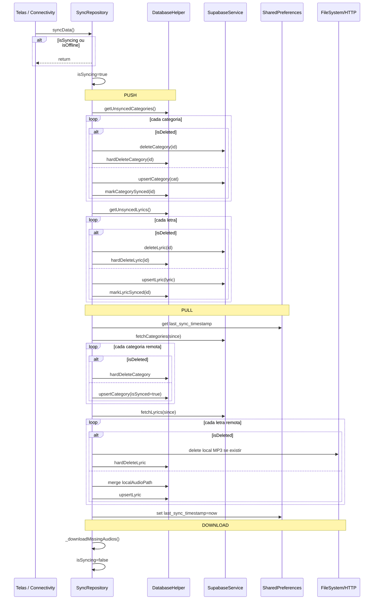
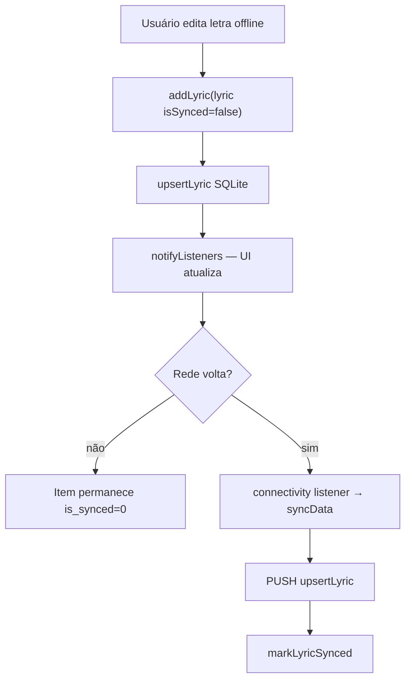
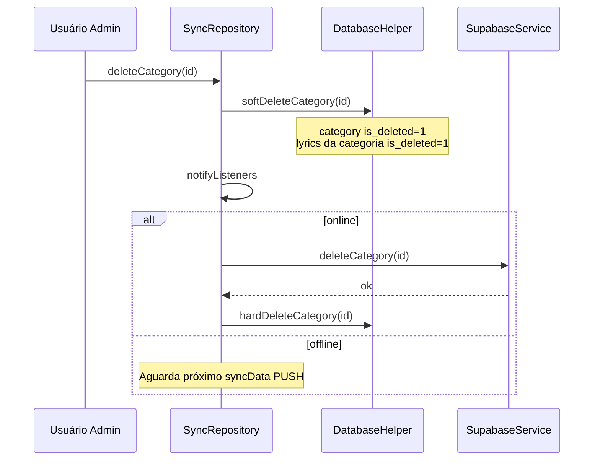
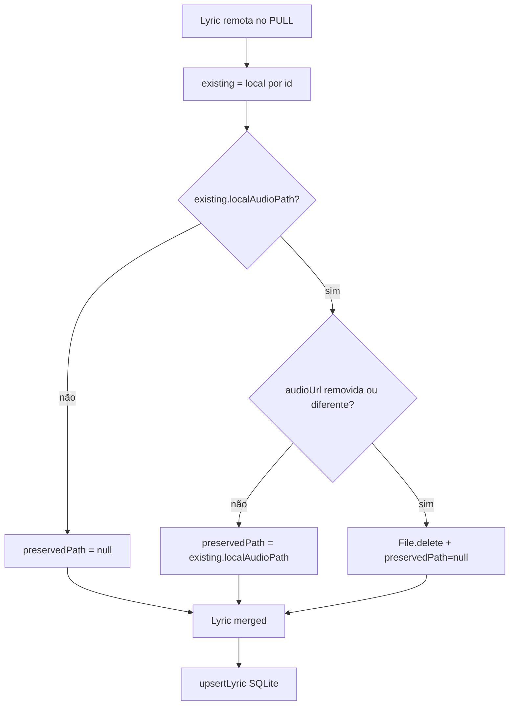
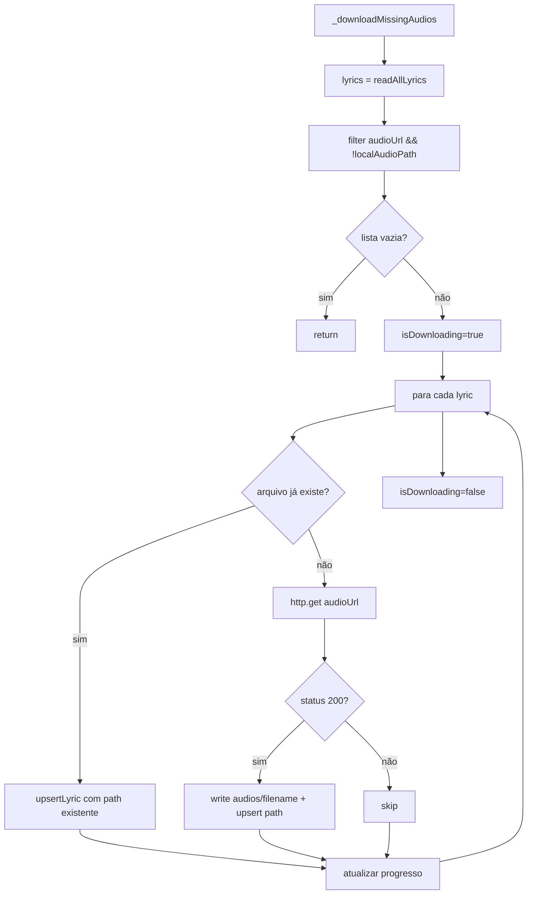
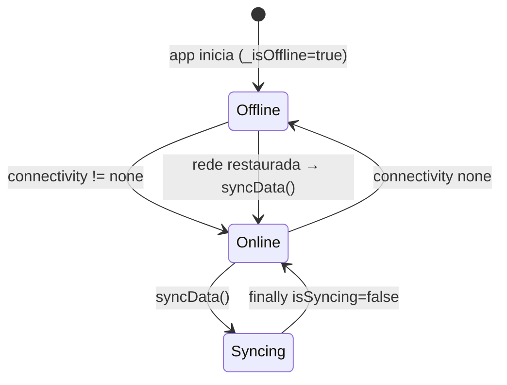
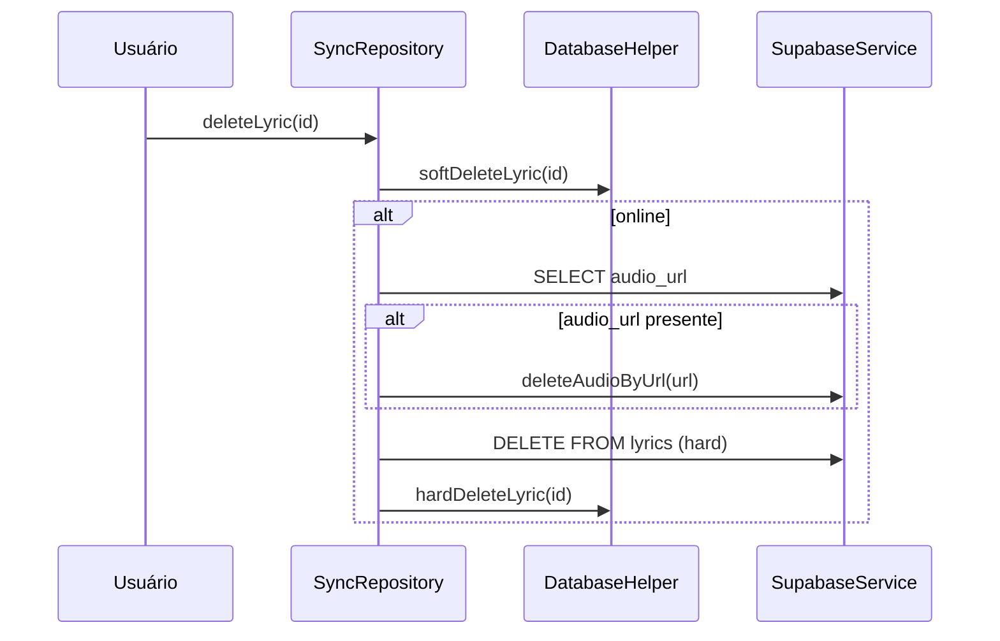

# Sincronização Offline — Fluxos Operacionais

## Fluxo 1 — Ciclo completo `syncData()`

### Contrato do fluxo

- 🟢 **CONFIRMADO** — Erros no `try` são logados; `finally` sempre desliga `_isSyncing`.
- 🟡 **INFERIDO** — Timestamp atualizado mesmo se PUSH parcial falhar antes do `catch`.

## Fluxo 2 — Edição offline e sincronização posterior

### Contrato do fluxo

- 🟢 **CONFIRMADO** — Edição offline não bloqueia o usuário.
- 🟢 **CONFIRMADO** — Push imediato em `addLyric` online é best-effort assíncrono; fila cobre falhas.

## Fluxo 3 — Soft delete de categoria com cascata

### Contrato do fluxo

- 🟢 **CONFIRMADO** — Cascata local ocorre em uma transação de updates no SQLite.
- 🟡 **INFERIDO** — PUSH posterior enviará categoria e letras marcadas `is_synced=0`.

## Fluxo 4 — Pull com preservação de áudio local

### Contrato do fluxo

- 🟢 **CONFIRMADO** — Nuvem nunca envia `local_audio_path`; merge é obrigatório.
- 🟢 **CONFIRMADO** — Mudança de `audioUrl` invalida arquivo local antigo.

## Fluxo 5 — Download pós-sync de MP3

### Contrato do fluxo

- 🟢 **CONFIRMADO** — Download é sequencial, não paralelo.
- 🟡 **INFERIDO** — Falha em um arquivo não interrompe os demais.
- 🟢 **CONFIRMADO** — Splash exibe progresso via `Consumer<SyncRepository>`.

## Fluxo 6 — Conectividade e sync automático

### Contrato do fluxo

- 🟢 **CONFIRMADO** — Transição para online dispara sync sem ação do usuário.
- 🟢 **CONFIRMADO** — Home também chama `syncData` no primeiro frame (redundância aceitável).

## Fluxo 7 — Exclusão imediata de letra online (caminho alternativo)

### Contrato do fluxo

- 🟡 **INFERIDO** — Diverge do PUSH que usa soft delete remoto (`deleteLyric` → `is_deleted=true`).
- 🔴 **LACUNA** — Dois semânticas de exclusão remota coexistem; reimplementação deve unificar.

## Matriz de disparo de sync

| Gatilho | Arquivo | Condição |
|---------|---------|----------|
| Rede restaurada | `sync_repository.dart` | `!_isOffline` no listener |
| Abertura Home | `home_screen.dart` | `addPostFrameCallback` |
| Pull refresh Home | `home_screen.dart` | usuário arrasta |
| Pull refresh Categoria | `category_screen.dart` | usuário arrasta |
| Pull refresh Busca | `search_screen.dart` | usuário arrasta |
| Pull refresh Letra | `lyric_view_screen.dart` | usuário arrasta |
