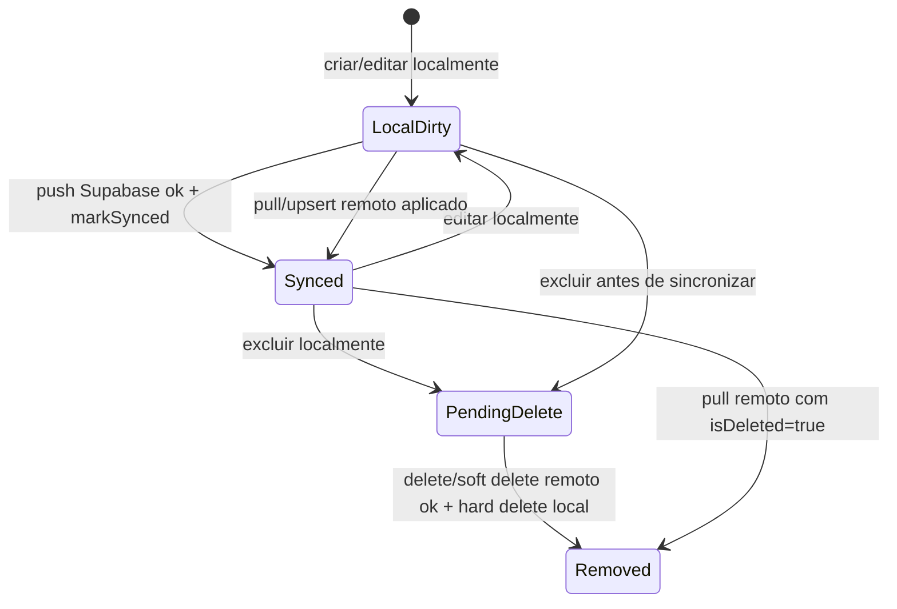
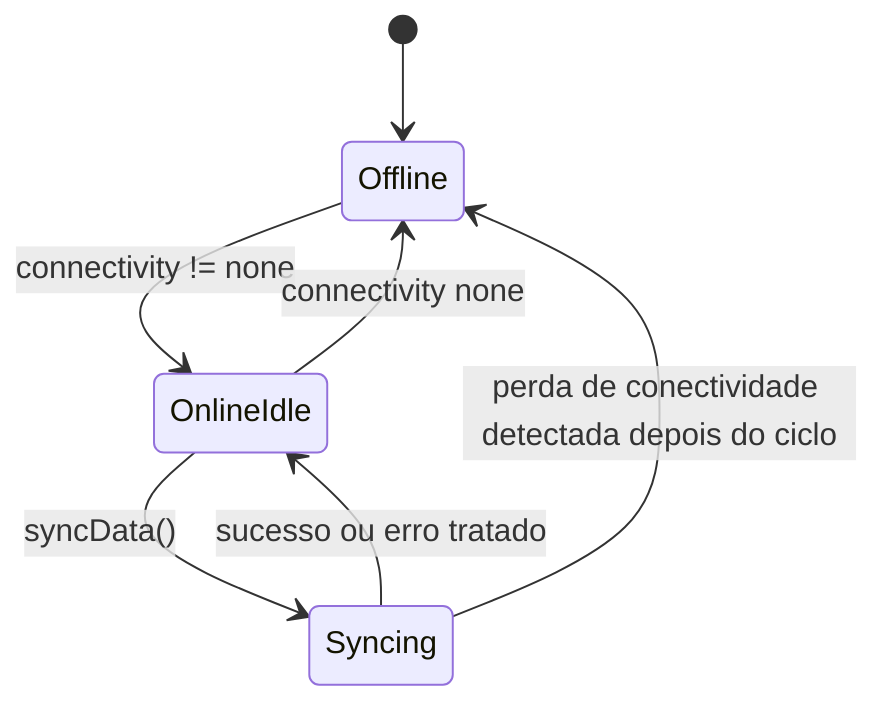
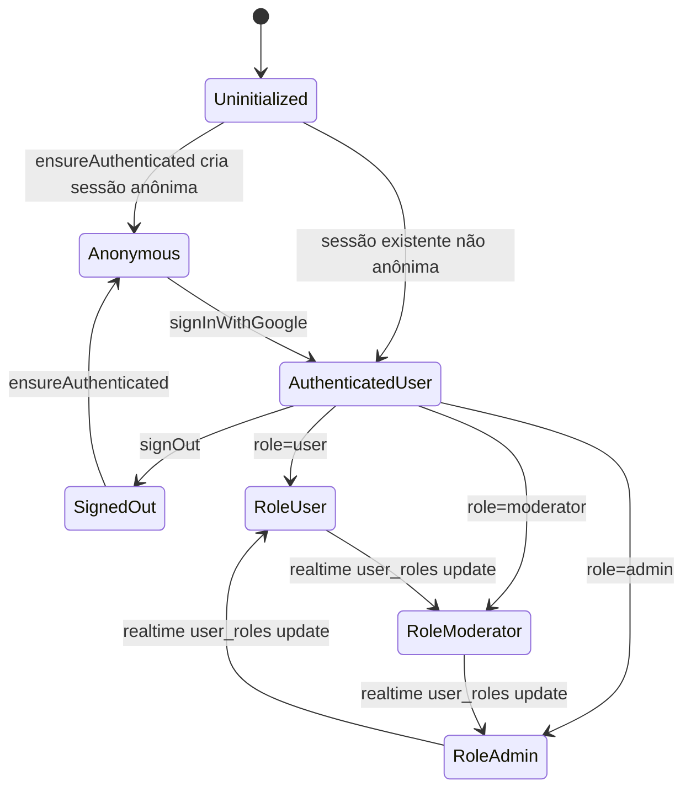
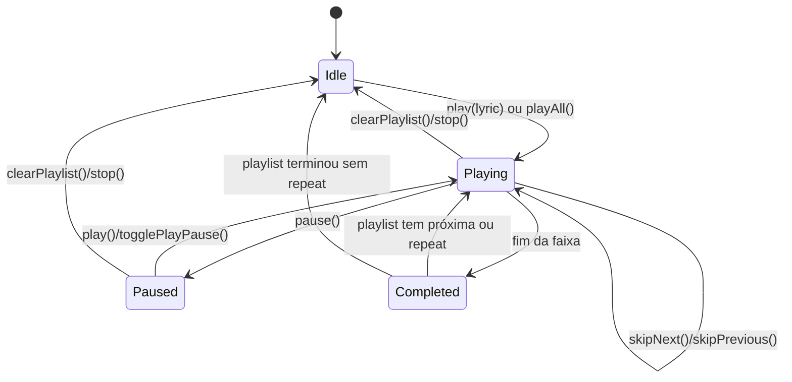
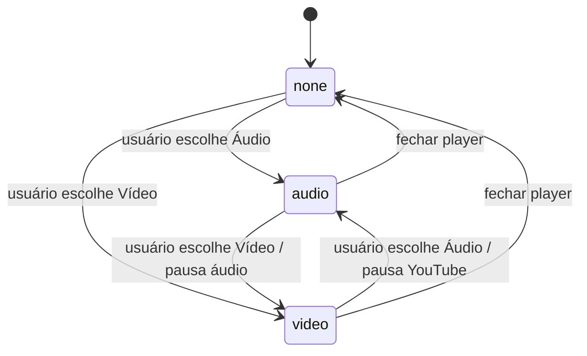
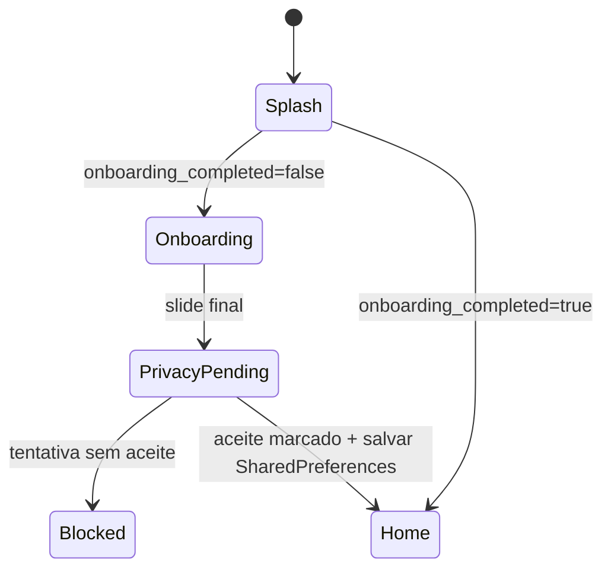

# Máquinas de Estado — FMA_Pontos

Gerado pelo Reversa Detective em 2026-05-19T02:03:06Z.

## Estado de Sincronização Local

Entidades: `Category`, `Lyric`

Campos: `is_synced`, `is_deleted`

Estados:

| Estado | Critério | Confiança |
|---|---|---|
| `LocalDirty` | `is_synced = 0`, `is_deleted = 0` | 🟢 CONFIRMADO |
| `Synced` | `is_synced = 1`, `is_deleted = 0` | 🟢 CONFIRMADO |
| `PendingDelete` | `is_synced = 0`, `is_deleted = 1` | 🟢 CONFIRMADO |
| `Removed` | Registro removido fisicamente do SQLite | 🟢 CONFIRMADO |

## Estado de Conectividade e Sync

Entidade: `SyncRepository`

Campos:

- `_isOffline`
- `_isSyncing`
- `_isDownloading`
- `_downloadProgress`
- `_downloadStatus`

## Estado de Autenticação e Role

Entidade: `AuthService`

## Estado de Playback

Entidade: `AudioPlayerService` / `MyAudioHandler`

Regras:

- 🟢 **CONFIRMADO** — `skipPrevious` reinicia a faixa se posição > 3 segundos.
- 🟢 **CONFIRMADO** — `repeat` faz a última faixa voltar para a primeira.
- 🟢 **CONFIRMADO** — Reproduzir uma letra registra estatística de play.

## Estado do Player da Tela de Letra

Entidade: `_PlayerMode`

Valores:

- `none`
- `audio`
- `video`

## Estado do Onboarding

## Lacunas

- 🔴 **LACUNA** — Não há estado explícito de conflito de sync.
- 🔴 **LACUNA** — `is_active=false` não aparece como estado bloqueante de autenticação no código analisado.

