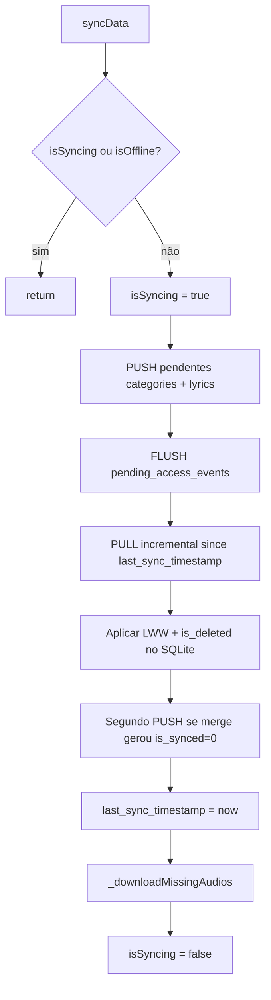
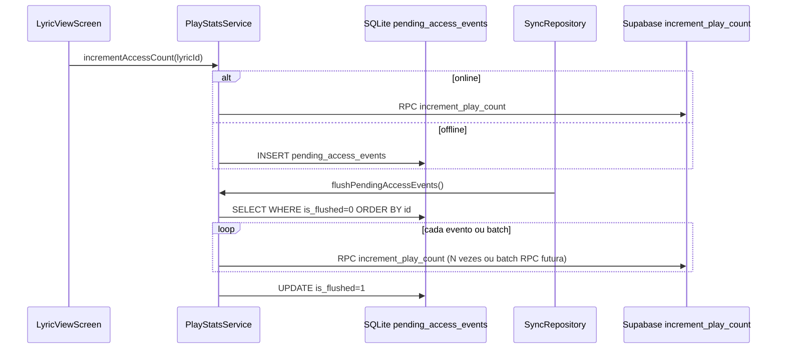

# RFC — Contrato de Sincronização (Sync Contract)

> **Status:** Proposta normativa  
> **Data:** 2026-05-31  
> **Escopo:** Acervo (`categories`, `lyrics`), estatísticas de acesso (`lyric_play_stats`) e integração Auth/RLS  
> **Decisões do stakeholder incorporadas:** LWW por `updated_at`; acessos offline contam no ranking global; CRUD sincronizado exige **autenticação + permissão RBAC** (não basta estar logado); soft delete via `is_deleted` alinhado local + Postgres.

**Referências cruzadas:**

| Artefato | Caminho |
|----------|---------|
| Implementação atual | `lib/services/sync_repository.dart`, `lib/services/sync_merge.dart`, `lib/services/supabase_service.dart` |
| SQLite | `lib/database/db_helper.dart` (`lyrics_v4.db`, versão 5) |
| Stats | `lib/services/play_stats_service.dart` |
| Auth/RBAC | `lib/services/auth_service.dart`, `_reversa_sdd/permissions.md` |
| Spec legada | `_reversa_sdd/sincronizacao-offline/` |
| ADR offline-first | `_reversa_sdd/adrs/001-offline-first-sync-soft-delete.md` |
| Schema Postgres | `_reversa_sdd/database/data-dictionary.md`, `supabase/migrations/20251226191350_initial_schema.sql` |

---

## 1. Resumo executivo

O app FMA_Pontos opera **offline-first**: SQLite é a fonte imediata de leitura; Supabase Postgres é a réplica compartilhada. A orquestração vive em `SyncRepository.syncData()` com ciclo **PUSH → PULL → download de áudios → segundo PUSH**.

Este RFC define o **modelo alvo** a partir de quatro decisões explícitas do produto, contrastando com o código e o schema remoto atuais, e propõe fases de implementação com nomes concretos de arquivos e tabelas.

---

## 2. Estado atual vs modelo alvo

### 2.1 Visão geral

| Dimensão | Estado atual (código + prod) | Modelo alvo (este RFC) |
|----------|------------------------------|------------------------|
| **Resolução de conflito** | Merge **por campo** em `SyncMerge` (`_pickField` compara `updated_at` por atributo) | **Last-write-wins (LWW)** no nível do registro: vence quem tem `updated_at` mais recente |
| **Fila de push** | Coluna `is_synced` nas tabelas `categories` e `lyrics` (sem outbox dedicada) | Manter `is_synced` como fila implícita; opcionalmente evoluir para outbox explícita (ver §4) |
| **Soft delete remoto** | `SupabaseService.delete*` envia `is_deleted: true`, mas **Postgres não possui a coluna** | Coluna `is_deleted boolean NOT NULL DEFAULT false` em `categories` e `lyrics` no Postgres, espelhando SQLite |
| **Soft delete local** | `is_deleted` + `hardDelete*` após confirmação remota | Igual, com PULL incremental trazendo registros deletados via `updated_at` |
| **Stats offline** | `PlayStatsService.incrementAccessCount` chama RPC/UPDATE **somente online**; offline perde contagem | Fila local `pending_access_events`; flush no sync/reconexão |
| **Auth no sync** | `SyncRepository` não verifica sessão nem role; UI parcialmente restringe CRUD via `AuthService.can*` | Apenas usuário **autenticado (não anônimo) com a permissão RBAC da operação** pode enfileirar mutações que entram no PUSH |
| **Observabilidade** | Erros em `debugPrint`; getters `isSyncing`, `isOffline`, progresso de download | Contagem de pendentes, último erro, timestamp do último sync bem-sucedido expostos à UI |
| **Cursor incremental** | `SharedPreferences` → `last_sync_timestamp` | Igual; só avançar após PUSH+PULL bem-sucedidos (corrigir avanço prematuro) |

### 2.2 Schema local (SQLite v5 — `lyrics_v4.db`)

**Tabela `categories`**

| Coluna | Tipo | Papel |
|--------|------|-------|
| `id` | TEXT PK | UUID |
| `name`, `code` | TEXT | Conteúdo |
| `updated_at` | TEXT ISO8601 | Cursor LWW + incremental |
| `is_synced` | INTEGER 0/1 | Fila de push (`0` = pendente) |
| `is_deleted` | INTEGER 0/1 | Soft delete local |

**Tabela `lyrics`**

| Coluna | Tipo | Papel |
|--------|------|-------|
| `id` | TEXT PK | UUID |
| `category_id` | TEXT | FK lógica |
| `title`, `content` | TEXT | Conteúdo |
| `updated_at` | TEXT | LWW + incremental |
| `is_synced`, `is_deleted` | INTEGER | Sync/delete |
| `audio_url`, `local_audio_path` | TEXT nullable | Remoto / **somente local** |
| `youtube_link`, `sequence_number` | TEXT/INT | Metadados |

**Tabela alvo (ainda não existe): `pending_access_events`**

| Coluna | Tipo | Papel |
|--------|------|-------|
| `id` | INTEGER PK AUTOINCREMENT | Ordem FIFO |
| `lyric_id` | TEXT NOT NULL | Ponto acessado |
| `accessed_at` | TEXT ISO8601 NOT NULL | Momento do acesso |
| `is_flushed` | INTEGER 0/1 DEFAULT 0 | Já enviado ao remoto |

Migração local: `DatabaseHelper._upgradeDB` versão **6**.

### 2.3 Schema remoto (Postgres — estado no backup 2026-01-21)

| Tabela | Colunas de sync | Lacuna |
|--------|-----------------|--------|
| `categories` | `id`, `name`, `code`, `updated_at` | **Sem `is_deleted`** |
| `lyrics` | idem + mídia, `sequence_number` | **Sem `is_deleted`** |
| `lyric_play_stats` | `lyric_id`, `play_count`, `last_played_at`, `updated_at` | RPC `increment_play_count` **ausente em prod** (presente no repo) |

O app já serializa `is_deleted` no fluxo de delete remoto (`SupabaseService.deleteCategory` / `deleteLyric`), mas a operação falha ou é ignorada enquanto a coluna não existir no Postgres.

---

## 3. Fluxos de sincronização

### 3.1 Ciclo principal — `SyncRepository.syncData()`



**Ordem normativa:** PUSH (acervo) → FLUSH (stats) → PULL → PUSH residual → cursor → download de MP3.

### 3.2 PUSH (local → remoto)

**Seleção:** `DatabaseHelper.getUnsyncedCategories()` e `getUnsyncedLyrics()` (`is_synced = 0`).

**Pré-condição alvo (PUSH de acervo):** sessão Supabase válida, `AuthService.isAnonymous == false`, conta `is_active == true` e **permissão RBAC da operação** (`canAddLyrics`, `canEditLyrics`, `canDeleteLyrics`, `canAddCategories`, `canEditCategories`, `canDeleteCategories` — ver §7.1). Anônimos e autenticados **sem** a permissão da mutação **não enfileiram** push (`is_synced = 0` não deve ser gerado para eles, ou o PUSH deve ignorar a linha).

| Estado local | Ação remota | Pós-sucesso local |
|--------------|-------------|-------------------|
| `is_deleted = 1` | `SupabaseService.delete*` → `UPDATE is_deleted=true, updated_at=now()` | `hardDeleteCategory` / `hardDeleteLyric` (+ limpar MP3 local se letra) |
| `is_deleted = 0` | Comparar LWW com remoto (fetch by id) → `upsert*` vencedor | `markCategorySynced` / `markLyricSynced` |

**Push imediato (CRUD online):** `addCategory`, `addLyric`, `delete*` disparam `SupabaseService` assíncrono (`.then markSynced`). Falha deve manter `is_synced = 0` para o ciclo batch — comportamento já parcialmente correto.

**Áudio:** upload via `SupabaseService.uploadAudio` antes do `upsertLyric`; `local_audio_path` nunca vai em `toSupabaseMap()`.

### 3.3 PULL (remoto → local)

**Seleção:** `SupabaseService.fetchCategories(since: lastSync)` e `fetchLyrics(since: lastSync)` com `.gt('updated_at', since)`.

**Importante:** queries de sync **devem incluir** registros com `is_deleted = true` (filtrados apenas na UI de leitura remota direta, que o app não usa). Após migração Postgres, não adicionar `WHERE is_deleted = false` nas queries de sync.

| Remoto | Local existente | Ação LWW |
|--------|-----------------|----------|
| `is_deleted = true` | qualquer | Apagar MP3 local se houver → `hardDelete*` |
| `is_deleted = false` | ausente | `upsert*` com `isSynced = true` |
| `is_deleted = false` | `is_synced = 1` | Substituir pelo remoto (remoto é fonte após sync) |
| `is_deleted = false` | `is_synced = 0` (dirty) | Se `remote.updated_at > local.updated_at` → aplicar remoto e `markSynced`; senão manter local (será empurrado no PUSH) |

**Preservação de mídia local (invariante mantida):** ao aplicar remoto, preservar `local_audio_path` quando `audio_url` não mudou; invalidar arquivo se URL removida ou alterada — lógica já presente em `sync_repository.dart` linhas 111–127.

### 3.4 Fila / outbox

**Acervo (atual e alvo Fase A/B):** outbox implícita via `is_synced = 0` nas mesmas linhas de `categories`/`lyrics`. Estados formais em `LocalSyncStatus` (`lib/models/states.dart`):

| Estado | `is_synced` | `is_deleted` |
|--------|-------------|--------------|
| `localDirty` | 0 | 0 |
| `pendingDelete` | 0 | 1 |
| `synced` | 1 | 0 |
| `removed` | — | registro ausente |

**Stats (alvo Fase C):** outbox explícita `pending_access_events`, desacoplada do acervo.

**Anti-padrão atual:** `DatabaseHelper.upsertCategory` / `upsertLyric` forçam `is_deleted: 0` no `INSERT OR REPLACE`, o que pode **ressuscitar** registro soft-deleted se houver upsert acidental — corrigir na implementação.

---

## 4. Política LWW detalhada

### 4.1 Regra normativa

> Para um par `(local, remote)` do **mesmo `id`**, o registro inteiro vencedor é aquele cujo `updated_at` é **estritamente maior**. Empate (`updated_at` igual): **local prevalece no PUSH**, **remoto prevalece no PULL** (desempate conservador contra perda de dados locais não enviados).

Campos comparados como bloco (não por campo):

- **Category:** `name`, `code`, `is_deleted` (via fluxo delete), `updated_at`
- **Lyric:** `category_id`, `title`, `content`, `audio_url`, `youtube_link`, `sequence_number`, `is_deleted`, `updated_at`

### 4.2 PUSH-first para pendentes

1. Antes de qualquer PULL, processar **todos** os registros com `is_synced = 0`.
2. Para cada pendente não deletado:
   - `remote = fetch*ById(id)`
   - Se `remote == null` ou `remote.is_deleted`: enviar local.
   - Se `remote.updated_at < local.updated_at`: enviar local (LWW).
   - Se `remote.updated_at > local.updated_at`: aplicar remoto no SQLite, `markSynced` (local perde).
   - Se empate: enviar local.
3. Para cada pendente deletado (`is_deleted = 1`): executar soft delete remoto; se remoto já estiver deletado ou com `updated_at` mais recente indicando outra mutação, aplicar regra de delete (delete local hard após confirmação).

### 4.3 Regras no PULL

1. Só executar PULL **após** PUSH inicial (e flush de stats quando existir).
2. Nunca sobrescrever registro local com `is_synced = 0` e `local.updated_at > remote.updated_at`.
3. Registro remoto deletado (`is_deleted = true`) **sempre** remove local, independentemente de LWW de conteúdo — delete é evento terminal com `updated_at` próprio.
4. Após PULL que alterou dados locais com `is_synced = 0`, executar **segundo PUSH** (já implementado, linhas 154–155 de `sync_repository.dart`).

### 4.4 Divergência vs código atual

| Aspecto | Código (`SyncMerge`) | Alvo (RFC) |
|---------|----------------------|------------|
| Granularidade | Por campo (`_pickField`) | Registro inteiro |
| `updated_at` pós-merge | `_maxDateTime(local, remote)` | Timestamp do vencedor LWW |
| Conflito parcial | Campos de vencedores diferentes coexistem | Impossível — snapshot monolítico |

**Ação:** substituir ou simplificar `lib/services/sync_merge.dart` para LWW record-level; atualizar regra **S-04** em `architecture-contract.md` na fase de implementação.

---

## 5. Semântica `is_deleted`

### 5.1 Local (SQLite)

| Operação | Comportamento |
|----------|---------------|
| `softDeleteCategory(id)` | `categories.is_deleted=1`, `is_synced=0`, `updated_at=now()`; **cascata** em `lyrics` da categoria |
| `softDeleteLyric(id)` | `lyrics.is_deleted=1`, `is_synced=0`, `updated_at=now()` |
| Leituras UI | `WHERE is_deleted = 0` (`readAllCategories`, `readLyricsByCategory`, `searchLyrics`) |
| Pós-push/pull confirmado | `hardDeleteCategory` / `hardDeleteLyric` remove fisicamente |

### 5.2 Remoto (Postgres) — migração recomendada

**Arquivo sugerido:** `supabase/migrations/YYYYMMDDHHMMSS_add_is_deleted_soft_delete.sql`

```sql
-- Adicionar colunas
ALTER TABLE public.categories
  ADD COLUMN IF NOT EXISTS is_deleted boolean NOT NULL DEFAULT false;

ALTER TABLE public.lyrics
  ADD COLUMN IF NOT EXISTS is_deleted boolean NOT NULL DEFAULT false;

-- Índice para sync incremental incluindo tombstones
CREATE INDEX IF NOT EXISTS idx_categories_updated_at ON public.categories (updated_at);
CREATE INDEX IF NOT EXISTS idx_lyrics_updated_at ON public.lyrics (updated_at);

-- Leitura pública: ocultar deletados na UI web/API futura
-- (app mobile lê SQLite; sync traz tombstones)
DROP POLICY IF EXISTS "Read Categories" ON public.categories;
CREATE POLICY "Read Categories" ON public.categories
  FOR SELECT USING (is_deleted = false);

DROP POLICY IF EXISTS "Read Lyrics" ON public.lyrics;
CREATE POLICY "Read Lyrics" ON public.lyrics
  FOR SELECT USING (is_deleted = false);

-- UPDATE de soft delete: manter policies de moderator/admin existentes,
-- garantindo que UPDATE pode setar is_deleted=true (já coberto por UPDATE policies)

-- RPC/sync: políticas separadas ou SECURITY DEFINER para fetch incremental
-- incluir is_deleted=true — ver open question §12 se usar view sync_categories.
```

**Serialização app:** estender `Category.toSupabaseMap()` / `Lyric.toSupabaseMap()` para incluir `is_deleted` quando alinhado (hoje omitido — remoto infere delete só via `delete*`).

**Triggers de auditoria:** `audit_trigger_func` continuará registrando UPDATE com `is_deleted=true` como UPDATE (não DELETE físico) — compatível com ADR 001.

**Storage:** remoção de MP3 no bucket `audio` permanece operação **assíncrona/opcional** pós-soft-delete (admin); não bloquear sync.

---

## 6. Estatísticas “mais acessados” — fila offline

### 6.1 Requisito

Acessos offline **devem** contabilizar no ranking global (`lyric_play_stats.play_count`).

### 6.2 Estado atual

- `LyricViewScreen.initState` chama `PlayStatsService.incrementAccessCount(lyricId)` (`lib/screens/lyric_view_screen.dart`).
- Serviço tenta RPC `increment_play_count`; fallback faz SELECT+UPDATE/INSERT direto em `lyric_play_stats`.
- **Sem persistência offline:** falha silenciosa em `debugPrint`.
- Ranking (`getTopPlayed`, `rankCategoriesByAccess`) lê **somente remoto** + join com SQLite local.

### 6.3 Design alvo — `pending_access_events`



**Gravação offline:** `INSERT INTO pending_access_events (lyric_id, accessed_at) VALUES (?, ?)`.

**Flush:** chamado de `SyncRepository.syncData()` após PUSH de acervo, antes do PULL; também no listener de reconexão (`Connectivity.onConnectivityChanged`).

**Idempotência:** múltiplos incrementos para o mesmo `lyric_id` são intencionais (cada abertura de tela = +1). Não deduplicar na fila.

**RPC em prod:** aplicar `_reversa_sdd/supabase-extracted/increment_play_count-proposed.sql` (ou migration equivalente) antes do flush em produção.

**Ranking offline-first (opcional Fase C+):** cache local de `play_count` agregado para Home offline — fora do escopo mínimo; ranking global exige flush bem-sucedido.

---

## 7. Autenticação, permissões e RLS

### Decisão do stakeholder (2026-05-31)

> **CRUD sincronizado:** não basta estar logado. Apenas usuários **autenticados (não anônimos) com a permissão RBAC adequada** podem criar, editar ou excluir conteúdo que entra na fila de sync (`is_synced = 0`) ou no PUSH imediato. Usuário logado com role `user` **não** pode editar letra/categoria nem enfileirar essas mutações. **PULL/leitura** permanece disponível para todos (incluindo anônimos), independentemente de permissão de escrita.

### 7.1 Regra normativa — escrita (PUSH / fila)

> Mutações que alteram acervo remoto exigem: (1) sessão não anônima, (2) `user_roles.is_active = true`, (3) getter `AuthService.can*` correspondente à operação. O `SyncRepository` e os wrappers de CRUD **devem** validar permissão antes de marcar `is_synced = 0` ou chamar `SupabaseService`.

**Roles** (tabela `user_roles.role`, hierarquia via `AuthService.hasRole` / SQL `public.has_role`):

| Role | Descrição |
|------|-----------|
| `user` | Autenticado comum |
| `moderator` | Editorial — herda `user` |
| `admin` | Administrador — herda `moderator` |

**Getters de permissão** (`lib/services/auth_service.dart`):

| Getter | `hasRole` mínimo | Roles efetivos |
|--------|------------------|----------------|
| `canAddLyrics` | `user` | `user`, `moderator`, `admin` |
| `canEditLyrics` | `moderator` | `moderator`, `admin` |
| `canDeleteLyrics` | `admin` | `admin` |
| `canAddCategories` | `moderator` | `moderator`, `admin` |
| `canEditCategories` | `moderator` | `moderator`, `admin` |
| `canDeleteCategories` | `admin` | `admin` |

**Matriz operação → permissão de sync (acervo):**

| Operação | Entidade | Permissão exigida | Papel mínimo |
|----------|----------|-------------------|--------------|
| CREATE | `lyrics` | `canAddLyrics` | `user` |
| UPDATE | `lyrics` | `canEditLyrics` | `moderator` |
| DELETE (soft) | `lyrics` | `canDeleteLyrics` | `admin` |
| CREATE | `categories` | `canAddCategories` | `moderator` |
| UPDATE | `categories` | `canEditCategories` | `moderator` |
| DELETE (soft) | `categories` | `canDeleteCategories` | `admin` |

**Quem NÃO enfileira PUSH de acervo:**

| Sujeito | CREATE letra | UPDATE letra | DELETE letra | CRUD categoria |
|---------|:------------:|:------------:|:------------:|:----------------:|
| Anônimo (`isAnonymous`) | ❌ | ❌ | ❌ | ❌ |
| `user` logado | ✅ | ❌ | ❌ | ❌ |
| `moderator` logado | ✅ | ✅ | ❌ | ✅ (sem delete) |
| `admin` logado | ✅ | ✅ | ✅ | ✅ |
| Qualquer com `is_active = false` | ❌ | ❌ | ❌ | ❌ |

### 7.2 Regra normativa — leitura (PULL)

> **PULL e leitura local não exigem permissão de escrita.** Qualquer sessão (incluindo anônima) pode executar `syncData()` para **receber** alterações remotas e ler SQLite. Restrições RBAC aplicam-se apenas a mutações que **empurram** para o remoto.

| Dimensão | Comportamento alvo |
|----------|-------------------|
| PULL incremental | Todos os usuários (anon + autenticados) |
| Leitura UI (SQLite) | Todos — `WHERE is_deleted = 0` |
| Stats offline (`pending_access_events`) | Enfileirar flush: todos autenticados não anônimos (sem gate de role editorial) |
| Favoritos locais | Sem auth (fora do escopo sync acervo) |

### 7.3 Estado atual vs alvo

| Camada | Atual | Alvo |
|--------|-------|------|
| UI | `AuthService.can*` em formulários; **exceção:** `canEditLyrics \|\| isAnonymous` em `lyric_view_screen.dart` e `category_screen.dart` permite edição anônima local | Remover bypass anônimo; bloquear CRUD local sem `can*` correspondente |
| `SyncRepository` | Sem gate de auth nem role | `_pushPendingChanges` ignora linhas se `isAnonymous` **ou** sem `can*` da operação; CRUD wrappers validam permissão antes de `is_synced = 0` |
| Supabase RLS | Schema alvo já usa `has_role` + bloqueio anônimo (ver `_reversa_sdd/permissions.md`); prod pode divergir | Alinhar prod às policies: INSERT/UPDATE/DELETE exigem `authenticated` + `has_role(...)` + JWT não anônimo |
| Sessão | `AuthService.ensureAuthenticated()` cria sessão anônima (`signInAnonymously`) | Manter para leitura/PULL/ranking/favoritos; mutações sync exigem Google login **e** role adequada em `user_roles` |

### 7.4 Implicações RLS pós-`is_deleted`

- SELECT público filtra `is_deleted = false` (§5.2).
- UPDATE soft delete exige role `admin` (categories/lyrics) — alinhado a `canDelete*`.
- `lyric_play_stats`: restringir INSERT/UPDATE à RPC `increment_play_count` SECURITY DEFINER; revogar INSERT/UPDATE direto do client (hoje permissivo — ver `business-rules.md`).

---

## 8. Gatilhos de sincronização

| Gatilho | Origem | Comportamento atual | Comportamento alvo |
|---------|--------|---------------------|-------------------|
| App aberto (Home) | `home_screen.dart` `initState` → `syncData()` | Sim | Sim + flush stats |
| Reconexão | `SyncRepository._initConnectivity` | `syncData()` | Sim + flush stats |
| Pull-to-refresh | `home_screen`, `category_screen`, `search_screen`, `lyric_view_screen`, `all_categories_screen` | `syncData()` | Sim |
| Após CRUD online | `add*` / `delete*` push assíncrono | Parcial (não chama `syncData` completo) | Manter push imediato; CRUD offline dispara sync no próximo online |
| Splash | `splash_screen.dart` | Auth + navegação; download progress via `SyncRepository` listeners | Opcional: sync inicial pós-auth |
| Pós-login Google | Não implementado | — | **Adicionar:** `syncData()` em `AuthService` após login bem-sucedido |

**Guardas:** `syncData()` retorna se `_isSyncing || _isOffline` (mantido).

---

## 9. Observabilidade

### 9.1 Estado exposto hoje (`SyncRepository`)

| Getter | Uso |
|--------|-----|
| `isSyncing` | Spinner global |
| `isOffline` | Ícone `wifi_off` na Home |
| `isDownloading`, `downloadProgress`, `downloadStatus` | Splash / progresso MP3 |

### 9.2 Métricas alvo

| Métrica | Fonte | Exposição sugerida |
|---------|-------|-------------------|
| `pendingCategoriesCount` | `COUNT(*) WHERE is_synced=0` em categories | Badge / bottom sheet debug |
| `pendingLyricsCount` | idem lyrics | idem |
| `pendingAccessEventsCount` | `pending_access_events WHERE is_flushed=0` | idem |
| `lastSyncAt` | SharedPreferences `last_sync_timestamp` | UI admin / about |
| `lastSyncError` | campo em memória + persistência opcional | Snackbar / log exportável |
| `lastFlushStatsAt` | SharedPreferences | diagnóstico |

**Erros:** substituir apenas `debugPrint("Sync Error: $e")` por estado observável + log estruturado; não avançar `last_sync_timestamp` se PUSH ou PULL falhar (gap atual).

---

## 10. Gaps vs código atual (checklist)

| # | Gap | Severidade | Evidência |
|---|-----|------------|-----------|
| G1 | Postgres **sem** `is_deleted`; delete remoto inconsistente | 🔴 Crítico | `data-dictionary.md`; migration inicial |
| G2 | Política de conflito é **merge por campo**, não LWW record-level | 🟠 Alto | `sync_merge.dart`; decisão stakeholder |
| G3 | **Sem fila offline** para stats de acesso | 🔴 Crítico | `play_stats_service.dart` |
| G4 | RPC `increment_play_count` ausente em prod | 🔴 Crítico | backup 2026-01-21 |
| G5 | **Sync não exige login nem permissão**; anônimo pode editar local e enfileirar; `user` logado poderia enfileirar edição sem `canEditLyrics` | 🟠 Alto | `sync_repository.dart`; telas com `\|\| isAnonymous`; `AuthService.can*` não consultado no sync |
| G6 | RLS prod pode divergir do schema alvo (`has_role` + bloqueio anônimo); INSERT anônimo era legado | 🟠 Alto | `permissions.md`; migration `20251226191350_initial_schema.sql` |
| G7 | `last_sync_timestamp` avança mesmo com falhas parciais | 🟡 Médio | `sync_repository.dart` finally sem rollback |
| G8 | Sem contagem de pendentes / erro exposto à UI | 🟡 Médio | só `debugPrint` |
| G9 | `upsert*` local força `is_deleted=0` | 🟡 Médio | `db_helper.dart` linhas 91–93, 165–168 |
| G10 | `toSupabaseMap()` não envia `is_deleted` | 🟡 Médio | models |
| G11 | Colisão de basename em `_downloadMissingAudios` | 🟢 Baixo | design legado |
| G12 | Sync pós-login Google não disparado | 🟡 Médio | `auth_service.dart` |

---

## 11. Fases de implementação

### Fase A — Fundação Postgres + soft delete remoto

**Objetivo:** alinhar remoto ao contrato `is_deleted`; desbloquear PUSH/PULL de tombstones.

| Item | Artefato |
|------|----------|
| Migration `is_deleted` + índices `updated_at` | `supabase/migrations/..._add_is_deleted.sql` |
| Aplicar RPC stats | `increment_play_count` (repo migration ou `supabase-extracted/increment_play_count-proposed.sql`) |
| Ajustar fetch sync | `lib/services/supabase_service.dart` — garantir leitura de `is_deleted` em `fromMap` |
| Mapeamento delete | `lib/models/category.dart`, `lib/models/lyric.dart` — `toSupabaseMap` inclui `is_deleted` |
| Atualizar RLS SELECT | migration SQL |
| Documentação | `_reversa_sdd/database/data-dictionary.md` (atualizar pós-deploy) |

**Critério de aceite:** soft delete local propagado; PULL incremental recebe registro remoto deletado e remove SQLite.

---

### Fase B — LWW + Auth/permission gate + observabilidade

**Objetivo:** conflitos record-level; mutações sync só para autenticados **com permissão RBAC da operação**; visibilidade operacional.

| Item | Artefato |
|------|----------|
| LWW record-level | Refatorar `lib/services/sync_merge.dart` ou inline em `sync_repository.dart` |
| Remover merge por campo | `_pushPendingChanges`, loop PULL em `sync_repository.dart` |
| Auth + permission gate | `sync_repository.dart` — checar `isAnonymous`, `is_active` e `can*` por tipo de mutação antes de PUSH/enfileirar; remover `\|\| isAnonymous` em `lyric_view_screen.dart`, `category_screen.dart`; bloquear CRUD local sem permissão |
| Sync pós-login | `lib/services/auth_service.dart` → callback/`syncData()` |
| Cursor seguro | `sync_repository.dart` — só gravar `last_sync_timestamp` após sucesso |
| Corrigir upsert ressuscita | `lib/database/db_helper.dart` |
| Observabilidade | `sync_repository.dart` — getters pending + `lastSyncError` |
| RLS alinhamento | nova migration Supabase se prod divergir de `has_role` + JWT não anônimo |
| Contrato | `architecture-contract.md` S-04 → LWW |

**Critério de aceite:** dois dispositivos editando offline — vence `updated_at` maior; anônimo e `user` sem permissão editorial **não** incrementam fila de push; `moderator` edita mas não deleta; PULL continua funcionando para todos.

---

### Fase C — Fila offline de acessos + flush

**Objetivo:** ranking global inclui uso offline.

| Item | Artefato |
|------|----------|
| Tabela SQLite | `lib/database/db_helper.dart` v6 → `pending_access_events` |
| Enfileirar offline | `lib/services/play_stats_service.dart` |
| Flush no sync | `lib/services/sync_repository.dart` → chamar `PlayStatsService.flushPendingAccessEvents()` |
| Testes | `test/unit/play_stats_sync_test.dart` (novo) |
| UI opcional | indicador “acessos pendentes de envio” |

**Critério de aceite:** abrir letra offline N vezes → reconectar → `play_count` remoto += N.

---

## 12. Open questions

| # | Questão | Por que não inferível |
|---|---------|------------------------|
| Q1 | Fetch incremental pós-RLS com `is_deleted=false` no SELECT público: usar **view** `sync_lyrics` (SECURITY DEFINER) ou policy dedicada `authenticated`? | Decisão de segurança Supabase; app usa anon key |
| Q2 | Remover MP3 do Storage no soft delete imediatamente ou job assíncrono admin? | Impacto custo/reversibilidade |
| Q3 | Batch RPC `increment_play_count_bulk(events jsonb)` vs N chamadas no flush | Performance com filas grandes |

---

## 13. Delta de implementação (referência rápida)

Arquivos que **provavelmente** serão tocados (sem alteração neste RFC):

| Fase | Arquivos / tabelas |
|------|-------------------|
| A | `supabase/migrations/*.sql`, `lib/services/supabase_service.dart`, `lib/models/{category,lyric}.dart`, Postgres `categories`, `lyrics` |
| B | `lib/services/sync_repository.dart`, `lib/services/sync_merge.dart`, `lib/database/db_helper.dart`, `lib/services/auth_service.dart`, `lib/screens/{lyric_view,category}_screen.dart`, `_reversa_sdd/architecture-contract.md` |
| C | `lib/database/db_helper.dart` (`pending_access_events`), `lib/services/play_stats_service.dart`, `lib/services/sync_repository.dart`, `lib/screens/lyric_view_screen.dart` |

---

## 14. Rastreabilidade de decisões

| Decisão stakeholder | Seção RFC |
|--------------------|-----------|
| LWW por `updated_at` | §4 |
| Acessos offline no ranking global | §6 |
| CRUD sync exige auth + permissão RBAC | §7 |
| Soft delete `is_deleted` local + Postgres | §5 |

---

*Documento gerado para execução pelo pipeline Reversa Forward / reversa-coding. Não modifica código legado por si só.*
