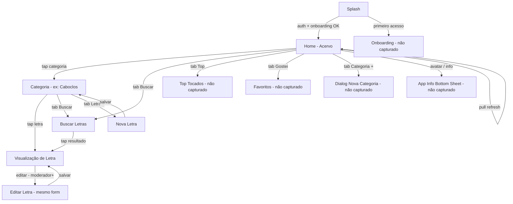
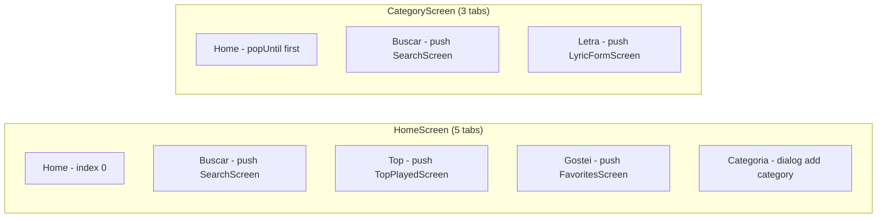
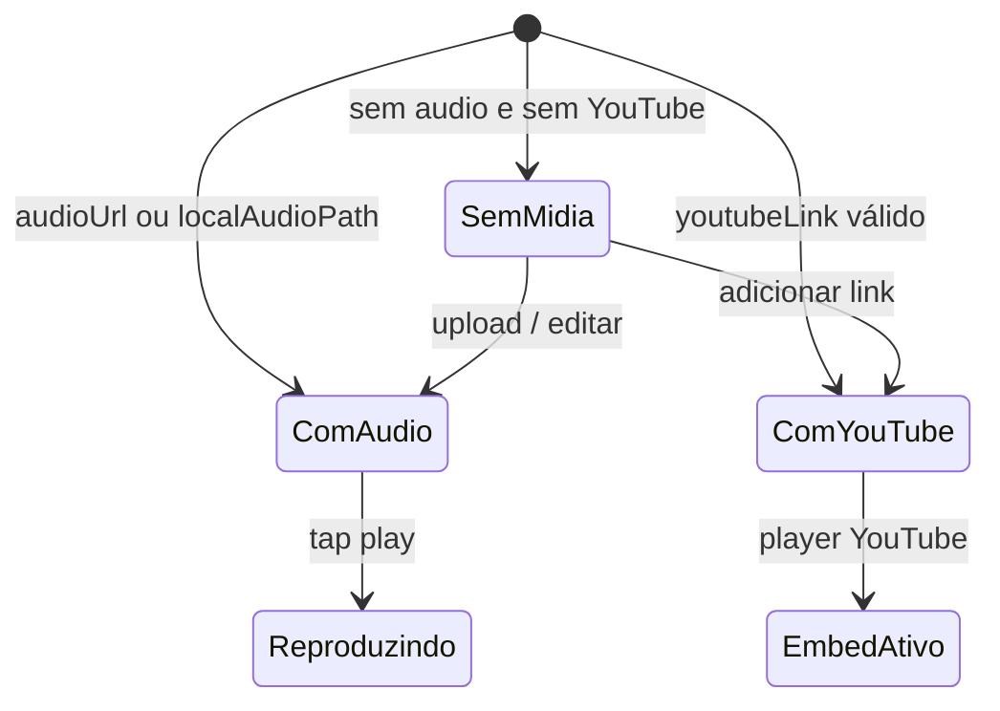

# Fluxo de Navegação — FMA Pontos

> Gerado pelo Visor · Mermaid

## Fluxo principal (capturado)

## Bottom navigation — comportamento

## Estados da Visualização de Letra

## Pontos de entrada

| Entrada | Destino |
|---------|---------|
| Cold start | Splash → Home ou Onboarding |
| Deep link | Não observado nos screenshots |
| Notificação | Não observado |

## Pontos de saída

| Origem | Ação |
|--------|------|
| Home | Back duplo → fecha app |
| Qualquer tela empilhada | Back → tela anterior |
