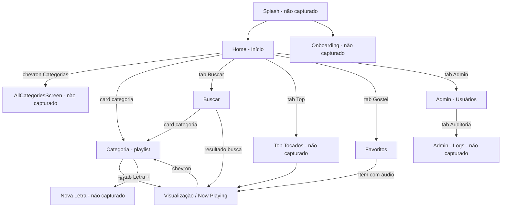
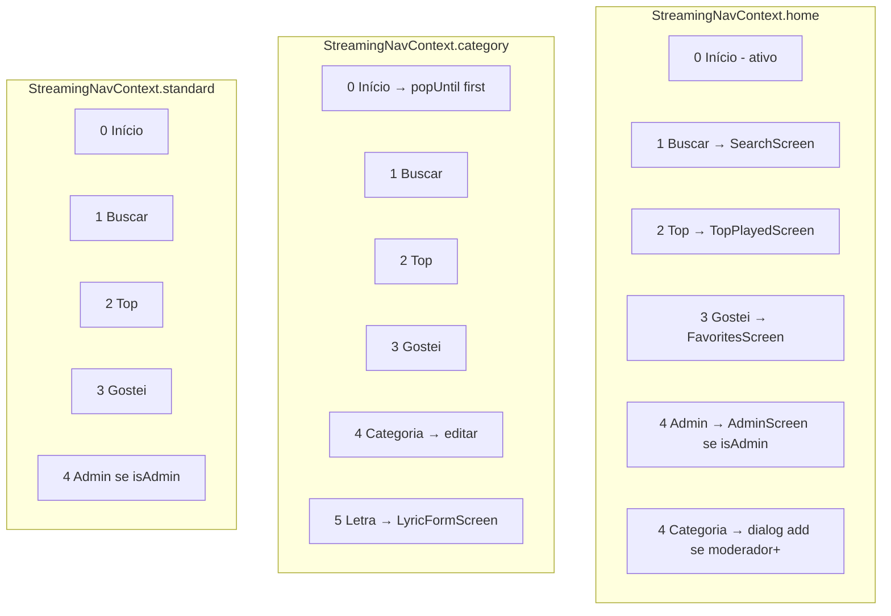
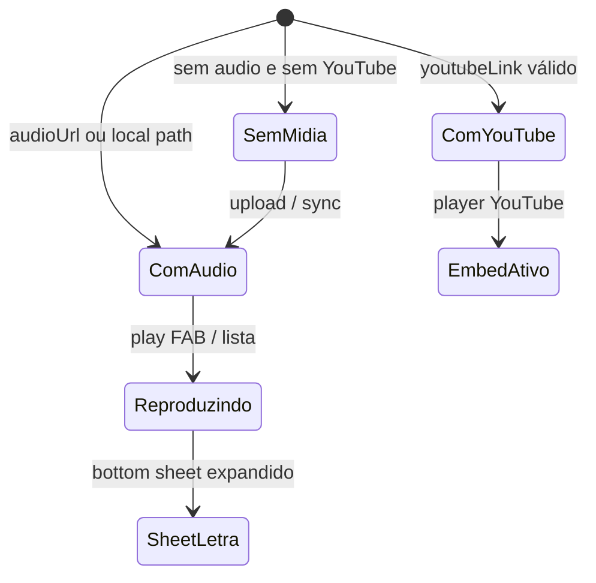
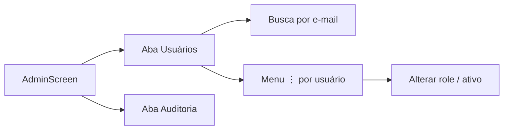

# Fluxo de Navegação — FMA Pontos (design streaming)

> Gerado pelo Visor · 2026-05-31 · 6 screenshots do novo visual

## Fluxo principal (capturado)

## Bottom navigation — por contexto

**Observação (screenshot Home):** usuário admin vê 5º slot **Admin** em vez de **Categoria (+)**.

## Estados da Visualização de Letra

## Admin — subfluxo

## Pontos de entrada

| Entrada | Destino |
|---------|---------|
| Cold start | Splash → Home ou Onboarding |
| Tab Início (qualquer tela) | `popUntil` primeira rota (= Home) |
| Deep link | Não observado |

## Pontos de saída

| Origem | Ação |
|--------|------|
| Home | Back duplo → fecha app (código) |
| Telas empilhadas | Seta voltar verde → pop |
| LyricView | Chevron superior → pop (minimizar player) |
